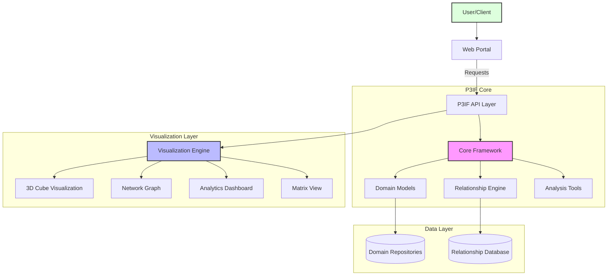
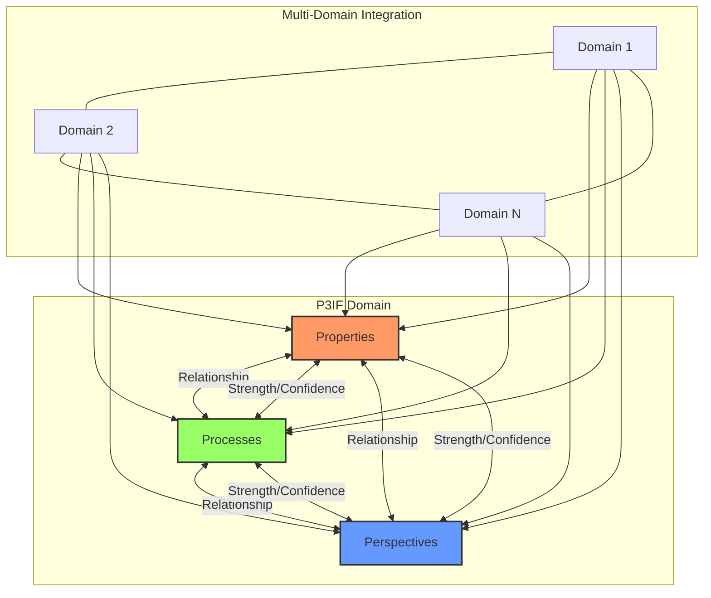
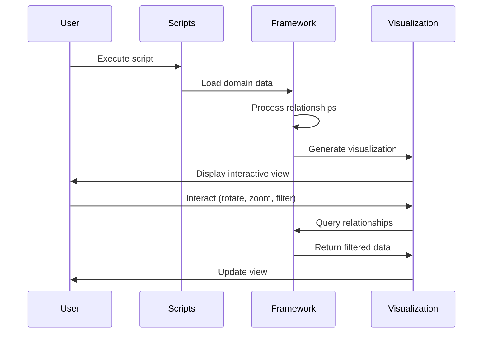
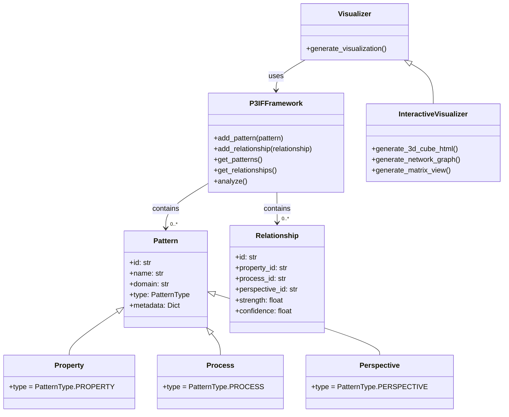
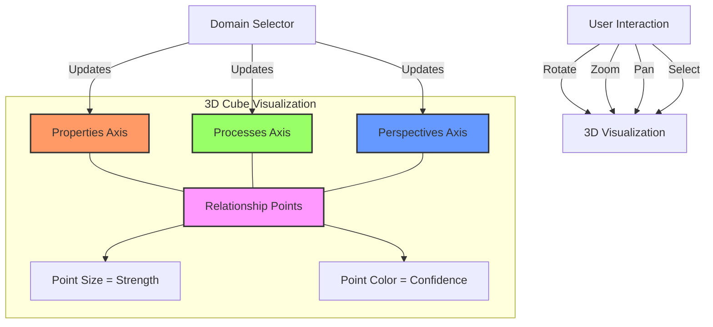
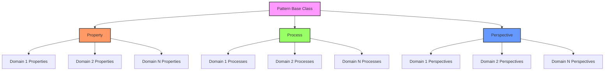
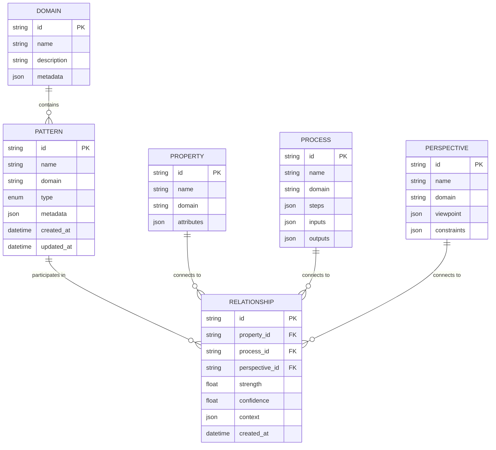
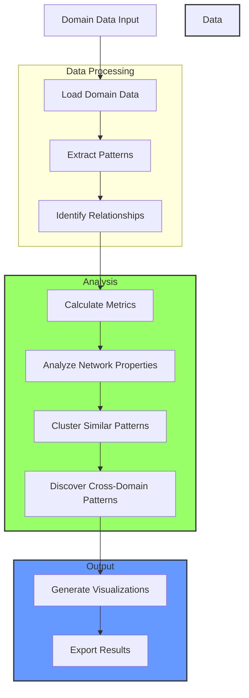
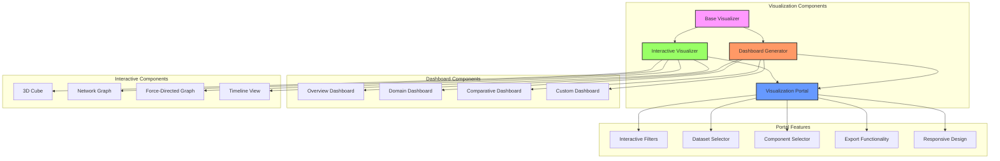

# P3IF - Patterns, Processes, Perspectives Inter-Framework (P3IF)

[](https://opensource.org/licenses/MIT)

P3IF is a sophisticated framework for integrating and visualizing complex data relationships across multiple domains. It provides a flexible, interoperable approach to requirements engineering that bridges gaps between existing methodologies and fosters cross-domain collaboration.

## Architecture Overview



## P3IF Conceptual Model



## Data Flow



## Features

- **Multi-domain Integration**: Connect and analyze data across multiple domains
- **Flexible Visualization**: Explore data through network diagrams, matrices, 3D cubes, and dashboards
- **Interactive Portal**: Web-based interactive portal for exploring relationships
- **Cross-domain Analysis**: Discover patterns and relationships that span different domains
- **Extensible Architecture**: Easily add new domains, visualization types, and analysis methods
- **Category Theory Foundation**: Rigorous mathematical foundation for framework operations
- **Cognitive Security Support**: Enhanced decision-making integrity and security

## Quick Start

```bash
# Clone the repository
git clone https://github.com/yourusername/p3if.git
cd p3if

# Generate a visualization portal
python3 scripts/run_multidomain_portal.py --output-dir output

# Generate the 3D cube visualization
python3 scripts/test_3d_cube_with_domains.py

# Open the 3D visualization
python3 scripts/view_p3if_website.py

# Generate all visualizations
bash scripts/generate_visualizations.sh

# Open the visualization portal
open output/index.html
```

## Documentation

For comprehensive documentation, see the [docs](docs/README.md) directory:

- [Getting Started Guide](docs/guides/getting-started.md)
- [Technical Documentation](docs/technical)
- [API Reference](docs/api/README.md)
- [Tutorials](docs/tutorials)
- [Concepts and Theory](docs/concepts)
- [3D Visualization](docs/visualization/README.md)

## LLM & AI Development Resources

P3IF includes resources to assist LLMs and autonomous agents with development:

- [LLM Development Guide](docs/LLM_DEVELOPMENT_GUIDE.md) - Comprehensive guide for AI working on P3IF
- [AI Prompt Library](docs/AI_PROMPT_LIBRARY.md) - Collection of prompts for generating P3IF-compatible code
- [Project Rules](.cursorrules) - Structured rules for code organization and standards

These resources help ensure code quality, consistency, and adherence to P3IF architectural patterns.

## Project Structure

```mermaid
graph TD
    p3if[p3if/] --> api[api/]
    p3if --> core[core/]
    p3if --> data[data/]
    p3if --> analysis[analysis/]
    p3if --> visualization[visualization/]
    p3if --> utils[utils/]
    p3if --> scripts[scripts/]
    
    scripts --> s1[run_multidomain_portal.py]
    scripts --> s2[test_3d_cube_with_domains.py]
    scripts --> s3[update_domain_files.py]
    scripts --> s4[view_p3if_website.py]
    scripts --> s5[generate_visualizations.sh]
    
    docs[docs/] --> d1[api/]
    docs --> d2[concepts/]
    docs --> d3[guides/]
    docs --> d4[technical/]
    docs --> d5[examples/]
    docs --> d6[diagrams/]
    docs --> d7[visualization/]
    docs --> d8[LLM_DEVELOPMENT_GUIDE.md]
    docs --> d9[AI_PROMPT_LIBRARY.md]
    
    tests[tests/] --> t1[core/]
    tests --> t2[api/]
    tests --> t3[data/]
    tests --> t4[analysis/]
    tests --> t5[visualization/]
    tests --> t6[utils/]
    
    style p3if fill:#f96,stroke:#333,stroke-width:2px
    style docs fill:#9f6,stroke:#333,stroke-width:2px
    style tests fill:#69f,stroke:#333,stroke-width:2px
```



## Core Components Relationships



## Visualizations

### 3D Cube Visualization

The P3IF framework includes an interactive 3D cube visualization that represents the three dimensions of the framework (properties, processes, and perspectives) across 16 different domains. This visualization allows users to explore relationships between elements from each dimension.



To generate and view the 3D visualization:

```bash
# Generate the 3D visualization
python3 scripts/test_3d_cube_with_domains.py

# Open the visualization in your browser
python3 scripts/view_p3if_website.py
```

For more information about the 3D visualization, see the [visualization documentation](docs/visualization/README.md).

## Contributing

Contributions are welcome! Please see [CONTRIBUTING.md](CONTRIBUTING.md) for details on how to contribute to P3IF.

## License

This project is licensed under the MIT License - see the [LICENSE](LICENSE) file for details.

## Technical Architecture Details

### Pattern Type Hierarchy



### Data Model



### Analysis Pipeline



### Visualization Components



## Acknowledgments

- The P3IF framework builds on concepts from category theory, cognitive security, and requirements engineering
- Special thanks to all contributors who have helped shape and improve this framework
