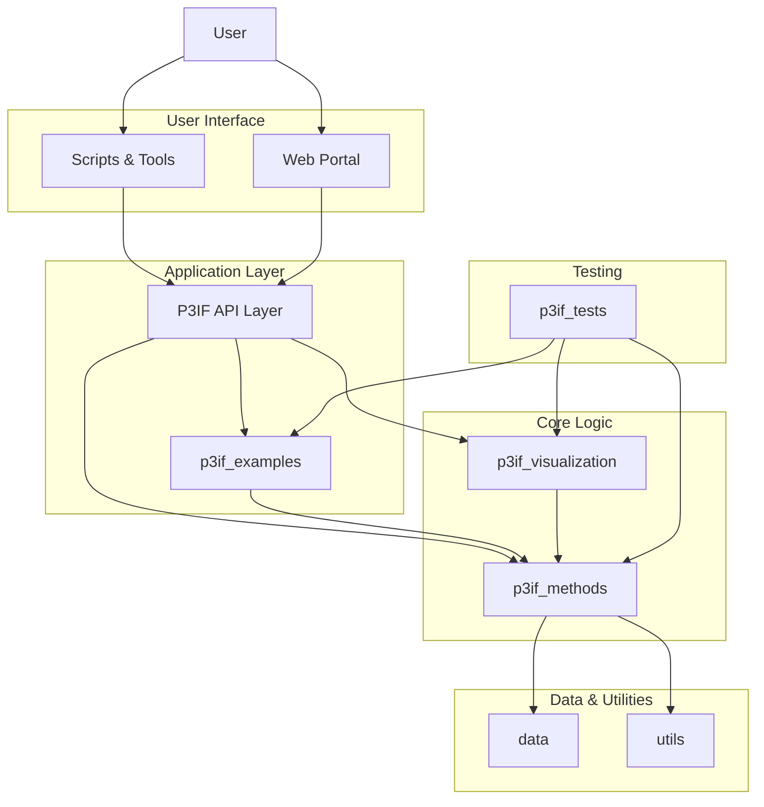

# P3IF - Patterns, Processes, Perspectives Inter-Framework (P3IF)

[](https://opensource.org/licenses/MIT)

P3IF is a sophisticated framework for integrating and visualizing complex data relationships across multiple domains. It provides a flexible, interoperable approach to requirements engineering that bridges gaps between existing methodologies and fosters cross-domain collaboration.

## 🏗️ **Unified Modular Architecture**

The P3IF codebase has been streamlined into a cohesive, modular architecture to enhance maintainability, scalability, and ease of use.

### **Core Packages**
- **`p3if_methods/`** - Core framework, models, analysis, and composition methods.
- **`p3if_examples/`** - Thin orchestrators demonstrating flexible composition patterns.
- **`p3if_visualization/`** - Advanced visualization and animation system.
- **`p3if_tests/`** - Comprehensive test suite with validation framework.
- **`utils/`** - Shared utility modules for configuration, performance, and storage.
- **`data/`** - Domain data, importers, exporters, and synthetic data generators.
- **`website/`** - Web-based portal and interactive methods.

### **Key Capabilities**
- **🔗 Framework Multiplexing** - Dynamic composition of multiple frameworks.
- **🎭 Thin Orchestrators** - Lightweight, reusable workflow patterns.
- **🎨 Advanced Visualization** - 3D animations, interactive portals, and multi-domain analysis.
- **🧪 Comprehensive Testing** - A unified test suite ensures reliability.
- **⚡ Performance Optimization** - Caching, concurrency, and memory management.

### **Architecture Overview**



## Quick Start

```bash
# Clone the repository
git clone https://github.com/yourusername/p3if.git
cd p3if

# Install dependencies
pip install -r requirements.txt
pip install .

# Option 1: Use the interactive terminal (recommended)
./interactive_terminal.sh

# Option 2: Run individual commands
# Generate all visualizations and reports
python3 scripts/generate_final_visualizations.py

# Run the comprehensive test suite
python3 scripts/run_tests.py

# Run example orchestrators
python3 scripts/run_examples.py
```

## Documentation

## Project Structure

P3IF follows a clean, modular architecture with clear separation of concerns:

```
├── p3if_methods/          # Core framework methods and models
├── p3if_examples/         # Thin orchestrator examples
├── p3if_visualization/    # Visualization and animation system
├── p3if_tests/           # Comprehensive test suite
├── utils/                # Shared utility modules
├── data/                 # Domain data and synthetic generators
├── scripts/              # All executable scripts and tools
├── docs/                 # Comprehensive documentation
└── website/              # Web portal and interactive interface
```

### Key Directories

- **Scripts**: All executable tools are in `scripts/` - see [scripts/README.md](scripts/README.md)
- **Documentation**: Comprehensive docs in `docs/` - see [docs/README.md](docs/README.md)
- **Core Methods**: Framework implementation in `p3if_methods/`
- **Examples**: Orchestrator examples in `p3if_examples/`
- **Tests**: Test suite in `p3if_tests/`
- **Website**: Web interface in `website/`

## Development Resources

### For Developers
- **[Interactive Terminal](interactive_terminal.sh)** - Full development environment
- **[Setup Script](scripts/setup_development.py)** - Environment setup
- **[Test Suite](scripts/run_tests.py)** - Comprehensive testing
- **[Documentation Validation](scripts/validate_documentation.py)** - Quality checks

### For AI/LLM Development
- [LLM Development Guide](docs/LLM_DEVELOPMENT_GUIDE.md) - AI agent guidelines
- [Project Rules](.cursorrules) - Code organization standards
- [Interactive Terminal](interactive_terminal.sh) - AI-friendly interface

## Documentation

For comprehensive documentation, see the [docs](docs/README.md) directory.

**Quick Access:**
- **[Core Concepts](docs/concepts/P3IF.md)** - P3IF framework fundamentals
- **[Tutorials](docs/tutorials/basic-usage.md)** - Getting started guides
- **[API Reference](docs/api/README.md)** - Framework API documentation
- **[Visualization Guide](docs/visualization/README.md)** - Visualization system
