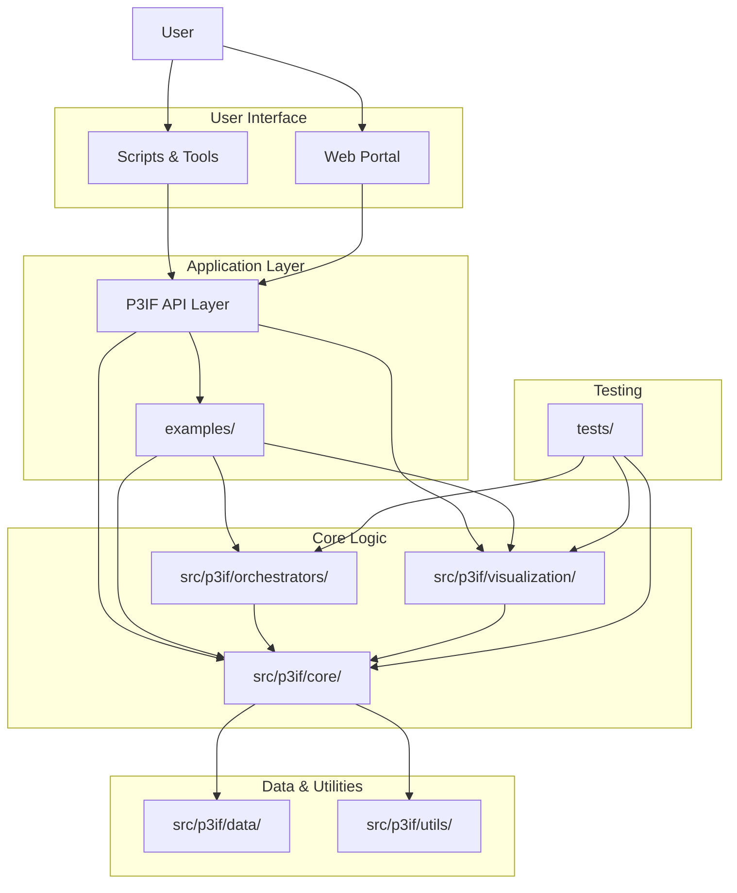

# P3IF - Properties, Processes, and Perspectives Inter-Framework

[](https://opensource.org/licenses/MIT)

P3IF is a sophisticated framework for integrating and visualizing complex data relationships across multiple domains. It provides a flexible, interoperable approach to requirements engineering that bridges gaps between existing methodologies and fosters cross-domain collaboration.

## 🏗️ **Modular Architecture**

The P3IF codebase follows a modular architecture for maintainability and scalability.

### **Core Packages**
- **`src/p3if/core/`** - Core framework, models, analysis, composition, and orchestration methods with comprehensive error handling.
- **`src/p3if/orchestrators/`** - Thin orchestrators demonstrating flexible composition patterns for domain-specific workflows.
- **`src/p3if/visualization/`** - Advanced visualization and animation system with static, interactive, and portal-based approaches.
- **`src/p3if/utils/`** - Shared utility modules for configuration, performance monitoring, logging, and storage.
- **`src/p3if/data/`** - Domain data management, importers, exporters, and synthetic data generators.
- **`tests/`** - Comprehensive test suite with unit, integration, and visualization tests.
- **`website/`** - Web-based portal and interactive methods with API endpoints.

### **Key Capabilities**
- **🔗 Framework Multiplexing** - Dynamic composition of multiple frameworks.
- **🎭 Thin Orchestrators** - Lightweight, reusable workflow patterns.
- **🎨 Visualization** - 3D animations, interactive portals, and multi-domain analysis.
- **🧪 Testing** - Unified test suite ensures reliability.
- **⚡ Performance** - Caching, concurrency, and memory management.
- **🔬 Validation** - Validation framework with constraint checking.
- **📊 Monitoring** - Real-time performance tracking.
- **🔧 Framework Integration** - Multi-framework composition and conflict resolution.

### **Architecture Overview**


```mermaid
graph TD
    subgraph "User Interface"
        CLI[Scripts & Tools]
        Portal[Web Portal]
    end

    subgraph "Application Layer"
        API[P3IF API Layer]
        Examples[examples/]
    end

    subgraph "Core Logic"
        Core[src/p3if/core/]
        Viz[src/p3if/visualization/]
        Orch[src/p3if/orchestrators/]
    end

    subgraph "Data & Utilities"
        Data[src/p3if/data/]
        Utils[src/p3if/utils/]
    end

    subgraph "Testing"
        Tests[tests/]
    end

    User --> CLI
    User --> Portal
    CLI --> API
    Portal --> API

    API --> Examples
    API --> Core
    API --> Viz

    Examples --> Core
    Examples --> Orch
    Examples --> Viz

    Orch --> Core
    Viz --> Core
    Core --> Data
    Core --> Utils

    Tests --> Core
    Tests --> Viz
    Tests --> Orch
```

## Quick Start

```bash
# Clone the repository
git clone https://github.com/docxology/p3if.git
cd p3if

# Install with modern packaging
pip install -e ".[dev,web]"

# Option 1: Use the interactive terminal (recommended)
./interactive_terminal.sh

# Option 2: Run individual commands
# Generate all visualizations and reports
python3 scripts/generate_final_visualizations.py

# Run the comprehensive test suite
python3 scripts/run_all.py

# Run example orchestrators
python3 scripts/run_examples.py

# Validate the system
python3 scripts/validate_system.py
```

## Project Structure

P3IF 2.0 follows a modern `src/` layout with unified namespace:

```
├── src/p3if/              # Main package
│   ├── core/              # Core framework methods and models
│   │   ├── core.py        # Core operations with custom exceptions
│   │   ├── composition.py # Framework composition and integration
│   │   ├── dimensions.py  # Property, Process, Perspective managers
│   │   ├── orchestration.py # Thin orchestrators and workflow engine
│   │   ├── validation.py  # Validation framework
│   │   ├── caching.py     # Performance optimization and caching
│   │   ├── framework.py   # Main P3IFFramework class
│   │   ├── models.py      # Pydantic data models
│   │   ├── exceptions.py  # Custom exception classes
│   │   └── analysis/      # Analysis tools and pattern recognition
│   ├── orchestrators/     # Thin orchestrator examples
│   │   ├── cognitive_security.py    # Information pipeline security
│   │   ├── framework_integration.py # Multi-framework integration
│   │   ├── healthcare_domain.py     # Healthcare domain analysis
│   │   └── integration_examples.py  # Integration examples
│   ├── visualization/     # Advanced visualization system
│   │   ├── base.py        # Base visualizer classes
│   │   ├── interactive/   # Interactive 3D visualizations
│   │   ├── static/        # Static chart and graph generators
│   │   ├── animated/      # Animation and sequence generation
│   │   └── portals/       # Web portal and dashboard systems
│   ├── utils/             # Shared utility modules
│   │   ├── config.py      # Configuration management
│   │   ├── logging.py     # Unified logging system
│   │   ├── performance.py # Performance monitoring
│   │   ├── storage.py     # Data persistence
│   │   └── json.py        # JSON utilities
│   └── data/              # Data management
│       ├── domains.py     # Domain data management
│       ├── importers.py   # Data import utilities
│       ├── exporters.py   # Data export utilities
│       └── synthetic.py   # Synthetic data generation
├── tests/                 # Test suite
│   ├── unit/              # Unit tests for core functionality
│   ├── integration/       # Integration tests
│   ├── visualization/     # Visualization system tests
│   ├── fixtures/          # Test fixtures and helpers
│   └── conftest.py        # Pytest configuration and fixtures
├── examples/              # Usage examples and demonstrations
├── data/                 # Domain data files
│   └── domains/          # Domain-specific data files
├── website/              # Web portal and API

## Python Usage

```python
from p3if import P3IFFramework, Property, Process, Perspective
from p3if.core import P3IFCore
from p3if.orchestrators import CognitiveSecurityOrchestrator
from p3if.visualization import InteractiveVisualizer

# Create framework
framework = P3IFFramework()

# Add patterns
prop = Property(name="Security", domain="cybersecurity")
proc = Process(name="Authentication", domain="cybersecurity")
persp = Perspective(name="Technical", domain="cybersecurity", viewpoint="developer")

framework.add_pattern(prop)
framework.add_pattern(proc)
framework.add_pattern(persp)

# Use orchestrators
orchestrator = CognitiveSecurityOrchestrator()
results = orchestrator.execute_analysis()

# Create visualizations
viz = InteractiveVisualizer(framework)
viz.generate_3d_cube_html("output/cube.html")
```

### Website

```
├── website/              # Web portal and API
│   ├── app.py           # Main Flask application
│   ├── routes/          # API routes and endpoints
│   ├── static/          # Static assets (CSS, JS, images)
│   ├── templates/       # HTML templates
│   ├── run.py           # Development server
│   └── run_stable.py    # Production server
├── docs/                 # Comprehensive documentation
│   ├── concepts/        # Core concepts and theory
│   ├── technical/       # Technical specifications
│   ├── guides/          # User guides and tutorials
│   ├── tutorials/       # Step-by-step tutorials
│   ├── examples/        # Example implementations
│   ├── api/            # API documentation
│   ├── visualization/  # Visualization documentation
│   └── diagrams/        # Architecture and process diagrams
├── scripts/              # Executable scripts and tools
│   ├── generate_final_visualizations.py # Complete visualization pipeline
│   ├── benchmark_performance.py        # Performance analysis
│   ├── validate_system.py              # System validation
│   ├── setup_development.py           # Development environment setup
│   └── run_all.py                      # Test execution
└── Root Files
    ├── README.md              # Main project overview
    ├── pyproject.toml         # Package configuration
    ├── requirements.txt       # Runtime dependencies
    ├── AGENTS.md              # AI agent development guide
    ├── CONTRIBUTING.md        # Contribution guidelines
    ├── interactive_terminal.sh # Interactive development environment
    └── .cursorrules           # Code organization rules
```

### Key Directories

- **Scripts**: All executable tools are in `scripts/` - see [scripts/README.md](scripts/README.md)
- **Documentation**: Comprehensive docs in `docs/` - see [docs/README.md](docs/README.md)
- **Core Framework**: Main package implementation in `src/p3if/core/`
- **Orchestrators**: Orchestrator examples in `src/p3if/orchestrators/`
- **Visualization**: Visualization system in `src/p3if/visualization/`
- **Tests**: Test suite in `tests/`
- **Website**: Web interface in `website/`

## Development Resources

### For Developers
- **[Interactive Terminal](interactive_terminal.sh)** - Full development environment
- **[Setup Script](scripts/setup_development.py)** - Environment setup
- **[Test Suite](scripts/run_all.py)** - Comprehensive testing
- **[System Validation](scripts/validate_system.py)** - Quality checks

### For AI/LLM Development
- [LLM Development Guide](docs/LLM_DEVELOPMENT_GUIDE.md) - AI agent guidelines
- [Project Rules](.cursorrules) - Code organization standards
- [Interactive Terminal](interactive_terminal.sh) - AI-friendly interface

## Documentation

For comprehensive documentation, see the [docs](docs/README.md) directory.

**Quick Access:**
- **[Core Concepts](docs/concepts/P3IF.md)** - P3IF framework fundamentals
- **[Tutorials](docs/tutorials/basic-usage.md)** - Getting started guides
- **[API Reference](docs/api/README.md)** - Framework API documentation
- **[Visualization Guide](docs/visualization/README.md)** - Visualization system
