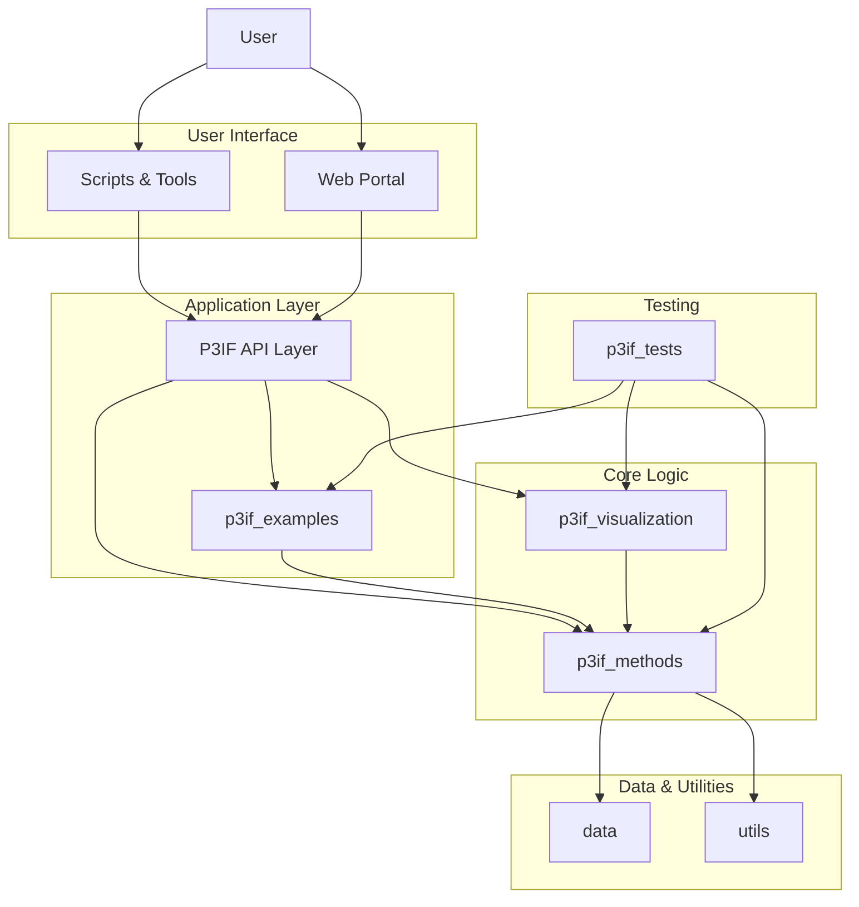

# P3IF - Patterns, Processes, Perspectives Inter-Framework (P3IF)

[](https://opensource.org/licenses/MIT)

P3IF is a sophisticated framework for integrating and visualizing complex data relationships across multiple domains. It provides a flexible, interoperable approach to requirements engineering that bridges gaps between existing methodologies and fosters cross-domain collaboration.

## 🏗️ **Unified Modular Architecture**

The P3IF codebase has been streamlined into a cohesive, modular architecture to enhance maintainability, scalability, and ease of use.

### **Core Packages**
- **`p3if_methods/`** - Core framework, models, analysis, and composition methods.
- **`p3if_examples/`** - Thin orchestrators demonstrating flexible composition patterns.
- **`p3if_visualization/`** - Advanced visualization and animation system.
- **`p3if_tests/`** - Comprehensive test suite with validation framework.
- **`utils/`** - Shared utility modules for configuration, performance, and storage.
- **`data/`** - Domain data, importers, exporters, and synthetic data generators.
- **`website/`** - Web-based portal and interactive methods.

### **Key Capabilities**
- **🔗 Framework Multiplexing** - Dynamic composition of multiple frameworks.
- **🎭 Thin Orchestrators** - Lightweight, reusable workflow patterns.
- **🎨 Advanced Visualization** - 3D animations, interactive portals, and multi-domain analysis.
- **🧪 Comprehensive Testing** - A unified test suite ensures reliability.
- **⚡ Performance Optimization** - Caching, concurrency, and memory management.
- **🔬 Enhanced Validation** - Comprehensive validation framework with constraint checking.
- **📊 Performance Monitoring** - Real-time performance tracking and optimization.
- **🔧 Framework Integration** - Multi-framework composition and conflict resolution.

### **Architecture Overview**


```mermaid
graph TD
    subgraph "User Interface"
        CLI[Scripts & Tools]
        Portal[Web Portal]
    end

    subgraph "Application Layer"
        API[P3IF API Layer]
        Examples[p3if_examples]
    end

    subgraph "Core Logic"
        Methods[p3if_methods]
        Visualization[p3if_visualization]
    end

    subgraph "Data & Utilities"
        Data[data]
        Utils[utils]
    end

    subgraph "Testing"
        Tests[p3if_tests]
    end

    User --> CLI
    User --> Portal
    CLI --> API
    Portal --> API
    
    API --> Examples
    API --> Methods
    API --> Visualization

    Examples --> Methods
    Visualization --> Methods
    Methods --> Data
    Methods --> Utils
    
    Tests --> Methods
    Tests --> Visualization
    Tests --> Examples
```

## Quick Start

```bash
# Clone the repository
git clone https://github.com/yourusername/p3if.git
cd p3if

# Install dependencies
pip install -r requirements.txt
pip install .

# Option 1: Use the interactive terminal (recommended)
./interactive_terminal.sh

# Option 2: Run individual commands
# Generate all visualizations and reports
python3 scripts/generate_final_visualizations.py

# Run the comprehensive test suite
python3 scripts/run_tests.py

# Run example orchestrators
python3 scripts/run_examples.py

# Option 3: Run the complete pipeline (recommended)
python3 scripts/run_complete_p3if_pipeline.py
```

## Documentation

## Project Structure

P3IF follows a clean, modular architecture with clear separation of concerns:

```
├── p3if_methods/          # Core framework methods and models
│   ├── core.py            # Enhanced core operations with validation
│   ├── composition.py     # Framework composition and integration
│   ├── dimensions.py      # Property, Process, Perspective managers
│   ├── orchestration.py   # Thin orchestrators and workflow engine
│   ├── validation.py      # Enhanced validation framework
│   ├── caching.py         # Performance optimization and caching
│   ├── framework.py       # Main P3IFFramework class
│   ├── models.py          # Pydantic data models with validation
│   └── analysis/          # Analysis tools and pattern recognition
├── p3if_examples/         # Thin orchestrator examples
│   ├── cognitive_security_orchestrator.py    # Information pipeline security
│   ├── framework_integration_orchestrator.py # Multi-framework integration
│   ├── healthcare_domain_orchestrator.py     # Healthcare domain analysis
│   └── integration_examples.py               # Comprehensive integration examples
├── p3if_visualization/    # Advanced visualization system
│   ├── base.py            # Base visualizer classes
│   ├── interactive.py      # Interactive visualization engine
│   ├── interactive_3d.py  # 3D visualization components
│   ├── animated_dimensions.py # Animation and dimension visualization
│   ├── portal.py          # Multi-domain portal generation
│   ├── multi_domain_portal.py # Multi-domain analysis portal
│   ├── orchestrator.py    # Visualization orchestration
│   ├── network.py         # Network graph visualizations
│   ├── matrix.py          # Matrix visualization engine
│   ├── cube_visualizations.py # 3D cube visualization generators
│   ├── list_visualizations.py # List-based visualizations
│   ├── grid_visualizations.py # Grid-based visualizations
│   ├── heatmap_visualizations.py # Heatmap visualization generators
│   ├── hierarchy_visualizations.py # Hierarchical visualizations
│   ├── statistical_visualizations.py # Statistical analysis visualizations
│   ├── animation_visualizations.py # Animation sequence generators
│   └── dashboard.py       # Dashboard generation
├── p3if_tests/           # Comprehensive test suite
│   ├── core/             # Core framework tests
│   ├── test_core.py      # Enhanced core functionality tests
│   ├── test_composition.py # Composition and multiplexing tests
│   ├── test_validation.py # Validation framework tests
│   ├── utils.py          # Test utilities and fixtures
│   ├── run_all_tests.py  # Comprehensive test runner
│   └── visualization/    # Visualization system tests
├── utils/                # Shared utility modules
│   ├── config.py         # Configuration management
│   ├── json.py           # JSON utilities with P3IF encoders
│   ├── output_organizer.py # Output organization and metadata
│   ├── performance.py    # Performance monitoring and optimization
│   └── storage.py        # Data storage interfaces and implementations
├── data/                 # Domain data and generators
│   ├── domains/          # Domain-specific data files
│   ├── synthetic.py      # Enhanced synthetic data generation
│   ├── importers.py      # Data import utilities
│   ├── exporters.py      # Data export utilities
│   └── domains.py        # Domain management
├── website/              # Web portal and API
│   ├── app.py           # Main Flask application
│   ├── routes/          # API routes and endpoints
│   ├── static/          # Static assets (CSS, JS, images)
│   ├── templates/       # HTML templates
│   ├── run.py           # Development server
│   └── run_stable.py    # Production server
├── docs/                 # Comprehensive documentation
│   ├── concepts/        # Core concepts and theory
│   ├── technical/       # Technical specifications
│   ├── guides/          # User guides and tutorials
│   ├── tutorials/       # Step-by-step tutorials
│   ├── examples/        # Example implementations
│   ├── api/            # API documentation
│   ├── visualization/  # Visualization documentation
│   └── diagrams/        # Architecture and process diagrams
├── scripts/              # Executable scripts and tools
│   ├── generate_final_visualizations.py # Complete visualization pipeline
│   ├── run_multidomain_portal.py       # Multi-domain portal generation
│   ├── benchmark_performance.py        # Performance analysis
│   ├── validate_documentation.py       # Documentation quality checks
│   ├── setup_development.py           # Development environment setup
│   └── run_tests.py                   # Test execution
└── Root Files
    ├── README.md              # Main project overview
    ├── setup.py               # Package installation
    ├── requirements.txt       # Runtime dependencies
    ├── AGENTS.md              # AI agent development guide
    ├── CONTRIBUTING.md        # Contribution guidelines
    ├── PACKAGE_README.md      # Comprehensive package overview
    ├── interactive_terminal.sh # Interactive development environment
    └── .cursorrules           # Code organization rules
```

### Key Directories

- **Scripts**: All executable tools are in `scripts/` - see [scripts/README.md](scripts/README.md)
- **Documentation**: Comprehensive docs in `docs/` - see [docs/README.md](docs/README.md)
- **Core Methods**: Framework implementation in `p3if_methods/`
- **Examples**: Orchestrator examples in `p3if_examples/`
- **Tests**: Test suite in `p3if_tests/`
- **Website**: Web interface in `website/`

## Development Resources

### For Developers
- **[Interactive Terminal](interactive_terminal.sh)** - Full development environment
- **[Setup Script](scripts/setup_development.py)** - Environment setup
- **[Test Suite](scripts/run_tests.py)** - Comprehensive testing
- **[Documentation Validation](scripts/validate_documentation.py)** - Quality checks

### For AI/LLM Development
- [LLM Development Guide](docs/LLM_DEVELOPMENT_GUIDE.md) - AI agent guidelines
- [Project Rules](.cursorrules) - Code organization standards
- [Interactive Terminal](interactive_terminal.sh) - AI-friendly interface

## Documentation

For comprehensive documentation, see the [docs](docs/README.md) directory.

**Quick Access:**
- **[Core Concepts](docs/concepts/P3IF.md)** - P3IF framework fundamentals
- **[Tutorials](docs/tutorials/basic-usage.md)** - Getting started guides
- **[API Reference](docs/api/README.md)** - Framework API documentation
- **[Visualization Guide](docs/visualization/README.md)** - Visualization system
