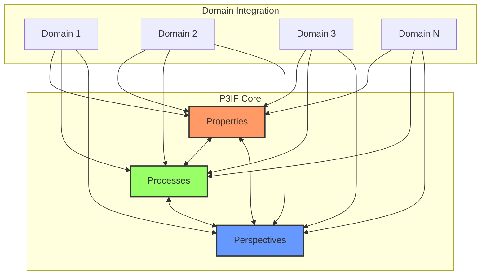
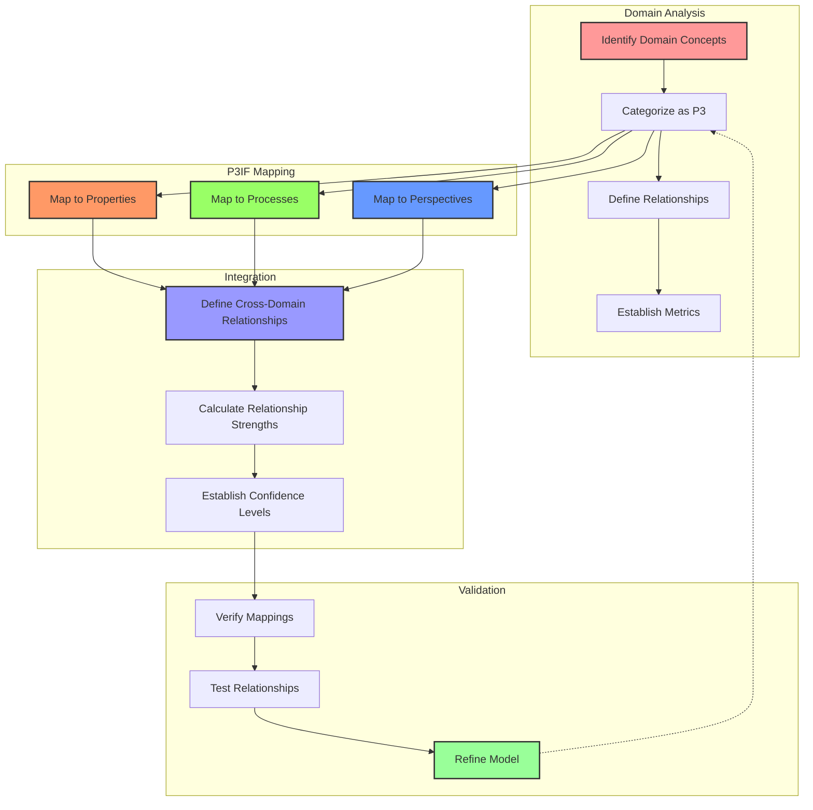
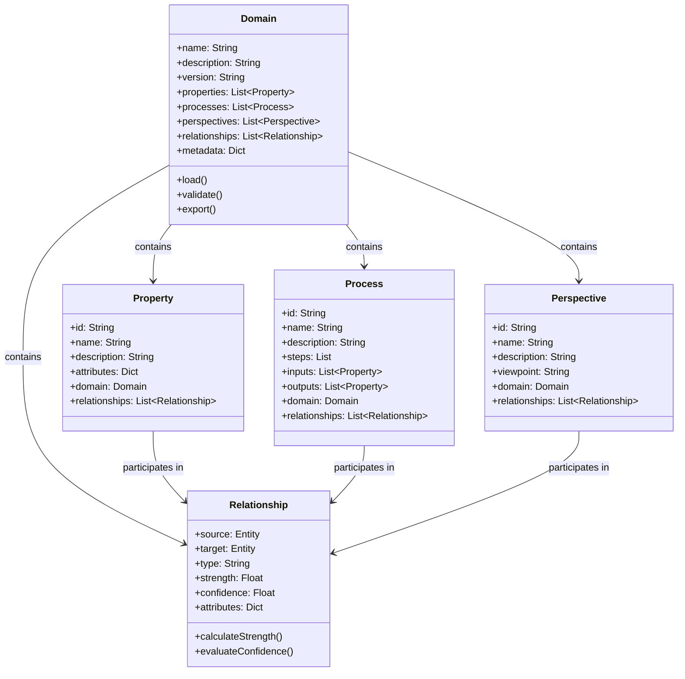
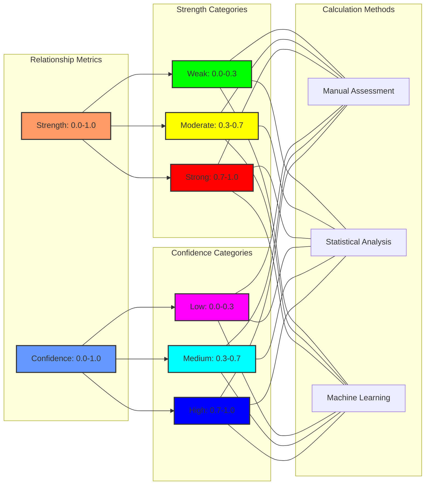
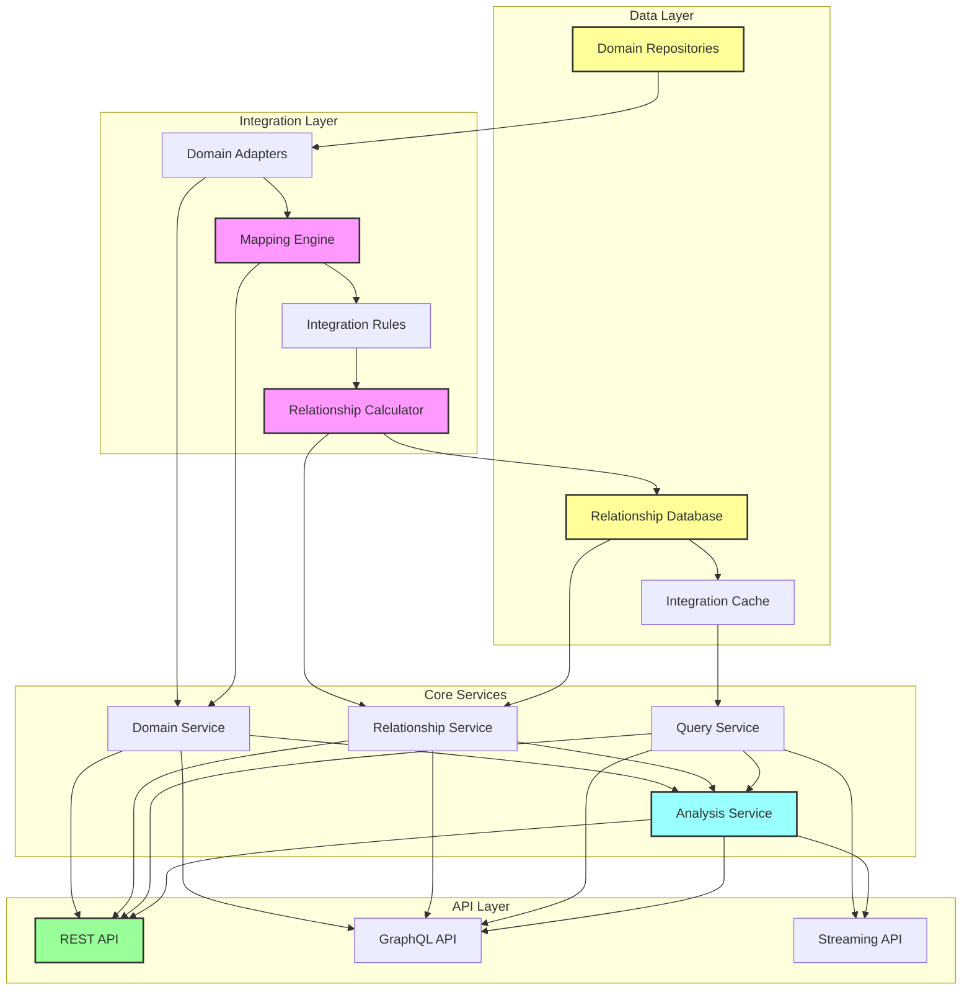
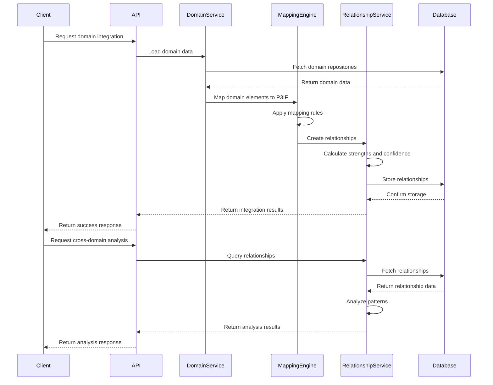
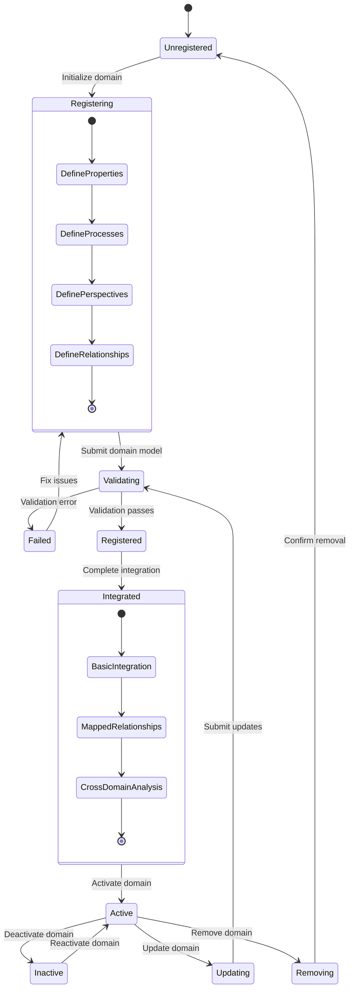
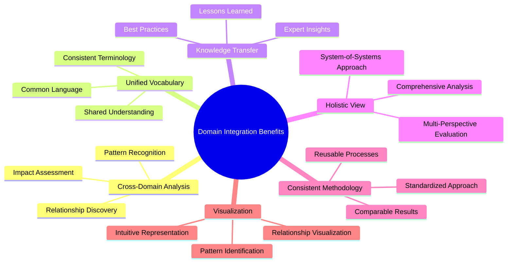

# P3IF Domain Integration

This document describes the domain integration capabilities of the P3IF framework, explaining how multiple domains can be connected and interrelated through the Properties-Processes-Perspectives pattern structure.

## Conceptual Overview

P3IF provides a framework for integrating multiple domains through a unified model based on Properties, Processes, and Perspectives. This allows for cross-domain analysis, visualization, and knowledge transfer.

## Domain Mapping Process

The following diagram illustrates the process of mapping domain-specific concepts into the P3IF framework:

## Domain Model Structure

Each domain in P3IF follows a consistent structure to facilitate integration:

## Cross-Domain Integration

```mermaid
graph TD
    subgraph "Domain A: Cybersecurity"
        A_P1[Property: Vulnerability]
        A_P2[Property: Asset]
        A_PR1[Process: Threat Modeling]
        A_PS1[Perspective: Adversary]
    end
    
    subgraph "Domain B: Risk Management"
        B_P1[Property: Risk]
        B_P2[Property: Control]
        B_PR1[Process: Risk Assessment]
        B_PS1[Perspective: Stakeholder]
    end
    
    subgraph "Domain C: Compliance"
        C_P1[Property: Requirement]
        C_P2[Property: Evidence]
        C_PR1[Process: Audit]
        C_PS1[Perspective: Regulator]
    end
    
    subgraph "P3IF Integration Layer"
        I_P[Properties Integration]
        I_PR[Processes Integration]
        I_PS[Perspectives Integration]
        
        I_P --> I_PR
        I_PR --> I_PS
        I_PS --> I_P
    end
    
    A_P1 --> I_P
    A_P2 --> I_P
    A_PR1 --> I_PR
    A_PS1 --> I_PS
    
    B_P1 --> I_P
    B_P2 --> I_P
    B_PR1 --> I_PR
    B_PS1 --> I_PS
    
    C_P1 --> I_P
    C_P2 --> I_P
    C_PR1 --> I_PR
    C_PS1 --> I_PS
    
    style I_P fill:#f96,stroke:#333,stroke-width:2px
    style I_PR fill:#9f6,stroke:#333,stroke-width:2px
    style I_PS fill:#69f,stroke:#333,stroke-width:2px
    
    style A_P1 fill:#faa,stroke:#333,stroke-width:2px
    style A_P2 fill:#faa,stroke:#333,stroke-width:2px
    style A_PR1 fill:#afa,stroke:#333,stroke-width:2px
    style A_PS1 fill:#aaf,stroke:#333,stroke-width:2px
    
    style B_P1 fill:#faa,stroke:#333,stroke-width:2px
    style B_P2 fill:#faa,stroke:#333,stroke-width:2px
    style B_PR1 fill:#afa,stroke:#333,stroke-width:2px
    style B_PS1 fill:#aaf,stroke:#333,stroke-width:2px
    
    style C_P1 fill:#faa,stroke:#333,stroke-width:2px
    style C_P2 fill:#faa,stroke:#333,stroke-width:2px
    style C_PR1 fill:#afa,stroke:#333,stroke-width:2px
    style C_PS1 fill:#aaf,stroke:#333,stroke-width:2px
```

## Relationship Strength and Confidence

P3IF uses a quantitative approach to model relationship strength and confidence between elements:

## Domain Integration Architecture

The following diagram shows the architectural components that enable domain integration in P3IF:

## Domain Integration Process Flow

## Domain Registration and Discovery

## Sample Domain Integration: Cybersecurity and Risk Management

```mermaid
graph TD
    subgraph "Cybersecurity Domain"
        C_P1[Property: Vulnerability]
        C_P2[Property: Control]
        C_P3[Property: Threat]
        
        C_PR1[Process: Threat Modeling]
        C_PR2[Process: Vulnerability Assessment]
        
        C_PS1[Perspective: Security Engineer]
        C_PS2[Perspective: Attacker]
    end
    
    subgraph "Risk Management Domain"
        R_P1[Property: Risk]
        R_P2[Property: Mitigation]
        R_P3[Property: Impact]
        
        R_PR1[Process: Risk Assessment]
        R_PR2[Process: Risk Treatment]
        
        R_PS1[Perspective: Risk Manager]
        R_PS2[Perspective: Executive]
    end
    
    C_P1 -- 0.9 --> R_P1
    C_P2 -- 0.8 --> R_P2
    C_P3 -- 0.7 --> R_P1
    C_P3 -- 0.6 --> R_P3
    
    C_PR1 -- 0.9 --> R_PR1
    C_PR2 -- 0.7 --> R_PR1
    C_PR2 -- 0.6 --> R_PR2
    
    C_PS1 -- 0.5 --> R_PS1
    C_PS2 -- 0.4 --> R_PS1
    
    style C_P1 fill:#f96,stroke:#333,stroke-width:2px
    style C_P2 fill:#f96,stroke:#333,stroke-width:2px
    style C_P3 fill:#f96,stroke:#333,stroke-width:2px
    
    style C_PR1 fill:#9f6,stroke:#333,stroke-width:2px
    style C_PR2 fill:#9f6,stroke:#333,stroke-width:2px
    
    style C_PS1 fill:#69f,stroke:#333,stroke-width:2px
    style C_PS2 fill:#69f,stroke:#333,stroke-width:2px
    
    style R_P1 fill:#f96,stroke:#333,stroke-width:2px
    style R_P2 fill:#f96,stroke:#333,stroke-width:2px
    style R_P3 fill:#f96,stroke:#333,stroke-width:2px
    
    style R_PR1 fill:#9f6,stroke:#333,stroke-width:2px
    style R_PR2 fill:#9f6,stroke:#333,stroke-width:2px
    
    style R_PS1 fill:#69f,stroke:#333,stroke-width:2px
    style R_PS2 fill:#69f,stroke:#333,stroke-width:2px
```

## Domain Integration Benefits

## Implementation Considerations

When implementing domain integration with P3IF, consider the following aspects:

1. **Domain Selection**: Choose domains that have conceptual overlap or related concerns
2. **Element Classification**: Clearly categorize domain elements as Properties, Processes, or Perspectives
3. **Relationship Definition**: Define meaningful cross-domain relationships with appropriate metrics
4. **Validation**: Establish a validation process to ensure accurate integration
5. **Scalability**: Design for multiple domains and large numbers of relationships
6. **Performance**: Consider caching and optimization for complex relationship networks
7. **Evolution**: Plan for domain model evolution and relationship updates over time 