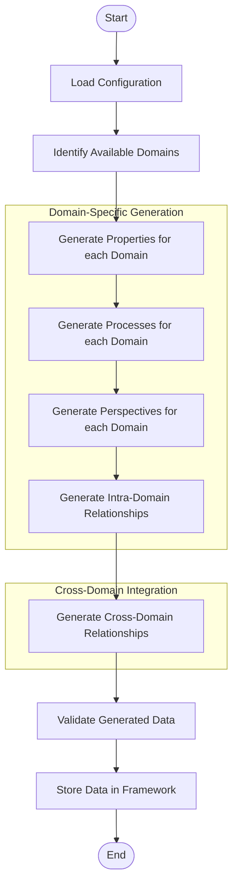
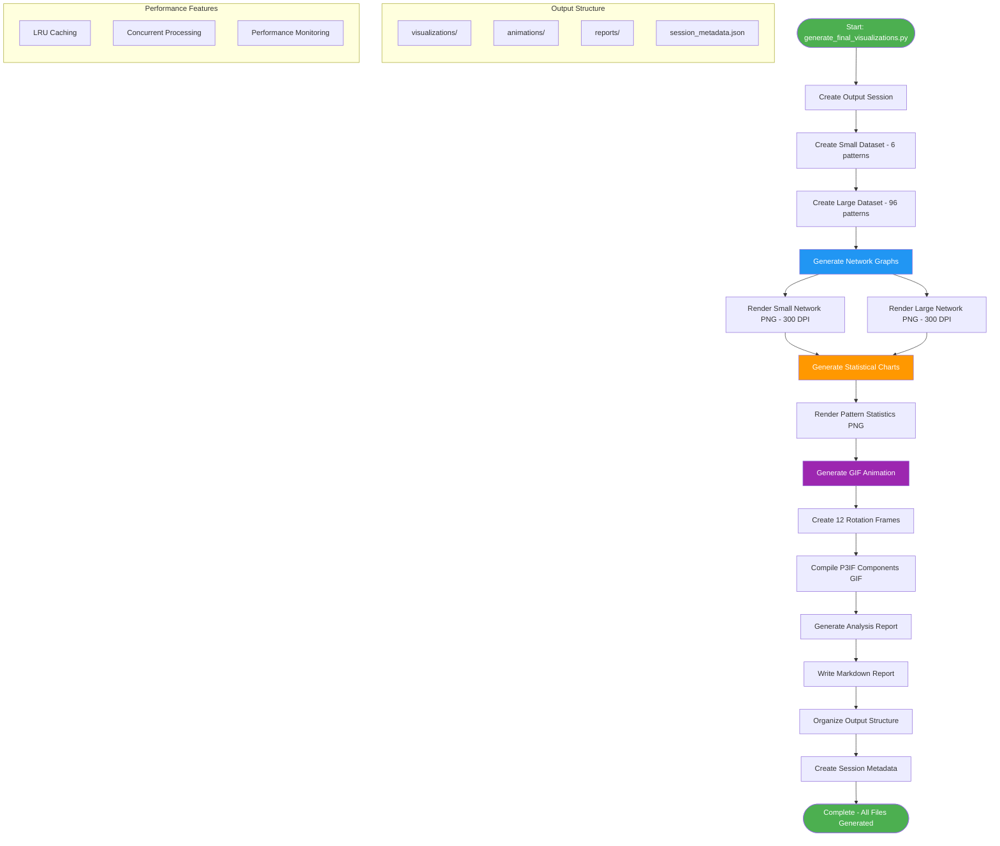
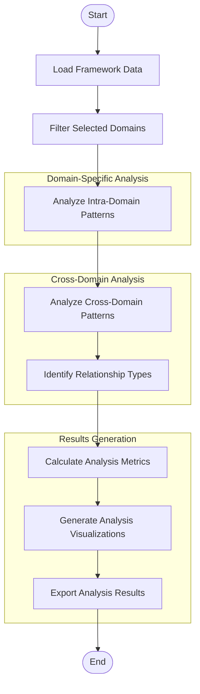
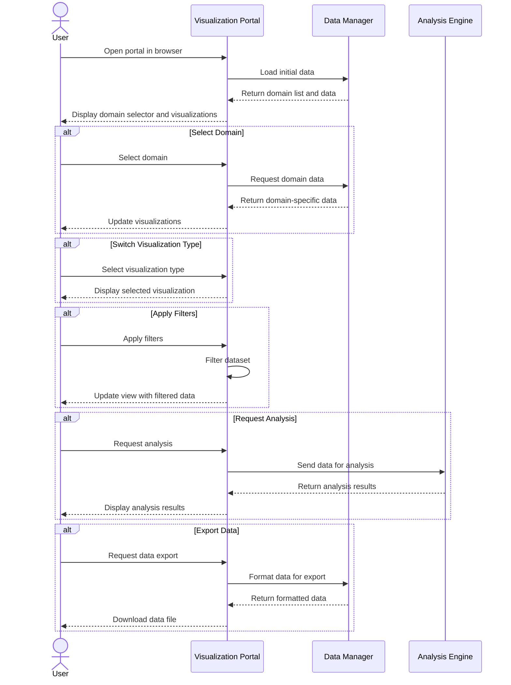
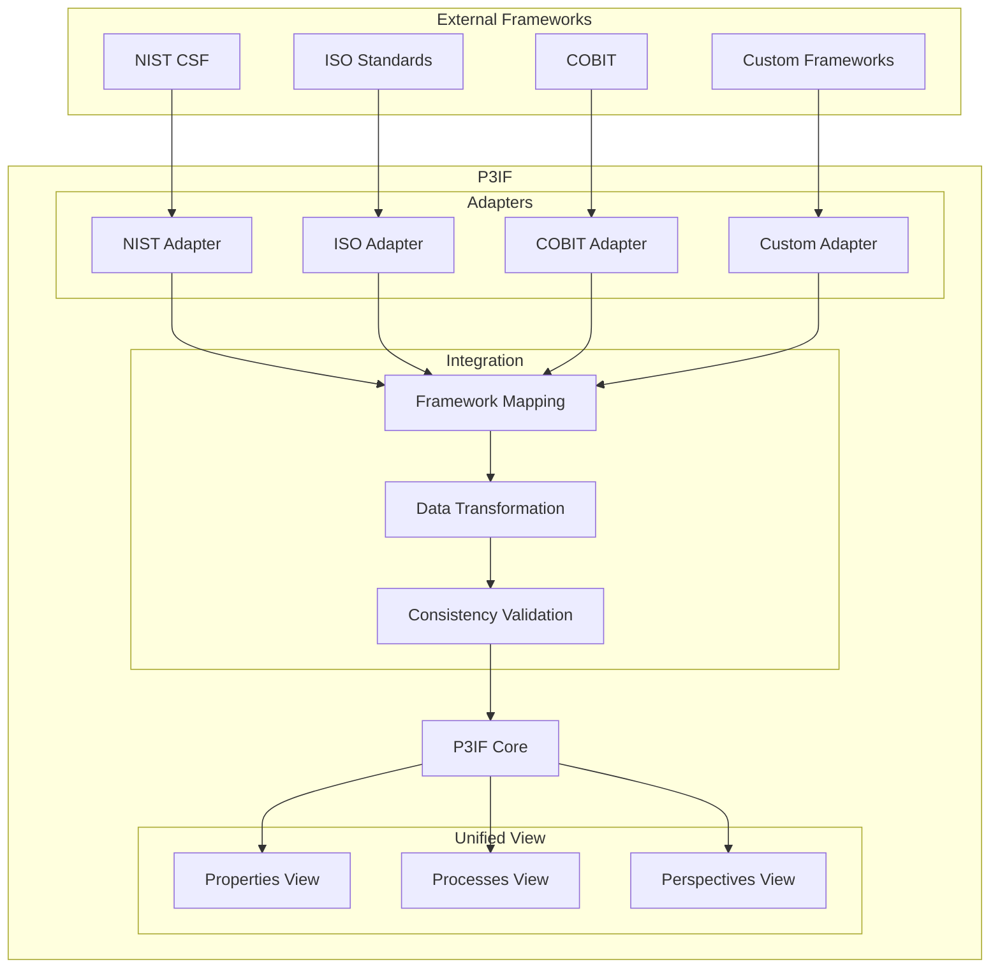
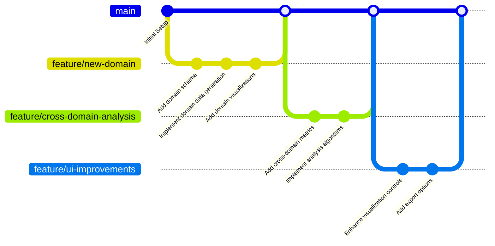

# P3IF Process Flows

This document illustrates the key process flows in the P3IF system using diagrams, reflecting the current implementation and capabilities.

## 🚀 Current Implementation Status

All process flows documented here are **fully implemented** and working in the current P3IF system. The diagrams reflect actual code paths and data flows in the production system.

## Data Generation Flow

The following diagram shows the process flow for generating synthetic data in P3IF:

## Comprehensive Visualization Generation Flow

This diagram illustrates the current implementation of the complete visualization generation process:

## Multi-Domain Analysis Flow

This diagram shows the process of analyzing data across multiple domains:

## User Interaction Flow

This diagram illustrates the user interaction flow when working with the P3IF portal:

## Framework Integration Flow

This diagram shows how P3IF integrates with external frameworks:

## Development Workflow

This diagram illustrates the development workflow for extending P3IF:

