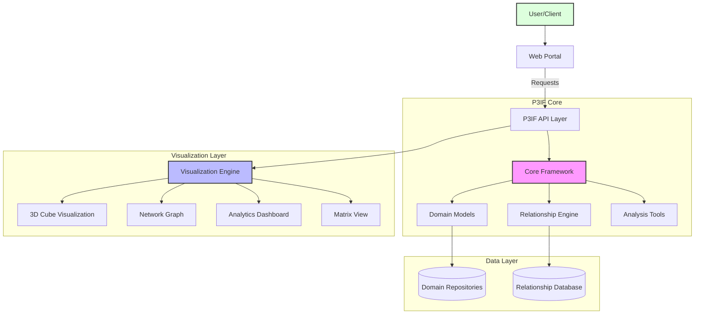
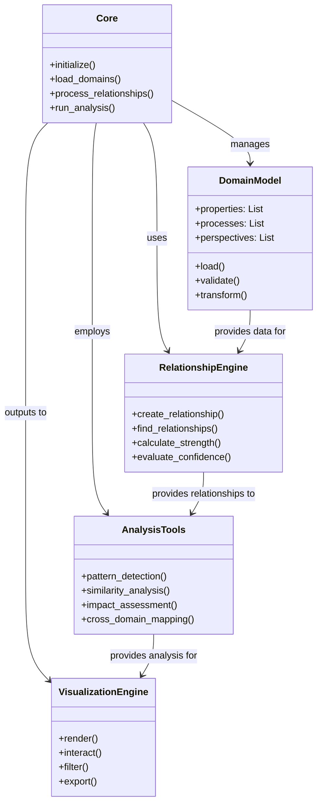
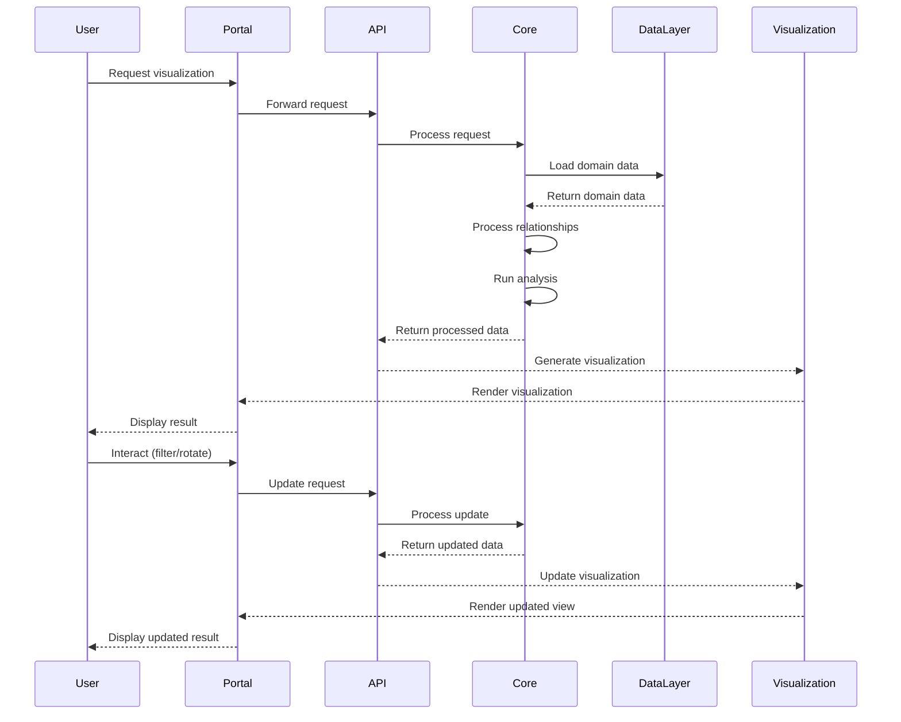
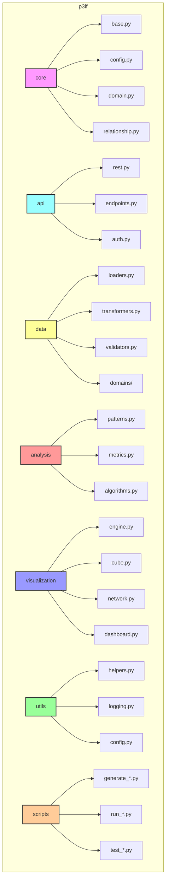
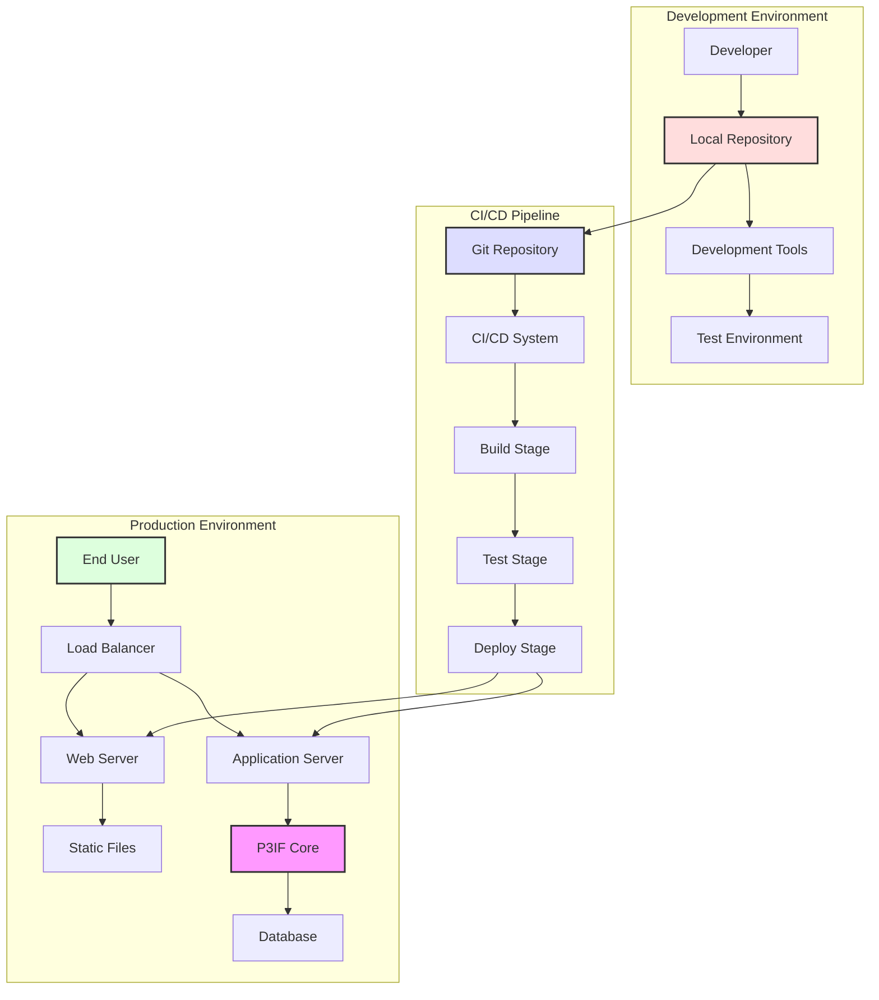
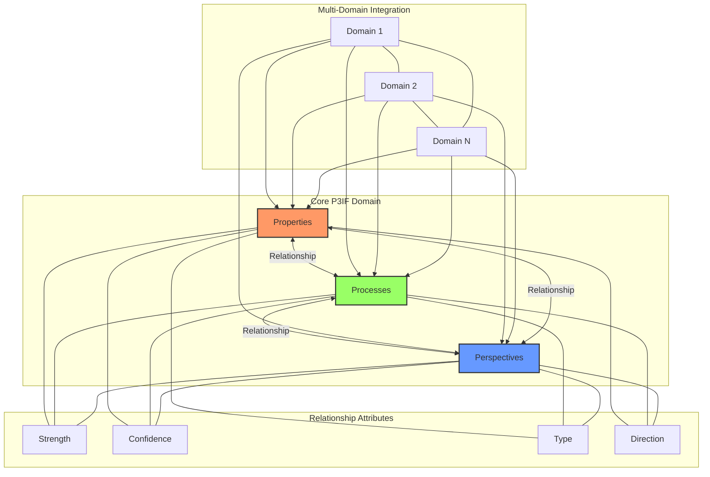
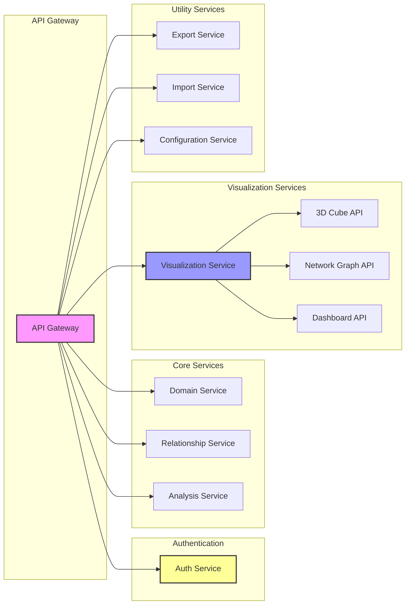
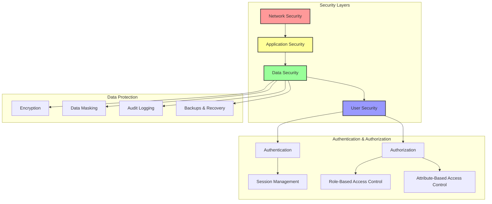

# P3IF System Architecture

This document provides comprehensive architectural diagrams and explanations of the P3IF framework's structure, components, and interactions.

## High-Level Architecture

## Component Relationships

## Data Flow

## Module Structure

## Deployment Architecture

## P3IF Conceptual Model

## API Structure

## Security Model

