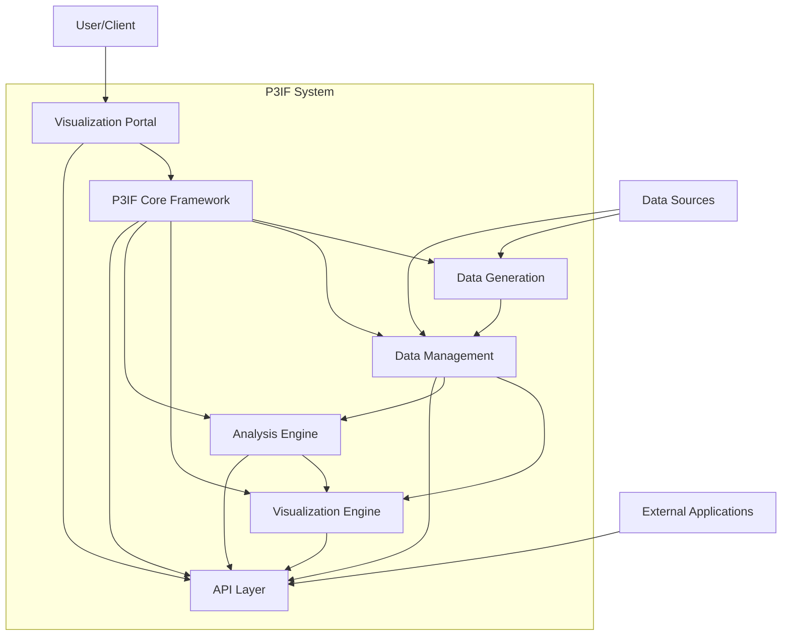
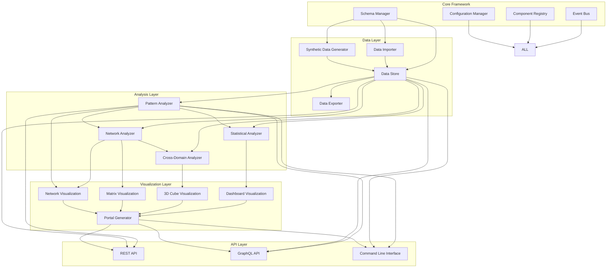
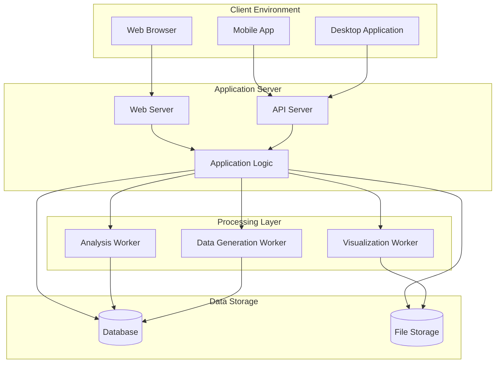
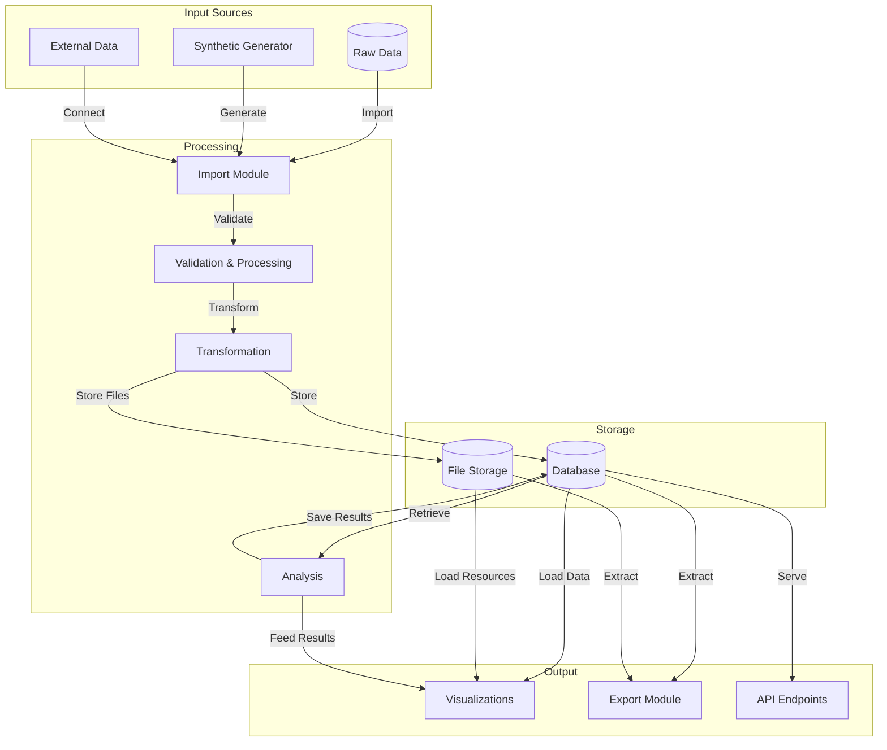
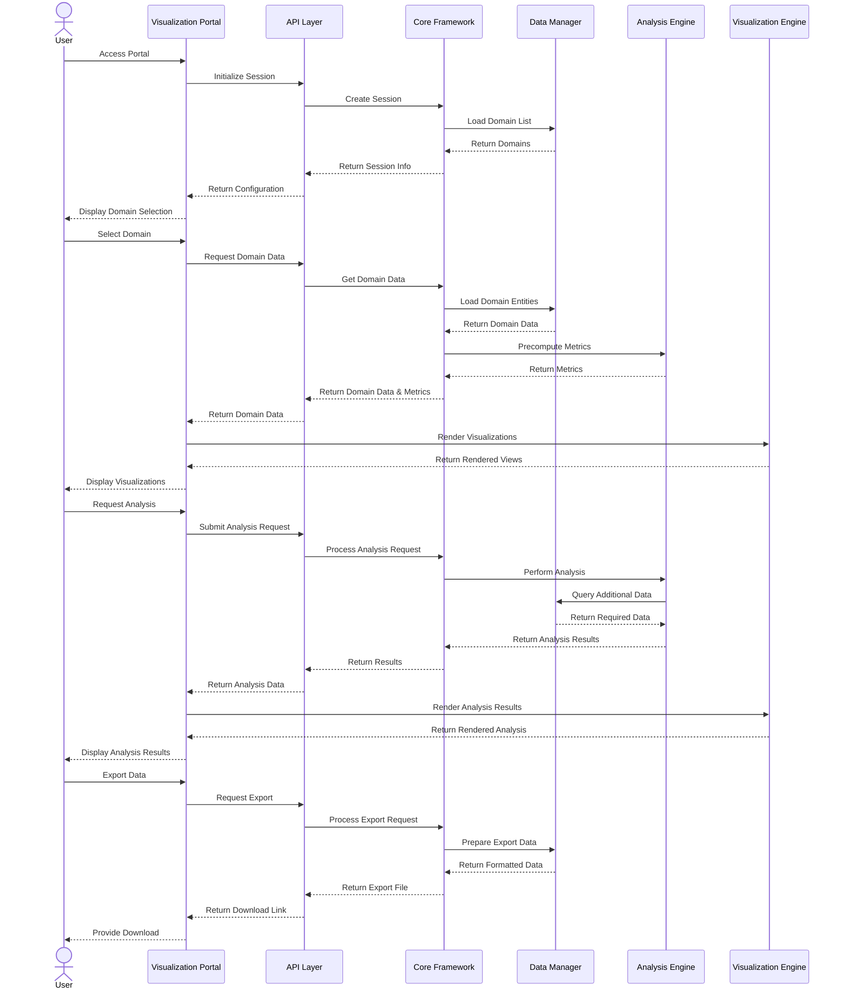
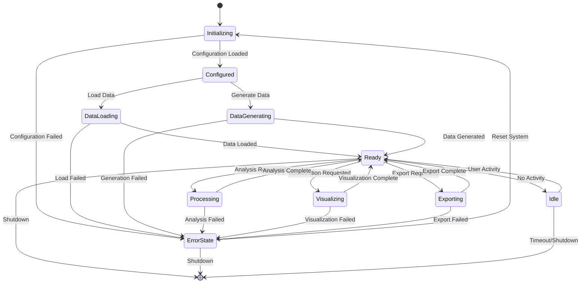
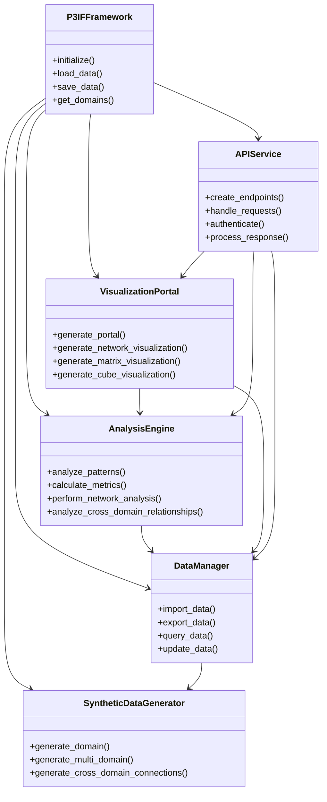

# P3IF System Diagrams

This document provides visual representations of the P3IF system architecture, components, and their interactions.

## System Overview

The following diagram shows the high-level overview of the P3IF system:

## Component Architecture

The following diagram shows the detailed architecture of the P3IF components:

## Deployment Architecture

The following diagram shows the deployment architecture of the P3IF system:

## Data Flow Diagram

The following diagram shows the data flow within the P3IF system:

## Interaction Diagram

The following diagram shows the interaction between components during a typical user session:

## System States

The following diagram shows the possible states of the P3IF system:

## Component Relationships

The following diagram shows the relationships between major components in the P3IF system:

