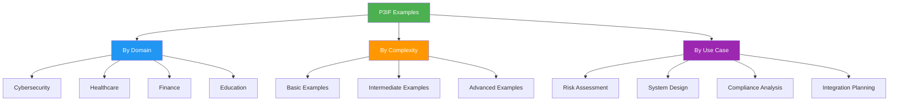
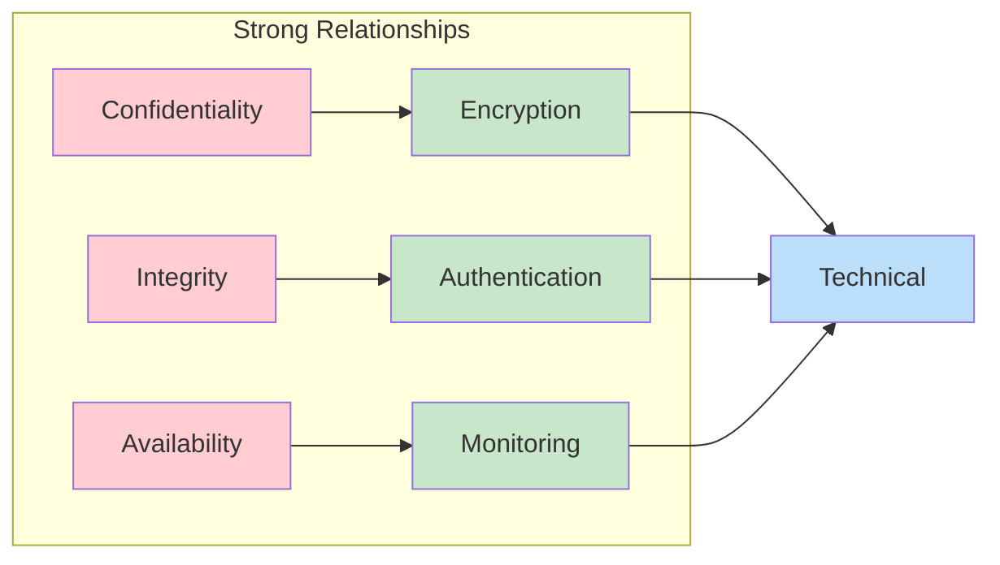
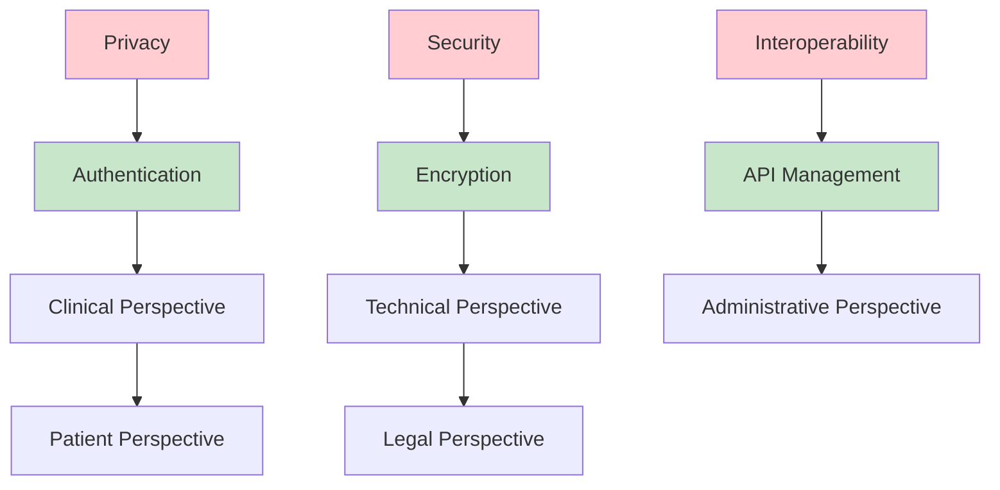
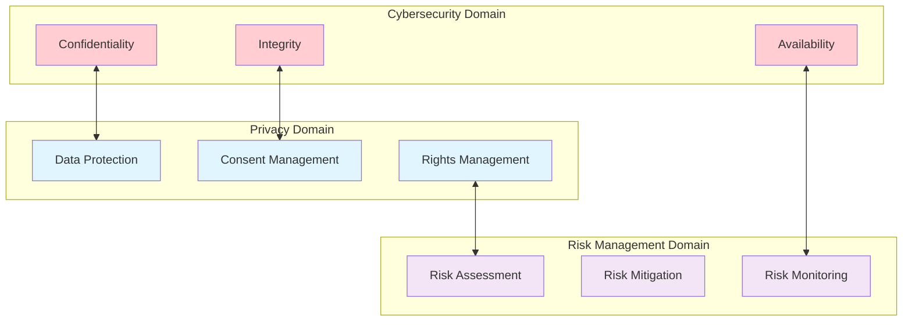

# P3IF Examples

This directory contains practical examples and use cases demonstrating how to apply P3IF (Properties, Processes, and Perspectives Inter-Framework) to various domains and scenarios.

## Overview

The examples are organized by domain and complexity level to help you understand how P3IF can be applied in different contexts.



## Example Categories

### Domain-Specific Examples

#### Cybersecurity Examples
- [Basic Security Framework](cybersecurity/basic-security.md)
- [NIST Cybersecurity Framework Mapping](cybersecurity/nist-mapping.md)
- [Multi-Layer Security Analysis](cybersecurity/multi-layer-analysis.md)
- [Incident Response Planning](cybersecurity/incident-response.md)

#### Healthcare Examples
- [Patient Data Privacy](healthcare/patient-privacy.md)
- [Healthcare Interoperability](healthcare/interoperability.md)
- [Telemedicine Framework](healthcare/telemedicine.md)
- [Medical Device Integration](healthcare/device-integration.md)

#### Financial Services Examples
- [Risk Management Framework](finance/risk-management.md)
- [Regulatory Compliance](finance/compliance.md)
- [Digital Banking Security](finance/digital-banking.md)
- [Payment Processing Analysis](finance/payment-processing.md)

#### Educational Technology Examples
- [Learning Management Systems](education/lms-analysis.md)
- [Student Data Protection](education/data-protection.md)
- [Online Assessment Security](education/assessment-security.md)
- [Educational Content Management](education/content-management.md)

### Use Case Examples

#### Cross-Domain Integration
- [Multi-Domain Portal](integration/multi-domain-portal.md)
- [Framework Harmonization](integration/framework-harmonization.md)
- [Cross-Industry Standards](integration/cross-industry.md)

#### Analytical Applications
- [Gap Analysis](analytics/gap-analysis.md)
- [Relationship Discovery](analytics/relationship-discovery.md)
- [Pattern Recognition](analytics/pattern-recognition.md)
- [Trend Analysis](analytics/trend-analysis.md)

## 🚀 Quick Start Examples

### Example 1: Generate Complete Visualization Suite

The fastest way to see P3IF in action:

```bash
# Generate comprehensive visualizations
python scripts/generate_final_visualizations.py

# Output includes:
# - High-resolution PNG network graphs (small_network.png, large_network.png)
# - Statistical analysis charts (pattern_statistics.png)
# - Animated GIF showing P3IF components (p3if_components.gif)
# - Comprehensive analysis report (visualization_report.md)
```

**Generated Files Structure:**
```
output/p3if_output_YYYYMMDD_HHMMSS/
├── visualizations/
│   ├── networks/
│   │   ├── small_network.png      # 6-pattern network (300 DPI)
│   │   └── large_network.png      # 96-pattern network (300 DPI)
│   └── statistics/
│       └── pattern_statistics.png # Distribution analysis
├── animations/
│   └── framework/
│       └── p3if_components.gif    # Rotating components
└── reports/
    └── visualization_report.md    # Comprehensive report
```

### Example 2: Multi-Domain Analysis Portal

Generate interactive web portal with multiple domains:

```bash
# Create multi-domain portal
python scripts/run_multidomain_portal.py

# Generates interactive visualizations for:
# - Healthcare domain (patient privacy, clinical workflows)
# - Finance domain (risk management, compliance)
# - Cybersecurity domain (CIA triad, threat modeling)
# - Education domain (learning management, data protection)
```

**Key Relationships:**


**Usage:**
```bash
# Generate this example
python scripts/generate_sample_data.py --template basic_cybersecurity

# Visualize
python scripts/run_multidomain_portal.py --domains basic_cybersecurity
```

### Example 2: Healthcare Data Management

This example shows how P3IF can be applied to healthcare data management scenarios.

**Focus Areas:**
- Patient privacy and HIPAA compliance
- Interoperability between systems
- Clinical workflow optimization

**Key Properties:**
- Privacy, Security, Accuracy, Accessibility
- Interoperability, Compliance, Usability

**Key Processes:**
- Data Collection, Processing, Storage, Sharing
- Authentication, Authorization, Audit, Backup

**Key Perspectives:**
- Clinical, Administrative, Technical, Legal, Patient

**Network Visualization:**


### Example 3: Multi-Domain Comparison

This example demonstrates comparing and aligning multiple domains.

**Domains:**
- Cybersecurity (NIST Framework)
- Privacy (GDPR Requirements)
- Risk Management (ISO 31000)

**Comparison Matrix:**

| Property | Cybersecurity | Privacy | Risk Management |
|----------|---------------|---------|-----------------|
| Confidentiality | High | High | Medium |
| Transparency | Low | High | Medium |
| Accountability | Medium | High | High |
| Resilience | High | Medium | High |

**Cross-Domain Relationships:**


## Code Examples

### Python API Usage

```python
from p3if import P3IFClient, Domain, Property, Process, Perspective, Relationship

# Initialize client
client = P3IFClient("http://localhost:5000/api/v1")

# Create a new domain
domain = Domain(
    name="Example Domain",
    description="Demonstration domain for P3IF"
)

# Add properties
properties = [
    Property("security", "Security", "Information security requirements"),
    Property("usability", "Usability", "User experience requirements"),
    Property("performance", "Performance", "System performance requirements")
]

# Add processes
processes = [
    Process("design", "Design", "System design process"),
    Process("testing", "Testing", "Quality assurance testing"),
    Process("deployment", "Deployment", "System deployment process")
]

# Add perspectives
perspectives = [
    Perspective("developer", "Developer", "Development team viewpoint"),
    Perspective("user", "User", "End user viewpoint"),
    Perspective("business", "Business", "Business stakeholder viewpoint")
]

# Create relationships
relationships = [
    Relationship("security", "testing", "developer", strength=0.9, confidence=0.8),
    Relationship("usability", "design", "user", strength=0.85, confidence=0.9),
    Relationship("performance", "deployment", "business", strength=0.7, confidence=0.75)
]

# Save domain
domain_id = client.domains.create(domain, properties, processes, perspectives, relationships)

# Generate visualization
viz_config = {
    "type": "network",
    "domain_id": domain_id,
    "layout": "force_directed"
}
visualization = client.visualizations.generate(viz_config)
```

### JavaScript Visualization

```javascript
// Create interactive visualization
const p3if = new P3IFVisualization({
    container: '#visualization',
    width: 800,
    height: 600,
    data: {
        domain: 'cybersecurity',
        properties: [...],
        processes: [...],
        perspectives: [...],
        relationships: [...]
    },
    options: {
        layout: 'force',
        colorScheme: 'default',
        showLabels: true,
        enableInteraction: true
    }
});

// Event handlers
p3if.on('nodeClick', (node) => {
    console.log('Clicked node:', node);
    // Show node details
});

p3if.on('edgeClick', (edge) => {
    console.log('Clicked edge:', edge);
    // Show relationship details
});

// Render visualization
p3if.render();
```

## Data Formats

### JSON Domain Definition

```json
{
  "name": "Example Domain",
  "description": "Complete domain definition example",
  "version": "1.0",
  "metadata": {
    "author": "P3IF Team",
    "created": "2024-01-01",
    "tags": ["example", "tutorial"]
  },
  "properties": [
    {
      "id": "prop1",
      "name": "Property Name",
      "description": "Property description",
      "category": "security",
      "weight": 1.0,
      "attributes": {
        "mandatory": true,
        "measurable": true
      }
    }
  ],
  "processes": [
    {
      "id": "proc1",
      "name": "Process Name",
      "description": "Process description",
      "category": "operational",
      "complexity": "medium",
      "attributes": {
        "automated": false,
        "frequency": "daily"
      }
    }
  ],
  "perspectives": [
    {
      "id": "persp1",
      "name": "Perspective Name",
      "description": "Perspective description",
      "stakeholder": "business",
      "priority": "high",
      "attributes": {
        "influence": "high",
        "interest": "medium"
      }
    }
  ],
  "relationships": [
    {
      "id": "rel1",
      "property_id": "prop1",
      "process_id": "proc1",
      "perspective_id": "persp1",
      "strength": 0.8,
      "confidence": 0.9,
      "type": "positive",
      "metadata": {
        "source": "expert_judgment",
        "validated": true,
        "last_updated": "2024-01-01"
      }
    }
  ]
}
```

## Visualization Examples

### Network Diagram Configuration

```javascript
const networkConfig = {
  nodes: {
    properties: {
      color: '#ff6b6b',
      size: node => Math.sqrt(node.connections) * 10,
      shape: 'circle'
    },
    processes: {
      color: '#4ecdc4',
      size: node => Math.sqrt(node.connections) * 10,
      shape: 'square'
    },
    perspectives: {
      color: '#45b7d1',
      size: node => Math.sqrt(node.connections) * 10,
      shape: 'triangle'
    }
  },
  edges: {
    width: edge => edge.strength * 5,
    opacity: edge => edge.confidence,
    color: '#999999'
  },
  layout: {
    algorithm: 'force',
    iterations: 100,
    springLength: 100,
    springStrength: 0.1
  }
};
```

### 3D Cube Visualization

```javascript
const cubeConfig = {
  dimensions: {
    x: 'properties',
    y: 'processes',
    z: 'perspectives'
  },
  visualization: {
    showGrid: true,
    enableRotation: true,
    animationSpeed: 1.0,
    pointSize: relationship => relationship.strength * 10,
    pointColor: relationship => {
      if (relationship.confidence > 0.8) return '#4CAF50';
      if (relationship.confidence > 0.6) return '#FF9800';
      return '#F44336';
    }
  },
  interaction: {
    hover: true,
    click: true,
    zoom: true,
    rotation: true
  }
};
```

## Best Practices

### Domain Design

1. **Start Simple**: Begin with core elements and expand gradually
2. **Clear Definitions**: Ensure each element has a clear, unambiguous definition
3. **Consistent Granularity**: Keep elements at similar levels of abstraction
4. **Validate Relationships**: Ensure relationships make logical sense

### Data Quality

1. **Strength Values**: Use consistent scales and criteria
2. **Confidence Levels**: Document the basis for confidence assessments
3. **Metadata**: Include source information and validation status
4. **Version Control**: Track changes over time

### Visualization Design

1. **Purpose-Driven**: Choose visualizations that serve your analysis goals
2. **Audience-Appropriate**: Consider the technical level of your audience
3. **Interactive Elements**: Enable exploration and discovery
4. **Performance**: Optimize for large datasets

## Contributing Examples

We welcome contributions of new examples! To add an example:

1. Create a new directory under the appropriate category
2. Include complete data files in JSON format
3. Provide clear documentation and instructions
4. Add visualization configurations if applicable
5. Include expected outputs or screenshots

### Example Submission Template

```markdown
# Example Name

## Overview
Brief description of the example and its purpose.

## Use Case
Description of when and why to use this example.

## Data
- Properties: X items
- Processes: Y items  
- Perspectives: Z items
- Relationships: N items

## Key Insights
What insights or patterns does this example demonstrate?

## Files
- `domain.json`: Main domain definition
- `config.yaml`: Visualization configuration
- `README.md`: This documentation

## Usage
```bash
# How to run this example
```

## Expected Output
Description or screenshots of expected results.
```

## Additional Resources

- [P3IF Core Documentation](../concepts/P3IF.md)
- [API Reference](../api/README.md)
- [Visualization Guide](../visualization/user_guide.md)
- [Configuration Guide](../guides/configuration.md)
- [Tutorials](../tutorials/) 