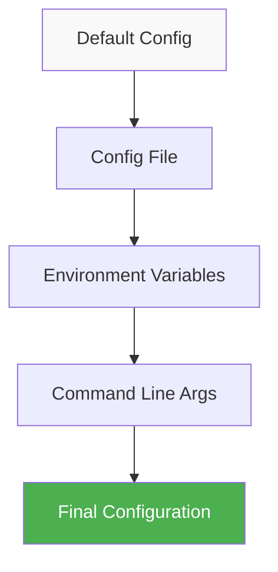
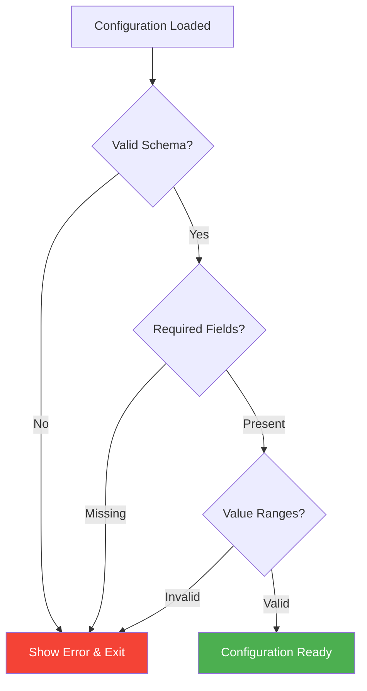

# P3IF Configuration Guide

This guide provides comprehensive information on configuring the P3IF (Properties, Processes, and Perspectives Inter-Framework) system for different environments and use cases.

## Configuration Overview

P3IF uses a hierarchical configuration system that supports multiple configuration sources:

1. **Default Configuration**: Built-in defaults for all settings
2. **Configuration Files**: YAML or JSON configuration files
3. **Environment Variables**: Override any configuration value
4. **Command Line Arguments**: Runtime overrides

## Configuration Structure



## Configuration Files

### Main Configuration File

Create `config/config.yaml` in your P3IF installation:

```yaml
# P3IF Main Configuration
app:
  name: "P3IF"
  version: "1.0.0"
  debug: false
  host: "0.0.0.0"
  port: 5000
  secret_key: "your-secret-key-here"
  timezone: "UTC"
  
  # Application behavior
  max_upload_size: "100MB"
  session_timeout: 3600  # seconds
  enable_cors: true
  cors_origins:
    - "http://localhost:3000"
    - "https://your-domain.com"

# Database Configuration
database:
  type: "sqlite"  # sqlite, postgresql, mysql
  
  # SQLite Configuration
  path: "data/p3if.db"
  
  # PostgreSQL Configuration (when type: postgresql)
  host: "localhost"
  port: 5432
  name: "p3if"
  user: "p3if_user"
  password: "your_password"
  ssl_mode: "prefer"
  
  # Connection Pool Settings
  pool_size: 10
  max_overflow: 20
  pool_timeout: 30
  pool_recycle: 3600

# Data Management
data:
  # Directory paths
  default_domain_path: "data/domains"
  synthetic_data_path: "data/synthetic"
  export_path: "data/exports"
  cache_path: "data/cache"
  
  # Data processing settings
  max_relationships_per_domain: 10000
  default_relationship_strength: 0.5
  default_confidence_level: 0.7
  
  # Synthetic data generation
  synthetic:
    default_properties_count: 15
    default_processes_count: 12
    default_perspectives_count: 8
    relationship_density: 0.3

# Visualization Configuration
visualization:
  # Default dimensions
  default_width: 800
  default_height: 600
  
  # Caching
  cache_enabled: true
  cache_path: "data/viz_cache"
  cache_max_size: "1GB"
  cache_ttl: 86400  # seconds
  
  # Rendering options
  default_theme: "default"
  available_themes:
    - "default"
    - "dark"
    - "high_contrast"
    - "colorblind_friendly"
  
  # 3D Visualization settings
  cube_3d:
    default_zoom: 1.0
    animation_speed: 1.0
    enable_rotation: true
    show_grid: true
    grid_opacity: 0.1
  
  # Network visualization settings
  network:
    node_size_range: [5, 30]
    edge_width_range: [1, 10]
    layout_algorithm: "force_directed"
    physics_enabled: true

# API Configuration
api:
  version: "v1"
  prefix: "/api"
  
  # Authentication
  auth_enabled: true
  auth_type: "token"  # token, oauth, basic
  token_expiry: 86400  # seconds
  
  # Rate limiting
  rate_limiting:
    enabled: true
    requests_per_minute: 60
    requests_per_hour: 1000
    burst_limit: 100
  
  # Pagination
  default_page_size: 20
  max_page_size: 100
  
  # Response formats
  supported_formats:
    - "json"
    - "xml"
    - "csv"

# Logging Configuration
logging:
  level: "INFO"  # DEBUG, INFO, WARNING, ERROR, CRITICAL
  format: "[%(asctime)s] %(levelname)s in %(module)s: %(message)s"
  
  # File logging
  file:
    enabled: true
    path: "logs/p3if.log"
    max_size: "10MB"
    backup_count: 5
    rotation: "daily"
  
  # Console logging
  console:
    enabled: true
    level: "INFO"
  
  # Structured logging (JSON)
  structured:
    enabled: false
    include_trace_id: true

# Security Configuration
security:
  # CSRF Protection
  csrf_enabled: true
  csrf_token_timeout: 3600
  
  # Content Security Policy
  csp_enabled: true
  csp_policy: "default-src 'self'; script-src 'self' 'unsafe-inline'"
  
  # Headers
  security_headers:
    x_frame_options: "DENY"
    x_content_type_options: "nosniff"
    x_xss_protection: "1; mode=block"
    strict_transport_security: "max-age=31536000; includeSubDomains"
  
  # API Security
  api_key_required: true
  jwt_secret: "your-jwt-secret"
  password_policy:
    min_length: 8
    require_uppercase: true
    require_lowercase: true
    require_numbers: true
    require_special_chars: true

# Performance Configuration
performance:
  # Caching
  redis:
    enabled: false
    host: "localhost"
    port: 6379
    db: 0
    password: null
  
  # Background tasks
  celery:
    enabled: false
    broker_url: "redis://localhost:6379/0"
    result_backend: "redis://localhost:6379/0"
  
  # Memory management
  memory:
    max_memory_usage: "2GB"
    gc_threshold: 0.8
    enable_profiling: false

# Monitoring and Metrics
monitoring:
  # Health checks
  health_check_enabled: true
  health_check_interval: 30  # seconds
  
  # Metrics collection
  metrics:
    enabled: false
    provider: "prometheus"  # prometheus, statsd
    endpoint: "/metrics"
  
  # Error tracking
  error_tracking:
    enabled: false
    provider: "sentry"
    dsn: "your-sentry-dsn"

# External Integrations
integrations:
  # Git integration for version control
  git:
    enabled: false
    auto_commit: false
    commit_message_template: "Auto-commit: {timestamp}"
  
  # Export integrations
  export:
    s3:
      enabled: false
      bucket: "p3if-exports"
      region: "us-east-1"
      access_key_id: "your-access-key"
      secret_access_key: "your-secret-key"
  
  # Notification integrations
  notifications:
    email:
      enabled: false
      smtp_server: "smtp.gmail.com"
      smtp_port: 587
      username: "your-email@gmail.com"
      password: "your-password"
    slack:
      enabled: false
      webhook_url: "your-slack-webhook"

# Feature Flags
features:
  experimental_visualizations: false
  beta_api_endpoints: false
  advanced_analytics: true
  multi_tenant_support: false
  real_time_collaboration: false
```

## Environment-Specific Configurations

### Development Configuration

Create `config/development.yaml`:

```yaml
app:
  debug: true
  host: "127.0.0.1"
  port: 5000

database:
  type: "sqlite"
  path: "data/dev_p3if.db"

logging:
  level: "DEBUG"
  console:
    enabled: true
    level: "DEBUG"

security:
  csrf_enabled: false
  api_key_required: false

features:
  experimental_visualizations: true
  beta_api_endpoints: true
```

### Testing Configuration

Create `config/testing.yaml`:

```yaml
app:
  debug: true
  testing: true

database:
  type: "sqlite"
  path: ":memory:"

logging:
  level: "WARNING"
  file:
    enabled: false

data:
  default_domain_path: "tests/fixtures/domains"
  synthetic_data_path: "tests/temp/synthetic"
  export_path: "tests/temp/exports"

visualization:
  cache_enabled: false
```

### Production Configuration

Create `config/production.yaml`:

```yaml
app:
  debug: false
  host: "0.0.0.0"
  port: 5000

database:
  type: "postgresql"
  host: "db.example.com"
  port: 5432
  name: "p3if_prod"
  user: "p3if_user"
  ssl_mode: "require"

logging:
  level: "INFO"
  file:
    enabled: true
    path: "/var/log/p3if/p3if.log"
  structured:
    enabled: true

security:
  csrf_enabled: true
  api_key_required: true
  
performance:
  redis:
    enabled: true
    host: "redis.example.com"
  celery:
    enabled: true

monitoring:
  health_check_enabled: true
  metrics:
    enabled: true
  error_tracking:
    enabled: true
```

## Environment Variables

All configuration values can be overridden using environment variables with the prefix `P3IF_`:

```bash
# Basic settings
export P3IF_APP_DEBUG=false
export P3IF_APP_HOST=0.0.0.0
export P3IF_APP_PORT=5000
export P3IF_APP_SECRET_KEY=your-secret-key

# Database settings
export P3IF_DATABASE_TYPE=postgresql
export P3IF_DATABASE_HOST=localhost
export P3IF_DATABASE_NAME=p3if
export P3IF_DATABASE_USER=p3if_user
export P3IF_DATABASE_PASSWORD=your-password

# Logging settings
export P3IF_LOGGING_LEVEL=INFO
export P3IF_LOGGING_FILE_PATH=/var/log/p3if/p3if.log

# Security settings
export P3IF_SECURITY_API_KEY_REQUIRED=true
export P3IF_SECURITY_JWT_SECRET=your-jwt-secret

# Performance settings
export P3IF_PERFORMANCE_REDIS_ENABLED=true
export P3IF_PERFORMANCE_REDIS_HOST=redis.example.com
```

### Environment Variable Naming Convention

- Use `P3IF_` prefix
- Use uppercase letters
- Replace dots with underscores
- Nested values use double underscores

Examples:
- `app.debug` → `P3IF_APP_DEBUG`
- `database.host` → `P3IF_DATABASE_HOST`
- `logging.file.path` → `P3IF_LOGGING_FILE_PATH`
- `visualization.cube_3d.default_zoom` → `P3IF_VISUALIZATION_CUBE_3D_DEFAULT_ZOOM`

## Command Line Configuration

Override configuration values at runtime:

```bash
# Start with custom configuration
python app.py --config config/production.yaml

# Override specific values
python app.py --host 0.0.0.0 --port 8080 --debug

# Use environment-specific config
python app.py --env production

# Enable specific features
python app.py --enable-feature experimental_visualizations
```

## Configuration Validation

P3IF validates configuration on startup. Common validation rules:



### Required Configuration

Minimal required configuration:

```yaml
app:
  secret_key: "must-be-set-in-production"

database:
  type: "sqlite"
  path: "data/p3if.db"
```

### Configuration Schema

The system validates against this schema:

```yaml
type: object
required:
  - app
  - database
properties:
  app:
    type: object
    required:
      - secret_key
    properties:
      secret_key:
        type: string
        minLength: 32
      port:
        type: integer
        minimum: 1
        maximum: 65535
  database:
    type: object
    required:
      - type
    properties:
      type:
        type: string
        enum: ["sqlite", "postgresql", "mysql"]
```

## Dynamic Configuration

Some configuration values can be changed at runtime:

### Via API

```bash
# Update logging level
curl -X PUT http://localhost:5000/api/v1/config/logging/level \
  -H "Content-Type: application/json" \
  -d '{"value": "DEBUG"}'

# Update visualization cache settings
curl -X PUT http://localhost:5000/api/v1/config/visualization/cache_enabled \
  -H "Content-Type: application/json" \
  -d '{"value": false}'
```

### Via Admin Interface

1. Navigate to `http://localhost:5000/admin/config`
2. Select the configuration section
3. Modify values in the web interface
4. Click "Apply Changes"

## Configuration Best Practices

### 1. Security

```yaml
# ✅ Good: Use environment variables for secrets
database:
  password: "${DATABASE_PASSWORD}"

# ❌ Bad: Hardcode secrets in config files
database:
  password: "my-secret-password"
```

### 2. Environment Separation

```yaml
# ✅ Good: Use environment-specific configs
app:
  debug: "${DEBUG:-false}"
  
# ❌ Bad: Same config for all environments
app:
  debug: true
```

### 3. Validation

```yaml
# ✅ Good: Validate configuration on startup
validation:
  strict_mode: true
  fail_on_unknown_keys: true

# ❌ Bad: Ignore validation errors
validation:
  strict_mode: false
```

### 4. Documentation

```yaml
# ✅ Good: Document configuration options
api:
  rate_limiting:
    enabled: true  # Enable API rate limiting
    requests_per_minute: 60  # Max requests per minute per user
    
# ❌ Bad: No documentation
api:
  rate_limiting:
    enabled: true
    requests_per_minute: 60
```

## Troubleshooting Configuration

### Common Issues

1. **Configuration File Not Found**
   ```bash
   ERROR: Config file not found: config/config.yaml
   
   # Solution: Create the file or specify correct path
   python app.py --config /path/to/config.yaml
   ```

2. **Invalid YAML Syntax**
   ```bash
   ERROR: Invalid YAML syntax in config file
   
   # Solution: Validate YAML syntax
   python -c "import yaml; yaml.safe_load(open('config/config.yaml'))"
   ```

3. **Environment Variable Override Not Working**
   ```bash
   # Ensure correct naming
   export P3IF_APP_DEBUG=true  # ✅ Correct
   export P3IF_DEBUG=true      # ❌ Incorrect
   ```

4. **Database Connection Failed**
   ```bash
   # Check database configuration
   python scripts/test_db_connection.py
   ```

### Debug Configuration

Enable configuration debugging:

```bash
export P3IF_CONFIG_DEBUG=true
python app.py
```

This will output:
- Configuration file locations searched
- Environment variables loaded
- Final merged configuration
- Validation results

## Advanced Configuration

### Custom Configuration Providers

Create custom configuration sources:

```python
from p3if.config import ConfigProvider

class ConsulConfigProvider(ConfigProvider):
    def load_config(self):
        # Load configuration from Consul
        return consul_client.get_config()

# Register custom provider
config_manager.add_provider(ConsulConfigProvider())
```

### Configuration Templates

Use Jinja2 templates for dynamic configuration:

```yaml
# config/config.yaml.j2
app:
  name: "{{ APP_NAME | default('P3IF') }}"
  debug: {{ DEBUG | default(false) | lower }}
  
database:
  host: "{{ DB_HOST | default('localhost') }}"
  port: {{ DB_PORT | default(5432) }}
```

### Configuration Encryption

Encrypt sensitive configuration values:

```yaml
database:
  password: "!encrypted:AES:base64encodedvalue"
  
security:
  secret_key: "!encrypted:AES:anothersecretvalue"
```

## Configuration Management Tools

### Ansible Playbook

```yaml
- name: Configure P3IF
  template:
    src: config.yaml.j2
    dest: /opt/p3if/config/config.yaml
  vars:
    app_debug: false
    db_host: "{{ database_host }}"
    db_password: "{{ vault_db_password }}"
```

### Docker Configuration

```dockerfile
# Use configuration from environment
ENV P3IF_APP_HOST=0.0.0.0
ENV P3IF_APP_PORT=5000
ENV P3IF_DATABASE_TYPE=postgresql

# Copy configuration file
COPY config/production.yaml /app/config/config.yaml
```

### Kubernetes ConfigMap

```yaml
apiVersion: v1
kind: ConfigMap
metadata:
  name: p3if-config
data:
  config.yaml: |
    app:
      debug: false
      host: "0.0.0.0"
      port: 5000
    database:
      type: "postgresql"
      host: "postgres-service"
```

For more advanced deployment scenarios, see the [Deployment Guide](deployment.md). 