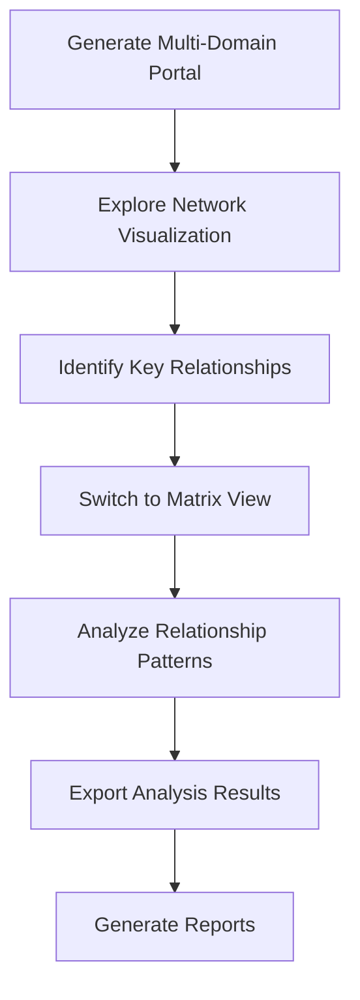

# Getting Started with P3IF

This guide provides a quick introduction to using P3IF for visualizing and analyzing multi-domain data relationships.

## Prerequisites

Before you begin, ensure you have:

1. Python 3.8 or later installed
2. Git installed (for cloning the repository)
3. Basic familiarity with command-line interfaces

## Installation

1. Clone the P3IF repository:

   ```bash
   git clone https://github.com/yourusername/p3if.git
   cd p3if
   ```

2. Set up a virtual environment (optional but recommended):

   ```bash
   python -m venv venv
   source venv/bin/activate  # On Windows: venv\Scripts\activate
   ```

3. Install the required dependencies:

   ```bash
   pip install -r requirements.txt
   ```

## Basic Usage

### Generating Visualizations

The quickest way to get started with P3IF is to generate a multi-domain visualization portal:

```bash
python scripts/run_multidomain_portal.py --output-dir output
```

This will:
1. Generate synthetic data for available domains
2. Create cross-domain connections
3. Generate an interactive visualization portal
4. Open the portal in your default web browser

### Exploring the Portal

Once the portal is open, you can:

1. **Select Domains**: Use the dropdown to switch between different domains
2. **Explore Visualizations**: Navigate between different visualization types:
   - Network View: Interactive node-link diagram
   - Matrix View: Adjacency matrix representation
   - 3D Cube: Three-dimensional visualization of P3IF
   - Dashboard: Combined analytics dashboard

3. **Interact with Data**:
   - Hover over elements to see details
   - Click on elements to focus
   - Use filters to narrow down the view
   - Search for specific items

## Example Workflow

Here's a typical workflow for analyzing multi-domain relationships with P3IF:



### Step 1: Generate Synthetic Data

If you want to create custom synthetic data:

```bash
python scripts/run_multidomain_portal.py --domains cybersecurity,healthcare --relationships 100 --cross-domain 30 --output-dir output
```

This command generates a portal with:
- Data for cybersecurity and healthcare domains
- 100 relationships per domain
- 30 cross-domain connections

### Step 2: Generate All Visualizations

To generate the complete set of visualizations for all domains:

```bash
bash scripts/generate_visualizations.sh
```

This creates:
- The main multi-domain portal
- Individual domain visualizations
- Cross-domain visualizations
- Dashboard visualizations

### Step 3: Analyze Relationships

1. Open the generated portal at `output/index.html`
2. Use the domain selector to navigate between domains
3. Explore the different visualization types
4. Export data for further analysis

## Next Steps

After getting familiar with the basic functionality, you can:

1. **Integrate Real Data**: Replace synthetic data with your own dataset
2. **Customize Visualizations**: Modify the visualization templates
3. **Extend the Framework**: Add new domains or relationship types
4. **Automate Analysis**: Set up scheduled runs for continuous monitoring

## Troubleshooting

### Common Issues

- **Visualization not loading**: Check your browser console for errors
- **Missing data**: Verify that the data generation completed successfully
- **Cross-domain connections not appearing**: Ensure you specified a non-zero value for cross-domain connections

### Getting Help

If you encounter issues or have questions:

1. Check the documentation in the `docs` directory
2. Look for similar issues in the GitHub repository
3. Create a new issue if your problem is not addressed

## Further Reading

- [Configuration Guide](configuration.md): Detailed configuration options
- [Data Model Documentation](../technical/data-model.md): Understanding the P3IF data model
- [API Reference](../api/README.md): Using the P3IF API
- [Advanced Features](../tutorials/advanced-features.md): Advanced usage scenarios