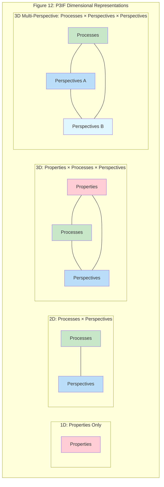
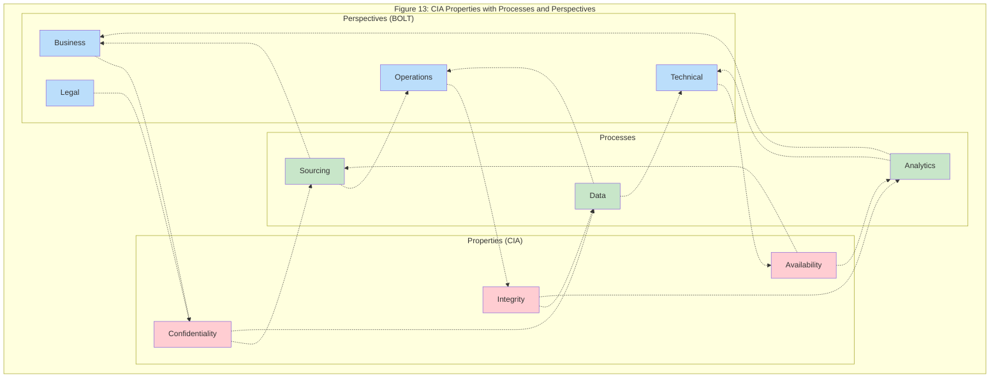
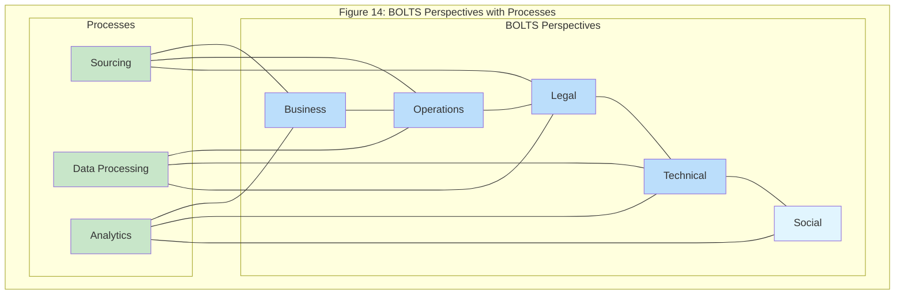
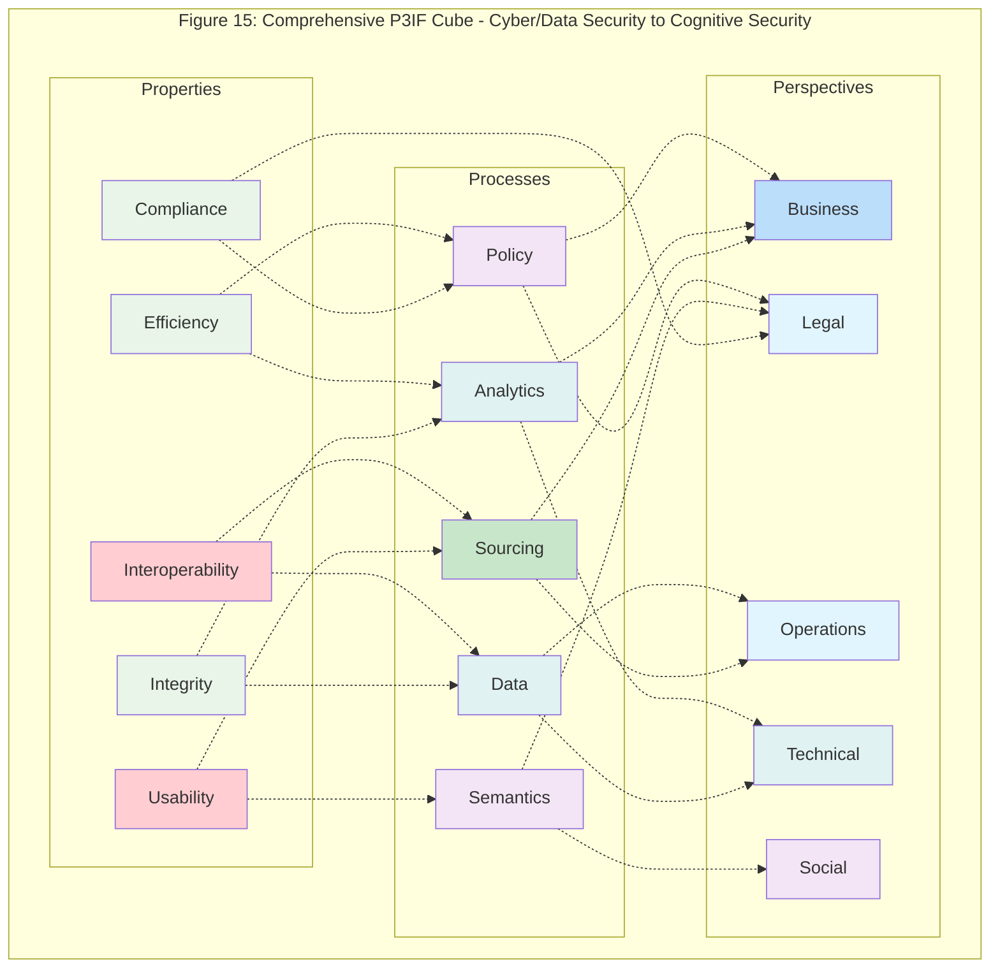

The Properties, Processes, and
Perspectives Inter-Framework (P3IF)
Multiplexing interdisciplinary requirements frameworks to manage
information risk and foster cognitive security
Thomas M. Wilkinson
1* RJ Cordes
2,3,4 Scott David
3,5 Daniel Ari Friedman
2,3,6
1. Office of Health Security, U.S. Department of Homeland Security
2. Cognitive Security and Education Forum (COGSEC)
3. Active Inference Institute
4. Pivot for Humanity
5. Information Risk and Synthetic Intelligence Research Initiative (IRSIRI), University of Washington, Applied Physics Laboratory
6. University of California, Davis, Department of Entomology and Nematology
* Corresponding author email address: OHS_CMIO@hq.dhs.gov
Abstract
Requirements engineering frameworks have historically been developed in the context of
cybersecurity and have tended to focus almost exclusively on the technical and operational aspects
of data security. Now, however, frameworks are being stretched to support interdisciplinary and
multiorganizational information systems, requirements, and risks, securing downstream processes
such as data analytics and balancing cross-domain priorities and perspectives. In this paper, we (i)
explore the purpose of frameworks and their function in facilitating requirements engineering in
information systems, (ii) perform an analysis of the relationships and lineages of common
frameworks in professional use today, and (iii) propose the Properties, Processes, and Perspectives
Inter-Framework (P3IF). P3IF enables flexible requirements engineering for complex information
systems by providing a modular abstraction layer between existing frameworks, extending their
value without replacing them. Factors from frameworks used across disparate domains are
multiplexed to harmonize vocabularies and narratives across different organizations and needs, to
create new approaches to managing information risk, and to enhance the cognitive security of
decisions-makers by expanding security considerations beyond cybersecurity to include the entire
information pipeline from sourcing to semantics.
Keywords: Requirements Engineering, Cybersecurity, Cognitive Security, Health Security, Evidence-Based
Decision-Making, Interdisciplinary Interoperable Frameworks, Shared Risk Management, Knowledge Management
0
Introduction
Institutions and organizations that deal with complex systems and evidence-based
decisions ultimately rely on people to process critical information, and this can challenge
any individual's cognitive capacity. Where high-consequence decisions are made, this
represents an emerging vulnerability. The complex area of health security offers examples
of these challenges, and this paper will draw multiple examples from that domain to
illustrate an approach toward protecting the integrity and validity of those decisions.
The Centers for Disease Control and Prevention (CDC) defines evidence-based
decision-making as the process for making decisions about a program, practice, or policy
that is grounded in the best available research evidence. But what happens when the
volume and technical complexity of that research exceeds the situational capabilities of an
individual human decision maker? The decision maker then becomes vulnerable to altered
evidence, cherry-picked results, misapplied statistics, or unwarranted conclusions.
Combined, these might be either innocently misleading or intentionally leveraged into a
manipulated scientific narrative that appears technically sound, but is instead dangerously
deceptive.
The concept of "cognitive security" arises in response to these vulnerabilities at the
interface of human cognitive capacities and organizational information needs. Where the
decision maker is a traditional cybersecurity professional, decisions might be made more
reliable by incorporating available external affordances, such as expanded cyber toolkits,
novel sensors, additional people, and even artificial intelligence, to help guide individual
and group decisions in relation to the complexity of the environment. That is, cognitive
vulnerabilities might be mitigated by offloading some of the cognitive load through
externalization within the environment, a phenomenon sometimes referred to as "situated
cognition" [1]. However, with today's massively distributed information networks affecting
all facets of society, the functional interaction surface between any organization and the
rest of the world has become equivalent to its attack and accident surface, creating an
urgent need to support human cognition across all domains, well beyond those
traditionally grouped as cybersecurity. We need to focus on the broader domain of
cognitive security and adapt yesterday's cybersecurity tools for use by a broad range of
organizational actors, while maintaining continuity and the best insights of prior models.
We expand the notion of cognitive security beyond its cybersecurity roots to encompass
evidence-based decision-making scenarios of all kinds and in any organization, but
especially those which are high-consequence and rely on evidence supplied from
interdisciplinary information systems, such as food, water, and health security decisions.
1
We asked: how might cognitive security be institutionalized and standardized so that it can
be integrated with all such evidence-based decisions? It's not a question of securing the
scientific or empirical "truth" from the evidence, an endeavor which will always be
imperfect. Instead, cognitive security deals with questions and measurements of the
integrity of the information supply chain that feeds and expresses organizational decisions,
and the validity of the evidence applied in such complex and technical decisions. Cognitive
security seeks to protect the integrity of decision-making and reduce the potential for a
variety of malignant or negligent influences.
The health security context illustrates the cognitive security challenges that arise in highly
complex domains where decisions are made across a broadly distributed system of loosely
coupled humans. How can organizations involved in securing healthcare assure the quality
of the information flows that inform human decision-making and which all together
constitute organizational policy? Securing the integrity of those decisions constitutes a
fundamental tenet of health security, but what determines the validity of information in
healthcare looks very different to health professionals than it does to cyber professionals.
Health professionals consider evidence to be trustworthy and actionable when the original
data arise from large randomized controlled clinical trials, ideally assembled from multiple
institutions and contexts and including a cross-section of patients from multiple
demographics. Thereafter, the data are expected to have been analyzed by experts in the
field, often in combination with other results from similar studies, until the conclusions
drawn from the evidence appear to be settled. The results must then be disseminated
through peer-reviewed publications and presentations, a process which provides
something of a "stamp of approval" on the data and its interpretation, indicating that
healthcare professionals are generally able to rely on the findings for their clinical and
public health decision-making. And finally, when the evidence has been successfully used
for some time, those decisions often become formalized into clinical guidelines.
The requirements to address and measure cognitive security across the multiple steps of
healthcare decision-making and its information supply chain need to include a variety of
factors beyond those applied in traditional cyber- and data-security analyses. It may not be
immediately obvious to professionals working in either evidence-based medicine or
cybersecurity how the relevant variables from one domain might be useful to mitigate risk
and leverage information in the other domain, and there are no pathways or vehicles to
facilitate the discovery of such connections.
The manifest difference between how healthcare and cybersecurity professionals have
traditionally appraised and enforced information validity and security requires a thoughtful
2
exploration of requirements engineering beyond cyber and data security. How might the
benefits of otherwise isolated frameworks be leveraged for maximum positive impact
across domains? The health security domain represents just one category of information
systems that could benefit from enhanced requirements engineering and measurements
for information integrity and cognitive security. The information supply chains of many
domains include numerous processes and gatekeeping functions that are not represented
in traditional cybersecurity information supply chain analyses.
Although the examples in this paper highlight the larger problems of information risk and
cognitive security within the medical and public health domains, we note that the absence
of far-reaching interdisciplinary collaboration, trust, and shared risk around information
systems for organizational decision making, as well as around the information supply
chains that support such systems, is a generalized problem across numerous domains and
is an increasingly common requirement for risk management. Unfortunately, the
requirements engineering frameworks in use today are either too narrow or too broad.
They are optimized for singular contexts with domain-specific objectives (such as the
pipelines which support decision-making in evidence-based medicine), or they suffer from
a combinatorial explosion from too many considerations, which consequently impedes
their practical application.
We need to bridge the information and decision security silos. What is needed is a
practical method for multiplexing interdisciplinary requirements frameworks to manage
cognitive security and protect the integrity of high-consequence, high-complexity
evidence-based decisions. If we can make requirements engineering and decision-making
frameworks more conceptually "interoperable," it will help organizations access the
benefits of additional decision-making frameworks. This would foster enhanced integrity
from those additional frameworks' information supply chain security requirements, helping
everyone to shift toward greater cognitive security. For that we require a deep
understanding of existing frameworks and their patterns.
In this paper, we (i) explore the form and function of frameworks in facilitating
requirements engineering in information systems, (ii) perform an analysis of common
frameworks found in professional requirements engineering contexts, (iii) generalize
features of these frameworks to common dimensions, and (iv) propose the P3IF
(Properties, Processes, and Perspectives Inter-Framework) for facilitating requirements
engineering in emerging complex and cross-domain information systems. The P3IF is
designed with an eye toward interdisciplinary, interorganizational, and interoperable
information systems, and is intended to extend the value of existing frameworks rather
than replace them.
3
The Form and Function of Frameworks
When faced with requirements engineering for novel complex domains, we often turn to
tools such as models, visualizations, checklists, and standards, all referred to herein as
frameworks, to ensure compliance and facilitate work and communication. Frameworks
serve multiple functions in their facilitatory role, helping to:
1. reduce the likelihood of preventable error [2],
2. reduce guesswork [3],
3. facilitate education,
4. enhance situational awareness and sensemaking about a system,
5. aid in identification of needs and requirements of interest,
6. increase the reusability of work given reliable definition of common patterns [4,5],
7. enable formal and visual comparison of complex objects, components, and
outcomes, and
8. establish common vocabularies and narratives among practitioners and teams [6,7].
Frameworks often function as a kind of "pre-flight safety checklist," to ensure that certain
things have been addressed before work begins or before work is considered complete, [5]
and as a tool to help taxonomize risks, approaches, phenomena, and objects [4,8–13].
Requirements engineering frameworks bring rigor, repeatability, and comparability to
otherwise complex processes, transforming implicit heuristics into formal patterns, and, in
some cases, formal patterns into accountability and compliance. Where enforceability and
compliance requirements are established and in place, frameworks can constitute "duties
of care," rendering the performance of activities more consistent, interoperable,
professional, insurable, and trustworthy.
In order to support these benefits, a framework must have some level of accuracy in
mapping the system of interest that the user is navigating, but it is also important to
consider the tradeoffs between navigability (i.e. usability) and unyielding accuracy. A "1:1"
matching of the details of a framework with its subject system does little to reduce the
cognitive load associated with decision-making. Don Norman observed that mental models
"need not be technically accurate (and usually are not), but they must be functional" [14],
which is a practice-oriented analog to the statistician's maxim that "all models are wrong
but some are useful" [15]. The same might be said of frameworks for information systems.
The imperative of frameworks is not to capture every minute aspect of the system of
interest through overelaboration, but instead to generate economical and evocative
models to facilitate the identification of salient relationships (Occam's razor) and cultivate
clarity for what is relevant for a system [15]. Frameworks are maps, not the territories they
4
represent; they facilitate navigation of the territory and must be updated when it changes,
although the mechanisms for framework modification are often informal and
decentralized.
Framework expansion and integration efforts have been attempted before, but were
frequently approached from within a domain-specific silo or its immediately adjacent
neighbors. While requirements engineering frameworks for information management and
similar enterprise systems, such as the CIA Triad [16] and McCumber Cube [4], have been
repeatedly reinterpreted and revised to account for new challenges, they may not be
comprehensive enough to address the rapidly changing landscape of information threats
and vulnerabilities. They also may not be enough to serve the needs of cognitive security
for a large, growing population of individual decision makers in myriad domains stretching
well beyond cybersecurity professionals. The collective migration of nearly all human and
institutional interactions onto networked information systems has created an urgent need
for information integrity tools, such as frameworks, to be made more broadly available and
interoperable. Further, given the roots of these frameworks in technical aspects related to
data security, they may not be readily amenable to the inclusion of increasingly important
non-technical factors that arise in the expanded set of information systems, such as the
many criteria relied upon by medical professionals regarding what constitutes valid
evidence for clinical decisions.
Recent years have witnessed emergence of increasingly decentralized data streaming
microservices (i.e., the API economy [17]), new statistical and predictive analytics
techniques, and expansive computational capabilities. Information systems and decision
making have become more distributed and democratized, often requiring individuals to
evaluate and act on information without having access to that information's provenance or
to the frameworks and other tools which might help assess and secure its validity. This
increased accessibility of large scale information repositories and intelligence fusion
methodologies have allowed for the rapid development of new interdisciplinary and
interorganizational tools, APIs, and knowledge bases, creating new vulnerabilities, risks,
and requirements [17].
Existing requirements engineering frameworks were designed during a time of discrete
disciplines and single-enterprise focused systems. The information risk issues that arise
from interorganizational data sharing, human-machine interactions, information fusion,
transformation, and provenance now all need to be considered as a baseline for operations
across a variety of domains and as being performed by a variety of humans with varying
training, backgrounds, and expertise. In addition, new governmental and self-regulatory
compliance regimes, such as ESG (Environmental, Social, Governance), as well as previously
5
fringe requirements such as the energy efficiency of computer algorithms, are now
becoming more commonplace considerations. Decision-making and information
environments have become inseparable.
It is increasingly clear that common frameworks for information systems in professional
use today were not designed to enable accounting for such factors without bending their
interpretation well beyond their commonsense use [16] or creating new communication
challenges [18,19], especially when the factors of interest move outside the specific domain
of data security into that of emerging cognitive security. Organizations now need to
consider integrity and security not just in relation to data, but also in relation to data
sourcing, collection, analysis, modeling, interaction context, and decision making itself. As
overall human and organizational interaction volumes continue their exponential growth,
alongside the derivative novelty and complexity that such growth causes, the benefits of
transitioning from heuristics to evidence-based design and requirements engineering is
needed across a variety of domains.
Despite the availability of many relevant guidelines, standards, and frameworks [3,13,20],
guidance as to what constitutes an optimal "fit", at a strategic level, among a new or
complex system's components, mechanisms, context, and intended functions, remains
relatively obscure and ephemeral, even with integration of analytical and quantitative tools.
After all, it is often the case that the only indication that a more optimal system might exist
is the logical implication borne from errors or "mis-fits'' between the system and its
intended function. That is, if there is a system which currently demonstrates poor fit for
purpose, then the implication is that another one might exist that does not [21,22]. In
situations where a domain's nascency, subjectivity, complexity, or rate of change prevents
functional or stable reduction of its systems into manageable parts and areas of concern,
optimal fit must be achieved through operational art (i.e., creative and opportunistic
decision-making) [5].
Frameworks for Information Systems
Common frameworks, such as the cybersecurity CIA Triad, have undergone significant
elaborations and transformations over time to account for changes to the environments in
which they are applied [13,16]. An emergent pattern within this family of frameworks is the
juxtaposition of potential requirements categories through the use of matrices and
overlays, leveraging combinatorics to display a much larger number of relevant factors (see
Figure 1). Given complex, continuous, and rapid change, pressure on performance within
the information environment, and such frameworks' roots in technical and operational
aspects of data security, it is possible that inclusion of newly relevant factors has led to an
6
combinatorial explosion of factors and an overcomplication of frameworks which can
create internal inconsistencies and hinder their functional utility (see Figure 1F and Figure
2). Further, it has led to frameworks which confuse the map with the territory; that is, the
attempt to capture all relevant factors can inadvertently encourage a framework to be
applied as a "blueprint" for its respective system, a function for which abstract frameworks
are neither designed nor well-suited.
Figure 1. Representation of the expansion of frameworks over time (A) Confidentiality, Integrity,
Availability Triad (CIA) [23], (B) Parkerian Hexad (PHEXAD) [23], (C) McCumber Cube (MCS) [3], (D)
Maconachy, Schou, Ragsdale Model (MSR) [18], (E) Information Assurance cube (IAC) [13], (F)
Expanded MSR Cube (MSR_Expanded) [18],
7
Figure 2. A representation of an apparent inconsistency in the documentation of the Federal
Enterprise Architecture Framework adapted from [19]. Here, 6 sub-architecture domains are listed
in the documentation, but the sixth, "security", does not appear to be a part of the same category
with the other 5 listed domains in the visual model.
8
Multi-Organization Information Systems
We live in an age where interdisciplinary multi-organizational interdependencies affect the
reliability of information and interacting systems across a variety of domains. The extensive
touchpoints across disciplines and organizations which represent those interdependencies
afford organizations opportunities for cross-fertilization and shared risk, but at the same
time expose those organizations to vulnerabilities of misunderstanding and attack.
Frameworks which have been applied over the previous decades in these fields reflect a
time when analysis and understanding of information systems was constrained within
discrete disciplines and featured a single-organization focus (i.e., single enterprise focus).
These bounded approaches are rendered anachronistic, and less "fit for function" in today's
setting due to the realities associated with developments across the API economy and
platform integrations, advances in Artificial Intelligence (AI), new methods of statistical and
predictive analytics, and the interorganizational and distributed nature of risk (e.g., food
security, public health, or information ecosystems). Sustainable and resilient information
management systems now require a variety of interconnected properties and processes,
and each of those from a variety of perspectives, within a context of continuous change.
Unfortunately, system designers often have little access to training, education, or
experience with such additional factors.
An expansive number of variables have become relevant for multi-organization information
systems, not just in the interest of usability and system quality, but also for the purpose of
risk management and liability reduction in increasingly networked domains and emerging
regulatory requirements [24–27]. These and other similar factors have been summarized
elsewhere as Business, Operations, Legal, Technical, and Social (BOLTS) functions [28,29].
Common frameworks appear unable to account for such factors without substantially
bending their interpretation [16] or expanding their scope to address these factors to the
point of overburdening the frameworks' navigability [18,19].
Methodology
Here we perform a literature analysis and synthesis exploring the history, form, and
function of a set of common professional requirements engineering frameworks for
organizational decision making and supporting information systems. We present and
summarize these frameworks' properties and evolution, and explore how we might
integrate such diverse frameworks without falling into the common trap of adding new
standards [30] to replace the old. This line of inquiry will result in the introduction of the
9
"Properties, Processes, and Perspectives Inter-Framework" (P3IF), an integrating abstraction
layer that is described in later sections of the paper.
Our analysis is intended to derive common patterns [10,11,31] from among existing
frameworks for information systems, with a particular focus on combinatorial frameworks
(i.e., those which use matrices and overlays to enable more efficient navigation of multiple
requirements). Our approach for exploring pathways of interoperability among frameworks
is to use the derived patterns as indicators that sets of existing frameworks might be
harmonically coupled. We therefore infer they might be combined in a way that improves
multi-disciplinary situational awareness and management effectiveness across
complementary dimensions in ways that no single framework can provide in isolation.
Framework Discovery and Collection
First a front-end user interface (UI) and an underlying knowledge management system was
developed using the low-code data management platform Coda.io to facilitate collection
(Figure 3).
A collection of requirements frameworks was identified and characterized. An exploratory,
literature-based "snowballing" method was employed to capture the most relevant
combinatorial frameworks for information systems, based upon citations and in-text
mentions. The initial scope of search was initiated using widely recognized and used
frameworks such as the CIA triad [16], McCumber Cube [3], Department of Defense
Architecture Framework (DoDAF) [32], and several others. From that initial set, we engaged
in extensive manual citation tracking to identify frameworks that were both antecedent to
and derived from those encountered in the review. Our goal was understanding the
evolution and influence of these frameworks for information systems. We captured
bibliographic details of publications where possible, and stored visual and textual aspects
of each framework using the Coda.io knowledge management system. As of the writing of
this paper (August 2023), we have included 41 frameworks for analysis. Full names,
shortened acronyms, and citations for each framework are provided in Table 1.
10
Figure 3. View of the developed user interface [33].
11
Common Name Abbreviation Sources Year
Active Inference Conflict Model AIC [34] 2021
Archimate Archimate [35] 2002
Bell-LaPadula Model BELL [13] 1973
Business Process Analysis BPA [13] 1980
Business, Operations, Legal, Technical, And Social Framework BOLTS [29] 2020
Clausewitz Trinity CWT [34,36] 1832
Confidentiality, Accessibility, Integrity, and Safety Pyramid CIAS [37,38] 2016
Confidentiality, Integrity, Availability Triad CIA [23] 1988
COSO Enterprise Risk Management Framework ERM [39] 2013
Cyber Defense Matrix CDM [40–42] 2016
Cyber Defense Matrix Reloaded CDM-R [41] 2019
Department of Defense Architecture Framework DODAF [43] 2003
Digital Enterprise Architecture Reference Cube DEARC [44] 2018
Expanded MSR Cube MSR_Expanded [18] 2023
Federal Enterprise Architecture Framework FEAF [19] 2012
Federal Enterprise Architecture Framework (Early Versions) FEAF-Early [45] 1999
Information Assurance cube IAC [13] 2016
Integrated Architecture Framework IAF [46,47] 1994
Maconachy, Schou, Ragsdale Model MSR [18,48] 2001
McCumber Cube MCS [3,48] 1991
Ministry of Defence Architecture Framework MODAF [49,50] 2005
Modified McCumber Cube MC_Modified [4] 2019
Multilevel Model of Enterprise Architecture Modeling MLM [51] 2023
NATO Architecture Framework 2018 NAF [52] 2007
NIST Cybersecurity Framework NIST-CF [40] 2014
Observe Orient Decide Act Loop OODA [34] 1976
Ostrom's Knowledge Commons Principles OSTROM [34] 2011
Parkerian Hexad PHEXAD [23] 1998
Revised CIA Rev_CIA [16] 2014
Rumsfeld Matrix RUMSFELD [34] 2002
Service Oriented Architecture - Reference Architecture Model SOA R [53] 2009
Services Oriented Architecture Security Cube SOA C [54] 2012
Technical Architecture Framework for Information Management TAFIM [55] 1986
The C4ISR Architecture Framework C4ISR [45] 1996
The Clark-Wilson Model for Financial Integrity CWM [13] 1987
The Cyber Kill Chain framework KILLCHAIN [41] 2011
The Open Group Architecture Framework TOGAF [56] 1995
Treasury Enterprise Architecture Framework TEAF [57] 2000
Treasury Information System Architecture Framework TISAF [45] 1997
User Centric McCumber Cube MC_UserCentric [58] 2021
Zachman Framework Zachman [59,60] 1987
Table 1. The 41 frameworks collected during literature analysis. Each row corresponds to a
framework included, along with an abbreviated name, citation/link, and the year of first reference or
of described year of origin. Combinatorial Frameworks (e.g., cubes and matrices), are bolded.
12
Framework Annotation
Collected frameworks were annotated with key aspects and categorizations following the
structure presented textually and graphically within each respective source.
Year
The earliest reference to or the described year of origin of each framework within included
texts was cataloged for the purpose of visualizing the relationships among frameworks
across time.
Combinatorial / Non-Combinatorial
Combinatorial frameworks were demarcated from non-combinatorial frameworks,
reference architecture systems, and other methodologies and approaches.
Image
Combinatorial frameworks were annotated with visualizations found during review.
Dimensions
The dimensions and discrete collections of overlays within combinatorial frameworks were
labeled (e.g. 1 dimension for a list, 2 dimensions for a table, 3 dimensions for a cube, and
so on), and where no name was found within the literature, given a namespace. In addition,
each dimension was annotated as being a collection of properties, processes, or
perspectives, after initial collection revealed that all dimensions fell into one of these 3
categorizations.
Attributes
The individual attributes of each dimension were cataloged and named. The underlying
data structure was amended to treat attributes as distinct objects, to facilitate common
reference in cases where framework derivations or syntheses included the same attributes
(e.g. PHEXAD, CIA, CIAS, Rev_CIA, IAC, MC_UserCentric, MCS, MC_Modified, SOA C, MSR, and
MSR_Expanded all share the attribute "Confidentiality").
Influences
Where one framework was found to be combined or synthesized with, considered in the
development of, or was otherwise an influence on another framework, or where the
13
working group behind one framework was described as supporting, informing, or
otherwise influencing the working group behind another framework in development, the
relationship was cataloged in order to enable visualization of genealogies and relationships
among frameworks across time.
Analysis Group
After early review revealed common areas in which frameworks were being applied and
their common roots, each framework was annotated as belonging to one or more of the
following categories (Table 2), based on the contexts in which the frameworks were used
and developed.
Category Frameworks
Defense Systems
Engineering
BELL, TAFIM, C4ISR, NAF, MODAF, DODAF
Enterprise
Requirements
Engineering
SOA C, DEARC, Archimate, FEAF-Early, FEAF, SOA R, Zachman,
IAF, MLM, TOGAF
Government
Requirements
Engineering
TEAF, TISAF, FEAF-Early, FEAF
Finance, Accounting,
and Banking
ERM, CWM, BPA, TEAF, TISAF
Data/Cyber Security IAC, Rev_CIA, CIAS, CIA, NIST-CF, CDM, CDM-R, KILLCHAIN,
PHEXAD, MC_UserCentric, MC, MC_Modified, MSR,
MSR_Expanded, SOA C
Military Science AIC, OODA, CWT, RUMSFELD
Interorganizational
Collaboration
AIC, OSTROM, BOLTS
Table 2. Analysis Groups and the frameworks labeled.
14
Figure 4. The 41 frameworks, generated over the decades, reflected a diversity of forms and settings.
15
Framework Analysis
Given the dimensionality and aspects of each framework, we considered the resulting
combinatorics and explored the different ways that aspects within each framework could
be combined or compared to better understand overlaps, gaps, and unique contributions
(Figure 4).
Finally, a detailed lineage of the different frameworks was assembled. Parent and child
relationships were identified based on citation histories and direct references, in order to
understand the developmental trajectories and intellectual inheritances among them. This
lineage information was processed into a phylogenetic-type arrangement, resulting in
"clades" of frameworks based on their common characteristics and lineages. This biological
metaphor provides a clear visualization of framework evolution over time. In this context,
the arrangement could be helpfully described as "phylo-memetic". Phylo-memetic trees of
each analysis group were rendered, showing influence from frameworks outside the clade
(shaded dark), frameworks within the clade (shaded white), and frameworks which
represent syntheses among clades (shaded gray) (see Figures 5 through 11). Frameworks
from earlier than 1985 were rendered to appear in 1985 to enable clear visualization.
Figure 5. Defense Systems Engineering frameworks. BELL, IAC, TISAF, MLM, TOGAF, TAFIM, C4ISR,
NAF, MODAF, DODAF, AIC.
16
Figure 6. Enterprise frameworks. - MC, SOA C, DEARC, Archimate, TEAF, TISAF, FEAF-Early, FEAF, SOA
R, Zachman, IAF, MLM, TOGAF, TAFIM, C4ISR, DODAF.
Figure 7. Government Requirements Engineering frameworks. TEAF, TISAF, FEAF-Early, FEAF,
Zachman, C4ISR.
17
Figure 8. Financial, Accounting, and Banking frameworks - ERM, CWM, IAC, BPA, TEAF, TISAF,
FEAF-Early, Zachman, C4ISR. While the ERM framework did appear to be influenced by earlier
frameworks within this clade, and by the McCumber cube and its progeny, no evidence of influence
could be confirmed.
Figure 9. Military Science frameworks. DODAF, AIC, OODA, CWT, RUMSFELD, OSTROM, BOLTS.
18
Figure 10. Data and Cybersecurity frameworks. CWM, BELL, IAC, BPA, Rev_CIA, CIAS, CIA, NIST-CF,
CDM, CDM-R, KILLCHAIN, PHEXAD, MC_UserCentric, MC, MC_Modified, MSR, MSR_Expanded, SOA C,
SOA R.
Figure 11. Interorganizational Collaboration Frameworks. DODAF, AIC, OODA, CWT, RUMSFELD,
OSTROM, and BOLTS.
19
Patterns and Insights
From evaluation of the frameworks collected, in the context of their history and discussion
of their origin, structure, and implementation, the following patterns and insights were
gleaned:
● Previous attempts at interoperability layers for frameworks tended to focus on
generating one-to-one maps between the interoperability layer's components and
those of other frameworks and reference architectures as a basis for comparison [61,62]. While this may have been a feasible goal at the time of initial development,
the sheer volume of frameworks makes this untenable, and the bilateral matching
arrests further integration across multiple frameworks.
● Requirements "Cubes" are a norm across multiple disciplines (reflecting the
ambition of expanding their dimensionality from 2 sets of factors (i.e., a matrix) to 3
sets.
● Expansion and adaptation of existing frameworks to fit particular use-cases or
contexts is not uncommon, but each derivative release tends to be considered its
own, standalone novel framework to replace the previous one. Later frameworks
tend to not be "backwards compatible."
● All dimensions and underlying attributes of all examined frameworks fit into one of
the following emergent categories: Properties, Processes, or Perspectives (see Table
3).
● As noted in Table 2 above, the following categories, or clades, of common contexts
for the development of frameworks emerged during early review: "Defense Systems
Engineering", "Enterprise Requirements Engineering", "Government Requirements
Engineering", "Finance, Accounting, and Banking", "Data/Cyber Security", "Military
Science", and "Interorganizational Collaboration."
● As suggested in prior sections, the more expansive (multi-factor) frameworks
tended to be the most difficult to document, due to inconsistencies in
documentation, proliferation of variables, and limitations of visualization.
● Some frameworks, such as the Cyber Defense Matrix (CDM), went beyond the
presentation of discrete variables to include continuous factors, using gradient
overlays to allow users to fine tune the direction of their attention and to
communicate prioritization.
20
● Many frameworks among the (i) Enterprise Requirements Engineering, (ii) Finance,
Accounting, and Banking, and (iii) Government Requirements Engineering clades
were heavily influenced or even entirely prompted by either compliance vacuums or
guidelines generated by regulatory and legislative acts which mandate certain
processes and properties and related evaluative criteria
1
. The large number of
frameworks in this category serves as evidence for the importance of navigability
and communication beyond data security and beyond data generally, to include
policy, information sourcing, human factors, and others.
Scope and Limitations of Analysis
The work as presented here is not considered an exhaustive compilation or systematic
meta-analysis of all available frameworks for information systems, nor of all versions of the
frameworks which have been included.
● Mentions of frameworks in the reviewed literature rarely specify the version being
referenced, and on some occasions actually predate the releases of the referenced
frameworks found in the "snowball" review, possibly due to the proprietary nature
of some enterprise frameworks and their development through working groups
(e.g., C4ISR and government working groups' influence on one another and on
industry working groups [45]).
● Full literature meta-analysis would have been unwieldy, as not all frameworks are
fully available or fully documented in the literature. Future research could add other
frameworks into consideration, potentially including proprietary frameworks, and
update or correct errors and missing data in our initial analysis.
1 Regulatory and legislative acts which prompted frameworks include the (i) Federal Information
Technology Acquisition Reform Act of 2014 [63], (ii) Clinger Cohen Act of 1996 [64], (iii) Federal
Information Security Modernization Act (FISMA) of 2014 [65], (iv) Chief Financial Officers Act of 1990
[66], (v) Privacy Act of 1974 [67], (vi) Paperwork Reduction Act of 1980 [68], (vii) Government
Paperwork Elimination Act of 1998 [69], (viii) Information Quality Act of 2000 [70], (ix) Freedom of
Information Act (FOIA) of 1967 [71], (x) Confidential Information Protection and Statistical Efficiency
Act of 2002 [72], (xi) Digital Accountability and Transparency Act of 2014 [73], (xii) Geospatial Data
Act of 2018 [74], (xiii) Foundations for Evidence-Based Policy Making Act [75], (xiv) Open Government
Data Act of 2018 [76], (xv) Internet of Things Cybersecurity Improvement Act of 2020 [77], (xvi) IT
Modernization Centers of Excellence Program Act of 2020 [78], (xvii) General Data Protection
Regulation (GDPR) of 2016 [79], and (xvii) California Consumer Privacy Act (CCPA) [80] among others.
21
● Some frameworks lack clear or consistent public documentation, so variable
interpretations were possible (e.g., as to which visualizations are primary
representations of the framework as opposed to other derivative or communicative
graphics, which phrasings of a term are core to the framework, or what constitutes a
dimension or discrete collection of attributes).
The analysis presented here reflects an initial snapshot of a sampling of frameworks, one
that is resolved enough to reveal underlying patterns and foundations for the development
of the P3IF; it is presented here as a foundation for future work. The database and
accompanying UI have been hosted publicly as a "P3IF Framework Library," allowing for the
incremental addition of frameworks via community suggestion and future analyses [33],
beyond the 41 frameworks included already (see Table 1).
The Properties, Processes, and Perspectives Inter-Framework (P3IF)
With the above descriptive analysis completed, we sought to develop a synthesis that
would i) enable faithful recapitulation of extant frameworks, ii) facilitate interoperability
among frameworks, and iii) support user-led composition of novel situationally-relevant
frameworks. Here we describe a synthetic approach towards analysis and visualization of
information frameworks, resulting in the Properties, Processes, and Perspectives
Inter-Framework (P3IF) tool.
The P3IF is a container for information systems requirements visualizations used to
facilitate the navigation and taxonomization of requirements, practices, and vulnerabilities.
The primary purpose of P3IF is to facilitate requirements setting in information systems
which sit at the intersection of a variety of fields, disciplines, and organizations; that is, to
multiplex signals from distinct domains into a single channel of consideration. As such,
there is no canonical form of the P3IF, either visually or formally.
The P3IF aims to enable the composition and decomposition of complex situations in
information systems. It builds on the tradition of pattern languages, which allows for
flexibility and adaptability in various contexts. In the informational and cognitive
environment, this entails understanding and designing how signals are bundled,
unbundled, and multiplexed. In contrast to mainstream (cyber)security discourse, which
primarily discusses security as a property of systems, P3IF offers an integrated perspective
on security as a multi-dimensional space of Processes, Properties, and Perspectives,
affording a broader and more flexible view. As noted above, it is recognized that all
framework dimensions and attributes can be categorized into one or more of the 3
categories of Properties, Processes, and Perspectives (P3) (see Table 3).
22
The P3IF treats any given information requirements cube as an abstract, provisional
container for attributes and dimensions of interest, capable of being formed with any
combination of Properties, Processes, and Perspectives dimensions (see Figure 12). From a
linguistics perspective, Properties correspond to adjectives (e.g., integrity, accessibility),
Processes correspond to verbs (e.g., collection, dissemination), and Perspectives
correspond to noun-based points of view (e.g., viewed from the medical, legal, or business
domain). Each such dimension may itself contain a combination of relevant attributes (e.g.,
any Process attribute can sit atop any Process dimension). The three dimensions of P3IF
are general categories into which all existing framework variables can be sorted and
resorted, providing an inter-framework – that is, a bridge between frameworks – that
enables the potential for multiplexing analytical variables from across existing frameworks
into new and contextually relevant synthesized frameworks. These new frameworks are
better matched to current information system complexities and challenges, making them
potentially more powerful, useful policy and risk management tools.
P3
Dimension
Definition Example Aspects
Properties Qualities the system may or should have, or descriptive
characteristics of the system (e.g., confidentiality), or
objectives. Static qualities of systems to evaluate or
engage.
Confidentiality, Integrity, Availability
Processes
Steps, stages, and their linear or non-linear sequencing,
or features and functions which the system must offer.
Action-oriented elements of the system.
Collection, Processing, Analysis,
Modeling, Dissemination
Perspectives
Viewpoints or contexts from a given domain, area of
expertise, or department from which framework is
derived or to which it is applicable. Environments in
which the system operates.
Business, Operations, Legal, Technical,
Social, Medical
Table 3. Definition of Properties, Processes, and Perspectives (P3) associated with P3IF.

23
Figure 12. Abstract representation of four potential constructions of the P3IF, showing
examples of (i) 1-dimensional (bottom right, Properties), (ii) 2-dimensional (bottom left,
Processes by Perspectives), (iii) 3-dimensional (top left, Processes by Perspectives by
Properties), and (iv) 3-dimensional with multiple implementations of the same dimension
(top right, Processes by Perspectives by Perspectives)
24
Parties which need streamlined navigation and communication of large volumes of
properties, processes, and perspectives of interest can use the P3IF to simply hot swap
attributes or whole dimensions of existing frameworks in lieu of documenting and
releasing novel frameworks, or challenging the limitations of the visual medium (i.e., trying
to visualize too many factors or dimensions at once in hyper-cube form).
P3IF is not intended to replace other frameworks, but rather to serve as an
interoperability layer to permit blending of their considerations and extension of
their value, ensuring that their insights and nuances can be integrated into a broader and
dynamic context without the need for continuous updating and replacement. P3IF provides
greater simultaneous access to the multiple perspectives offered by various existing
frameworks, thereby enhancing the efficacy of any one standalone risk mitigation
framework. P3IF can help users in a given framework silo to discover and apply other
neighboring frameworks, and subfactors thereof, which were previously isolated and
unavailable. Indeed, P3IF permits frameworks such as the McCumber Cube to remain
unencumbered and unchanged by new considerations and adaptations, by enabling it to
be provisionally combined through P3IF with other frameworks' factors on a
situation-specific basis. The P3IF anticipates and facilitates a user- and context-guided
access to more granular views.
The n-dimensional P3 space is referred to as an "information requirements cube" to fit the
professional norms of the cyber domain and the expectation of 3-dimensional
representations, but the P3IF can be presented in reduced or expanded dimensionality,
from a one-dimensional vector to a 4-dimensional hypercube or beyond, depending on the
specific needs of a given use-case. Unlike traditional frameworks, the P3IF is optimized for
dimensional flexibility, due to its origin in the patterns of P3 found in the other referenced
frameworks. This composability enables assembly of novel actionable frameworks, for
example by providing a processual and multi-perspective view on the classic CIA properties
(Figure 13), or providing a processual view on cross-BOLTS engagements (Figure 14).

25
Figure 13. This cubic visualization presents the Processes (Sourcing, Data, Analytics) associated with
required Properties (Confidentiality, Integrity, Availability) evaluated in terms of relevant
Perspectives (Business, Operations, Legal, Technical).
Figure 14. This cubic visualization presents Processes (Sourcing, Data, Analytics) associated
evaluated at the intersection of relevant BOLTS Perspectives (Business, Operations, Legal, Technical,
Social).
26
Usage of the P3IF
Our approach utilizes an initial implementation of the P3IF which makes use of each of its
features, in the specific context of the impetus for this work and this paper. While this work
was motivated by the particular requirements of health security, it reaches beyond those
origins and generalizes to address a need for common interorganizational infrastructure
shared among government agencies, military service branches, academia, journalists, and
the general public, which we can describe here as a "knowledge commons" [25,81]. Our
intention was to assist in developing interaction reliability, information provenance,
information value liquidity, and enhanced navigability of such infrastructure within the
larger information supply chain.
Interorganizational infrastructure might offer a foundation for features such as
management of (i) common reference to abstract objects (e.g., a reference to a paper, or a
reference to a particular claim within a paper) and (ii) common reference to relationships
among abstract objects (e.g., a direct reference within one paper to another paper, or a
reference within a news article to a specific press release). Other features can be readily
imagined that might help address concerns across large swaths of current security, privacy,
liability, risk, trust and related information system risks. With so many variables to address
on the pathway toward such a "knowledge commons," no single existing framework will
ever be sufficient to facilitate situational awareness across all of the dimensions needed for
reliable navigation of associated requirements, vulnerabilities, risks, and practices. For
example, variables that might need be considered could include: (i) diverse stakeholders,
(ii) the involvement of government agency CIOs and the unique compliance requirements
that accompany them, or (iii) the presence of complex sociotechnical risks such as dual-use
research, semantic integrity, or cognitive security.
The components of an example P3IF rendering might apply BOLTS as an initial Perspectives
dimension to help manage the cognitive security considerations of the hybrid knowledge
commons system described above. The generality of the business, operating, legal,
technical and social categories in BOLTS is intended to prompt broad consideration of a
variety of existing perspectives on expectations and performance measurements across
multiple types of interactions.
With BOLTS as an initial dimension, the P3IF rendering for the knowledge commons
continues with the second dimension. Given that the entire information supply chain is of
interest, the team might make use of the "intelligence production cycle" as a Processes
dimension, as it has been used as a generalized description for information supply chains
elsewhere [82]. The knowledge commons will be an emergent phenomenon of the
27
achievement of high integrity and trustworthy information supply chains. The application of
the intelligence production cycle to generally describe information supply chains
establishes precedent for its application here, and additionally, it invites scrutiny of the
intelligence context as a potential source of patterns for application in the knowledge
commons. In this way, the P3IF also functions as a knowledge discovery tool, the
interlocking patterns reveal novel potential use cases and create networks for innovation
and new solutions to shared challenges.
Finally, as a Properties dimension, the team might "hot swap" components from the CIA
triad and its progeny on an ad hoc basis, depending on the particular component of the
knowledge commons to which it is being applied. With a diverse potential user base,
different "neighborhoods" in the commons network will have different expectations of the
properties of the system with which they engage. The analytical stability offered by the
application of uniform Perspectives and Processes dimensions allows for the hot swapping
of Properties factors, enabling the localization of features to satisfy the expectations of
subpopulations of users.
P3IF is a toolbox that enables reconstruction of existing framework tools. This allows the
user to retrieve and use the context-relevant sets of tools best suited to their
organizational needs. The P3IF acts as a container for a synthesized model derived from
existing models, serving as a provisional vehicle for context-guided selection of risk
mitigation criteria from among existing models and enabling constitution, rapid adaptation,
and revival and reconstitution [13] of information frameworks (i.e., you can recreate any
given framework within P3IF by selecting a previously-published combination of
dimensions and aspects). As a consequence of its use across different systems, it can also
function as a foundation for integration and innovation, supporting and contributing to
trade association functions, and facilitating distribution of relevant cognitive security
factors across trades and other forms of human organization, i.e., the "knowledge
commons."
P3IF renderings are not static. They are entirely flexible, inviting exploration of new
combinations of variables, and even swapping of factors within each category, which can
help lead to new discoveries of strategies for information risk mitigation and cognitive
security across previously isolated domains. P3IF renderings can be re-rendered for specific
collections or itineraries of requirements, without requiring the need for documentation
and dissemination of multiple novel frameworks, although a particular rendering might be
promoted as such. Unlike the frameworks from which it is derived, P3IF renderings are
intended to be dynamically and contextually constituted from existing framework parts.
The promotion of any P3IF rendering to a best practice or standard would not subsume or
28
replace other frameworks from which it is derived, and would not prevent adaptation of
new source frameworks in the future.
We close this section with a final example P3IF rendering, designed to illustrate the
interplay of Cyber/Data Security and Cognitive Security, across intersections of different
dimensions (Figure 15). Each cell in the cube represents a set of evaluative criteria or a
checklist to consider. When applied to the healthcare domain, this rendering suggests an
entire suite of new considerations are needed to fully ensure the integrity and validity of
evidence-based decision-making in medicine and public health. These observations will be
explored in more detail in future work.

Figure 15. A P3IF cube that enumerates combinations of system Properties (Usability, Integrity,
Compliance, Interoperability, Efficiency), Processes (Sourcing, Data, Analytics, Semantics, Policy), and
Perspectives (Business, Operations, Legal, Technical, Social). Cells in the figure are shaded on a
continuum ranging from darker (Cyber/Data Security oriented) to lighter (Cognitive Security
oriented).
29
Discussion
In this work, we conducted a review of requirements engineering frameworks for
information systems via a "snowballing" literature method. This allowed us to trace the
lineage and influence of these frameworks, giving rise to an understanding of their
evolution across time, sectors, and use cases. We then annotated and analyzed each
framework's aspects and dimensional structure, organizing them according to a
phylo-memetic scheme, elucidating their evolutionary trajectories and intellectual
inheritances. This analytic work prepared the foundation for a comprehensive comparative
analysis, culminating in the development of the Properties, Processes, and Perspectives
Inter-Framework (P3IF). P3IF enables adaptive multiplexing and rendering of elements
and dimensions from existing frameworks while bridging their gaps, thereby emerging
as an adaptable tool ready to accommodate future theoretical insights and practical
additions.
Through our analysis, we have clarified that information frameworks have historically
served a dual purpose. In some settings they function as visualizations of reference
architecture and detailed archival maps, evidenced by the exhaustive combinatorics of the
Federal Enterprise Architecture Framework (FEAF) and Expanded MSR Cube. In other
settings the frameworks are used as lean or simplified itinerary maps, exemplified by the
sparsity of the CIA (Confidentiality, Integrity, Availability) model. Our P3IF approach allows
for a clearer demarcation between these two roles. By employing P3IF, we can establish a
comprehensive repository of attributes drawn from among existing frameworks that, when
tied to an underlying repository, both constitutes the archival map and allows for economic
and evocative renderings of its components without overwhelming the viewer.
P3IF renderings constitute specific itinerary maps that are pertinent to a particular project,
mission, or designer, allowing for a necessary separation of concerns in communication
and navigation without requiring separation of concerns in the underlying regulatory or
taxonomic structures. The P3IF approach provides the means to navigate different
requirements because itinerary maps can be rendered on demand from a larger archive,
enabling a more streamlined and effective use of these complex information structures
[29].
This work lies at the intersection of synthetic intelligence, compositional cognitive
cartography, and extended framework-enabled cognition. Synthetic intelligence highlights
the need to integrate situational awareness from a variety of perspectives, fostering a more
comprehensive understanding of the information landscape. This synthetic approach is
grounded in the principles of compositional cognitive cartography, borrowing from
30
category theory and active inference as a means to construct meaningful and navigable
cognitive maps [28,83,84]. Furthermore, this work integrates the notion of narrative
information management and knowledge hodology, building on insights from cartography,
indigenous knowledge systems and pathfinding, and generalized intelligence production
and dissemination in order to reduce cognitive overload and collaboratively manage risk
across multiple dimensions and perspectives [6,29,85].
We recognize that current models, while useful, lack a mechanism for interoperability and a
nuanced weighting system to account for their proliferating aspects and dimensions. To
navigate this complexity, we propose pattern and map-guided relationships among models
through P3IF by relying on their commonalities – specifically, through the sorting of their
dimensions and attributes as Properties, Processes, and Perspectives. Acknowledging that
there is no single perfect number of dimensions or aspects, our work promotes
re-composability, allowing for dynamic rearrangement and adjustment of models in
response to evolving needs and contexts.
Recommendations
● Businesses, trade associations, and business leagues which sponsor conferences
and educational sessions should consider introducing sessions to explore the use of
the P3IF in requirements engineering and related communications.
● Banks, insurance and secured lending organizations, and other financial entities
which are already well practiced in risk analysis should consider using P3IF
renderings to help communicate financial risk mitigation and insurance products to
clients, and to provide guidance during financial engineering processes.
● Law firms and in-house legal counsel should consider the use of P3IF for analysis,
collection, and communication of legal and regulatory compliance factors.
● Public Health officials and policy makers can look to P3IF as a mechanism for
policy and systems integration across the vast diversity of sectors and industries
that collectively contribute to health security. The ability to re-render based on the
context of interest allows for easier navigation and communication of requirements
without requiring numerous frameworks or mass adoption. P3IF can help
contextualize decisions and balance competing requirements while securing the
evidential basis for those decisions.
31
● Governments and other social and civil society organizations should look at
P3IF as a potential vehicle for intervention and communicating requirements, since
it provides a ready mechanism for access to frameworks relied upon by a given
sector. Where the dominant frameworks are known for a given potential object of
regulatory attention, P3IF provides a shared vocabulary for intervention and
interaction, and a foundation for the presentation of alternatives.
● Academics and research funding agencies should consider helping to extend the
P3IF approach to so-called "wicked problems" in which multiple, disparate complex
problems intersect and where convergence among multiple approaches, disciplines,
or organizations is required for analysis and addressment, and should consider
potential opportunities for synthesis among fields.
● Organizations involved in design of systems of all kinds should use P3IF as an
opportunity to synthesize and communicate their existing requirements
frameworks, for communication to and with clients (e.g., investigation and
explanation of priorities and gaps in requirements consideration), and as an
opportunity to more effectively adapt popular frameworks to their use cases.
● Organizations performing requirements engineering between organizations,
should use P3IF to assist in navigating and translating requirements and priorities
among organizations.
● Designers of information and data communications Systems, should use P3IF to
expand their more traditional cyber- and data-security frameworks to include
human factors and ergonomics.
● Readers and interested parties should interact and contribute with existing
frameworks of all kinds on the provisional front end that the authors are hosting at
https://P3IF.com, in order to help further explore and amend the phylogeny and
history of frameworks in design, and further, to help choose useful dimensions and
factors to consider in their use cases.
32
Disclaimer
● This article represents the opinion of the authors and the views expressed herein do not
necessarily represent the views of the Department of Homeland Security or the United
States Government.
Funding and Acknowledgements
● RJC is funded and supported by the National Science Foundation Convergence Accelerator
under the Food, Land, Water Environmental Open-Source Risk Intelligence Synthesis Model
Program (Award #49100423C0010)
● SLD is funded by Department of Homeland Security Silicon Valley Innovation Program
contract #N0002421D6400 and National Science Foundation Convergence Accelerator under
the Food, Land, Water Environmental Open-Source Risk Intelligence Synthesis Program
(Award #49100423C0010)
● DAF is funded by National Science Foundation (Award #2010290)
● We thank Lyndsey Cole for herding cats with geniality and considerable patience.
33
Works cited
1. Robbins P, Aydede M. The Cambridge Handbook of Situated Cognition. Cambridge
University Press; 2008.
2. Weinberg G, McCann L. Super Thinking: The Big Book of Mental Models. Penguin; 2019.
3. McCumber J. Assessing and Managing Security Risk in IT Systems: A Structured
Methodology. CRC Press; 2004.
4. Easttom C, Butler W. A Modified McCumber Cube as a Basis for a Taxonomy of Cyber
Attacks. 2019 IEEE 9th Annual Computing and Communication Workshop and
Conference (CCWC). 2019. pp. 0943–0949.
5. Cordes RJ, Friedman DA. The Facilitator's Catechism. In: Friedman DA, Cordes RJ,
editors. The Great Preset: Remote Teams and Operational Art. COGSEC; 2020. pp.
65–107.
6. Cordes RJ, Applegate-Swanson S, Friedman DA, Knight VB, Mikhailova A. Narrative
Information Management. In: Cordes RJ, Friedman DA, editors. Narrative Information
Ecosystems: Conflict and Trust on the Endless Frontier. COGSEC; 2021. pp. 1–64.
7. Vyatkin A, Metelkin I, Mikhailova A, Cordes RJ, Friedman DA. Active Inference &
Behavior Engineering for Teams. Active Inference Lab; 2020 Sep.
doi:10.5281/zenodo.4021163
8. Meier JD, Mackman A, Vasireddy S, Dunner M, Escamilla R, Murukan A. Improving Web
Application Security: Threats and Countermeasures. Microsoft; 2003.
9. Kohler K, Kerkow D. Building and Evaluating a Pattern Collection for the Domain of
Workflow Modeling Tools. Engineering Interactive Systems. Springer Berlin Heidelberg;
2008. pp. 555–566.
10. Alexander C. A Pattern Language: Towns, Buildings, Construction. Oxford University
Press; 1977.
11. Buschmann F, Henney K, Schmidt DC. Pattern-Oriented Software Architecture, On
Patterns and Pattern Languages. John Wiley & Sons; 2007.
12. ISO. ISO 9241-11:2018 Ergonomics of human-system interaction - Part 11: Usability.
2023. Available: https://www.iso.org/standard/63500.html
13. Schinagl S, Paans R, Schoon K. The Revival of Ancient Information Security Models,
Insight in Risks and Selection of Measures. 2016 49th Hawaii International Conference
on System Sciences (HICSS). unknown; 2016. pp. 4041–4050.
14. Norman DA. Some Observations on Mental Models. In: Gentner D, Stevens AL, editors.
Mental Models. 1983.
15. Box GEP. Science and Statistics. J Am Stat Assoc. 1976;71: 791–799.
16. Samonas S, Coss D. The Cia strikes back: Redefining Confidentiality, Integrity and
Availability in security. proso.com; 2014 [cited 31 May 2023]. Available:
https://www.proso.com/dl/Samonas.pdf
17. Mascarenhas M, Cordes RJ, Bleu Knight V, Murphy S, Friedman DA. Tracking Public
Sensemaking through Rhetorical Annotation of Memes. In: David S, Cordes RJ,
Friedman DA, editors. Structuring the Information Commons: Open Standards and
Cognitive Security. COGSEC; 2022. pp. 310–350.
18. Frenzel EH, Mcandrew I. Component security vs. Cybersecurity: Defining next
generation cybersecurity. ijatl.org; 2022 [cited 2 Jun 2023]. Available:
https://www.ijatl.org/wp-content/uploads/journal/published_paper/volume-2/issue-1/a
rticle_BsMvbVTm.pdf
19. Executive Office of the President. THE COMMON APPROACH TO FEDERAL ENTERPRISE
ARCHITECTURE. 2012.
20. Wiegers K, Beatty J. Software Requirements. Pearson Education; 2013.
21. Alexander C. Notes on the Synthesis of Form. Harvard University Press; 1964.
22. Norman D. The Design of Everyday Things: Revised and Expanded Edition. Basic Books;
2013.
23. Pender-Bey G. The parkerian hexad. Information Security Program at Lewis University.
2016. Available:
http://cs.lewisu.edu/mathcs/msisprojects/papers/georgiependerbey.pdf
24. Maalej W, Pham YD, Chazette L. Tailoring Requirements Engineering for Responsible AI.
Computer . 2023;56: 18–27.
25. David S, Cordes RJ, Friedman DA, editors. Structuring the Information Commons: Open
Standards and Cognitive Security. COGSEC; 2022.
26. Daneva M, Wieringa RJ. A requirements engineering framework for
cross-organizational ERP systems. Requirements Engineering. 2006;11: 194–204.
27. David S, Abu-Ghazaleh J, Friedman D, Cordes RJ. Comments on AI Accountability Policy
Submitted to NTIA Docket 2023-0005-0001 by IRSIRI, AII, PFH, and COGSEC. 2023.
doi:10.5281/zenodo.8025957
28. David S, Cordes RJ, Friedman DA. Active Inference in Modeling Conflict. 2021.
doi:10.5281/zenodo.5750935
29. Cordes RJ, Friedman DA, Maron M. Reimagining Maps. 2020.
doi:10.5281/zenodo.4170026
30. Standards. In: xkcd [Internet]. [cited 14 Jul 2023]. Available: https://xkcd.com/927/
31. Gamma E, Helm R, Johnson R, Vlissides J. Design Patterns: Elements of Reusable
Object-Oriented Software. Pearson Deutschland GmbH; 1995.
32. Hause M. The Unified Profile for DoDAF/MODAF (UPDM) enabling systems of systems
on many levels. 2010 IEEE International Systems Conference. ieeexplore.ieee.org; 2010.
pp. 426–431.
33. PPPiC Framework Library. In: P3IF.com [Internet]. 21 Jul 2023 [cited 21 Jul 2023].
Available: https://P3IF.com
34. David S, Cordes RJ, Friedman DA. Active Inference in Modeling Conflict. In: Cordes RJ,
Friedman DA, editors. Narrative Information Ecosystems: Conflict and Trust on the
Endless Frontier. COGSEC; 2021. pp. 173–245.
35. The Open Group. 3. Language Structure: ArchiMate® 3.1 Specification. In:
pubs.opengroup.org [Internet]. 2019 [cited 16 Jun 2023]. Available:
https://pubs.opengroup.org/architecture/archimate31-doc/chap03.html
36. Archambault MT. WHAT WOULD CLAUSEWITZ READ? PROFESSIONAL READING WITH A
PURPOSE. 2021 [cited 17 Jun 2023]. Available:
https://mwi.usma.edu/what-would-clausewitz-read-professional-reading-with-a-purpos
e/
37. Gregory PH. The CIA Triad is Dead. In: peterhgregory.wordpress.com [Internet]. 13 Oct
2021 [cited 14 Jun 2023]. Available:
https://peterhgregory.wordpress.com/2021/10/13/the-cia-triad-is-dead/
38. Miller LC, Gregory PH. CISSP For Dummies. 5th ed. For Dummies; 2016.
39. COSO. Enterprise Risk Management - Integrated Framework Executive Summary. 2004.
Available: https://www.sox-online.com/documents/COSO_ERM_ExecutiveSummary.pdf
40. Dutta A, Al-Shaer E. Cyber defense matrix: a new model for optimal composition of
cybersecurity controls to construct resilient risk mitigation. Proceedings of the 6th
Annual Symposium on Hot Topics in the Science of Security. New York, NY, USA:
Association for Computing Machinery; 2019. pp. 1–2.
41. Yu S. Cyber Defense Matrix: Reloaded. RSA Conference; 2019. Available:
https://www.slideshare.net/sounilyu/cyber-defense-matrix-reloaded
42. Yu S. Understanding The Security Vendor Landscape Using the Cyber Defense Matrix.
RSA Conference; 2016. Available:
https://www.slideshare.net/sounilyu/understanding-the-security-vendor-landscape-usi
ng-the-cyber-defense-matrix-60562115
43. Department of Defense. The DoDAF Architecture Framework Version 2.02 - DODAF
Viewpoints and Models. 2010. Available:
https://dodcio.defense.gov/Library/DoD-Architecture-Framework/dodaf20_viewpoints/
44. Zimmermann A, Schmidt R, Sandkuhl K, Möhring M. Evolution of Enterprise
Architecture for Digital Transformation. 2018 IEEE 22nd International Enterprise
Distributed Object Computing Workshop (EDOCW). unknown; 2018. pp. 87–96.
45. Thomas R, Beamer RA, Sowell PK. Civilian application of the DOD C4ISR architecture
framework: Citeseer; 2000. Available:
https://citeseerx.ist.psu.edu/document?repid=rep1&type=pdf&doi=a2de3e0109714c01
b7768211ec38d726b18fc25d
46. Wout JV, Waage M, Hartman H, Stahlecker M, Hofman A. The Integrated Architecture
Framework Explained: Why, What, How. Springer Science & Business Media; 2010.
47. Capgemini. Integrated Architecture Framework. Available:
https://alchetron.com/cdn/integrated-architecture-framework-27695fc6-fab7-4813-98a
5-f48941c5d2e-resize-750.jpeg
48. Maconachy WV, Schou CD, Ragsdale D, Welch D. A Model for Information Assurance:An
Integrated Approach. 2001 [cited 17 Jun 2023]. Available: http://dx.doi.org/
49. Hause M, Bleakley G, Morkevicius A. TECHNOLOGY UPDATE ON THE UNIFIED
ARCHITECTURE FRAMEWORK (UAF). OR Insight. 2017;20: 71–78.
50. Ministry of Defence. MODAF Meta Model v1.0 - Withdrawn. Available:
https://assets.publishing.service.gov.uk/government/uploads/system/uploads/attachm
ent_data/file/907884/20090310_modaf_meta_model_v1_0-U_-_withdrawn.pdf
51. Hussein A, Hacks S. Towards a multi-level model of enterprise architecture modeling
notations. diva-portal.org; 2023 [cited 16 Jun 2023]. Available:
https://www.diva-portal.org/smash/get/diva2:1756401/FULLTEXT01.pdf
52. NATO. NATO Architecture Framework. NATO C3 Board Brussels, Belgium; 2018.
Available:
https://www.nato.int/nato_static_fl2014/assets/pdf/2021/1/pdf/NAFv4_2020.09.pdf
53. SOA Source Book. [cited 11 Jul 2023]. Available:
http://www.opengroup.org/soa/source-book/intro/index.htm
54. Kassou M, Kjiri L. A Novel SOA Security Model. Systems Testing and Validation. 2012.
Available:
https://publica.fraunhofer.de/bitstreams/94ed5826-37cb-45a8-8d7d-ef755a76357c/do
wnload#page=97
55. DEFENSE INFORMATION SYSTEMS AGENCY. DoD TAFIM. Volume 3. Architecture
Concepts and Design Guidance. DEFENSE INFORMATION SYSTEMS AGENCY; 1996 Apr.
Available: https://apps.dtic.mil/sti/citations/ADA321171
56. The Open Group. The Open Group Architecture Framework. In: opengroup.org
[Internet]. [cited 18 Jul 2023]. Available: https://www.opengroup.org/togaf
57. USDT CIO Council. Treasury Enterprise Architecture Framework. 2000. Available:
https://web.archive.org/web/20090318003653/http://www.eaframeworks.com/TEAF/te
af.doc
58. Lundgren M, Padyab A. Security and privacy of smart homes: Issues and solutions.
Security and Privacy in the Internet of Things. Wiley; 2021. pp. 235–260.
doi:10.1002/9781119607755.ch9
59. The Open Group. ADM and the Zachman Framework. In: The Open Group, editor.
TOGAF Version 811. {The Open Group}; 2006.
60. Zachman JA. A framework for information systems architecture. IBM Syst J. 1987;26:
276–292.
61. Department of Defense. DoD Architecture Framework V1.5. 2007. Available:
https://dodcio.defense.gov/Portals/0/Documents/DODAF/DoDAF_Volume_I.pdf
62. Sowell PK. The C4ISR Architecture Framework: History, status, and plans for evolution.
MITRE CORP MCLEAN VA; 2006. Available: https://apps.dtic.mil/sti/pdfs/ADA456187.pdf
63. United States. Congress. House. Committee on Oversight and Government Reform.
Federal Information Technology Acquisition Reform Act : U.S. Government Printing
Office; 2014.
64. 2.2 Clinger Cohen Act (1996). [cited 18 Aug 2023]. Available:
https://www.cio.gov/handbook/it-laws/clinger-cohen-act/
65. Carper, [d-De] TR. Federal Information Security Modernization Act of 2014. 2521 Dec
18, 2014. Available: http://www.congress.gov/bill/113th-congress/senate-bill/2521
66. 2.4 Chief Financial Officers Act (1990). [cited 18 Aug 2023]. Available:
https://www.cio.gov/handbook/it-laws/cfo-act/
67. Overview of The Privacy Act of 1974 (2020 Edition). 14 Oct 2020 [cited 18 Aug 2023].
Available: https://www.justice.gov/opcl/overview-privacy-act-1974-2020-edition
68. Paperwork Reduction Act (PRA). In: Bureau of Justice Assistance [Internet]. [cited 18
Aug 2023]. Available:
https://bja.ojp.gov/program/it/privacy-civil-liberties/authorities/statutes/1289
69. 2.8 Government Paperwork Elimination Act (1998). [cited 18 Aug 2023]. Available:
https://www.cio.gov/handbook/it-laws/gpea/
70. 2.9 Information Quality Act (2000). [cited 18 Aug 2023]. Available:
https://www.cio.gov/handbook/it-laws/information-quality-act/
71. The Freedom of Information Act, 5 U.S.C. § 552. 22 Jun 2016 [cited 18 Aug 2023].
Available: https://www.justice.gov/oip/freedom-information-act-5-usc-552
72. Horn, [r-Ca-38] S. Confidential Information Protection and Statistical Efficiency Act of
2002. 5215 Nov 13, 2002. Available:
http://www.congress.gov/bill/107th-congress/house-bill/5215
73. 2.12 Digital Accountability and Transparency Act (2014). [cited 18 Aug 2023]. Available:
https://www.cio.gov/handbook/it-laws/data/
74. 2.13 Geospatial Data Act (2018). [cited 18 Aug 2023]. Available:
https://www.cio.gov/handbook/it-laws/gda/
75. Foundations for Evidence-Based Policymaking Act. 2018 [cited 18 Aug 2023]. Available:
https://www.cio.gov/policies-and-priorities/evidence-based-policymaking/
76. 2.15 Open Government Data Act (2018). 2018 [cited 18 Aug 2023]. Available:
https://www.cio.gov/handbook/it-laws/ogda/
77. Kelly, [d-Il-2] RL. IoT Cybersecurity Improvement Act of 2020. 1668 Dec 4, 2020.
Available: http://www.congress.gov/bill/116th-congress/house-bill/1668
78. 2.18 IT Modernization Centers of Excellence Program Act. [cited 18 Aug 2023].
Available:
https://www.cio.gov/handbook/it-laws/modernization-centers-of-excellence-program-a
ct/
79. Wikipedia contributors. General Data Protection Regulation. In: Wikipedia, The Free
Encyclopedia [Internet]. 7 Aug 2023. Available:
https://en.wikipedia.org/w/index.php?title=General_Data_Protection_Regulation&oldid
80. California Consumer Privacy Act (CCPA) (2018). In: State of California - Department of
Justice - Office of the Attorney General [Internet]. 15 Oct 2018 [cited 18 Aug 2023].
Available: https://oag.ca.gov/privacy/ccpa
81. Hess C, Ostrom E. Understanding Knowledge as a Commons: From Theory to Practice.
MIT Press; 2011.
82. Mascarenhas M, Cordes RJ, Friedman DA. Digital Rhetorical Ecosystem Analysis:
Sensemaking of Digital Memetic Discourse. In: Cordes RJ, Friedman DA, editors.
Narrative Information Ecosystems: Conflict and Trust on the Endless Frontier. COGSEC;
2021. pp. 65–134.
83. Friston KJ, Ramstead MJD, Kiefer AB, Tschantz A, Buckley CL, Albarracin M, et al.
Designing Ecosystems of Intelligence from First Principles. arXiv [cs.AI]. 2022. Available:
http://arxiv.org/abs/2212.01354
84. St Clere Smithe T. Mathematical Foundations for a Compositional Account of the
Bayesian Brain. arXiv [q-bio.NC]. 2022. Available: http://arxiv.org/abs/2212.12538
85. Turnbull D. Maps narratives and trails: Performativity, hodology and distributed
knowledges in complex adaptive systems. Geogr Res. 2007;45: 140–149.
40