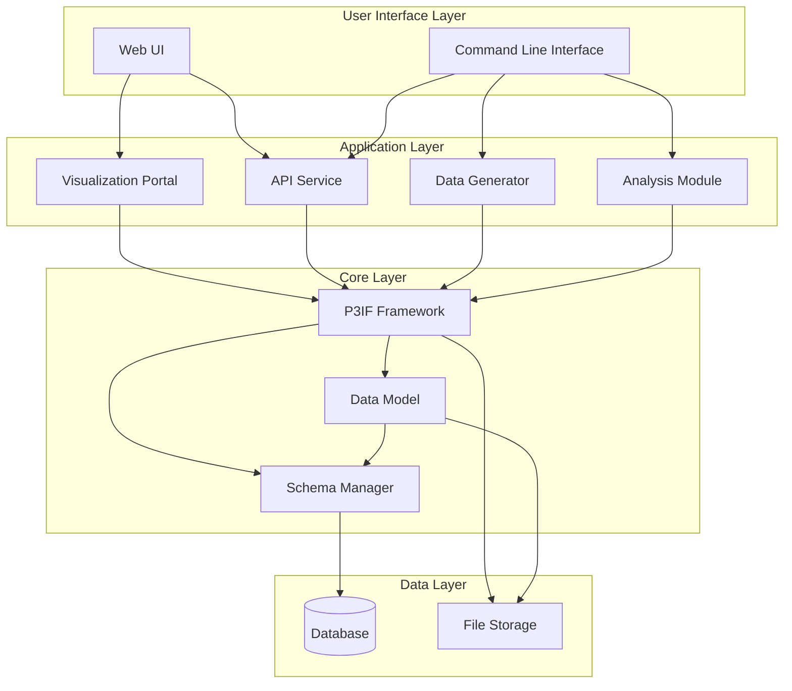
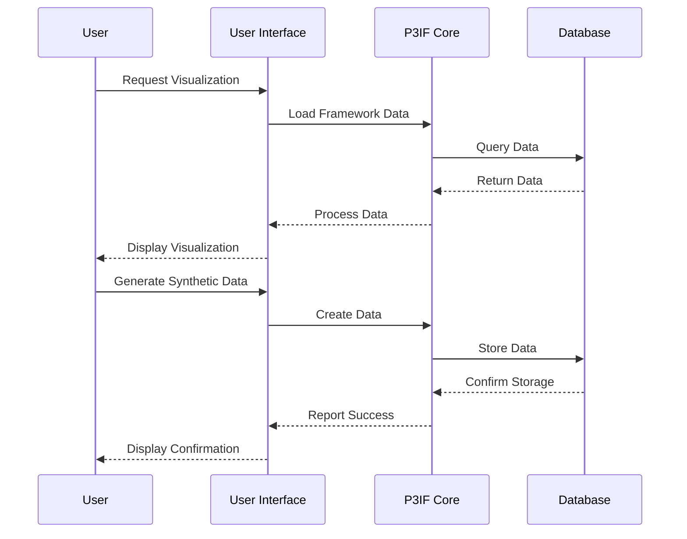
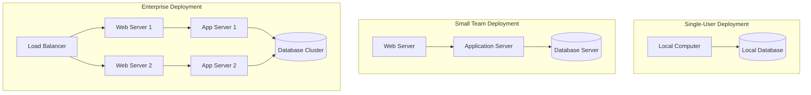

# P3IF System Architecture

This document provides a comprehensive overview of the P3IF system architecture, including its components, interactions, and design principles.

## Architecture Overview

The P3IF system is built on a modular, layered architecture that allows for flexibility, extensibility, and interoperability. The system is designed to handle complex data relationships across multiple domains while providing powerful visualization and analysis capabilities.

## Component Descriptions

### User Interface Layer

The user interface layer provides multiple ways for users to interact with the P3IF system:

- **Web UI**: A browser-based interface for visualizing and exploring P3IF data
- **Command Line Interface**: A scriptable interface for automation and integration

### Application Layer

The application layer contains the main functional components of the system:

- **Visualization Portal**: Generates interactive visualizations of P3IF data
- **API Service**: Provides RESTful endpoints for integration with external systems
- **Data Generator**: Creates synthetic data for testing and demonstration
- **Analysis Module**: Performs analytics on P3IF data

### Core Layer

The core layer implements the fundamental P3IF concepts and data handling:

- **P3IF Framework**: Implements the core logic of the P3IF system
- **Data Model**: Defines the structure of P3IF data
- **Schema Manager**: Handles schema validation and evolution

### Data Layer

The data layer manages persistent storage:

- **Database**: Stores structured P3IF data
- **File Storage**: Stores visualization outputs and other artifacts

## Data Flow

## Deployment Architecture

The P3IF system can be deployed in various configurations depending on the needs of the organization. Here are common deployment patterns:

## Design Principles

The P3IF architecture adheres to the following design principles:

1. **Modularity**: Components are designed with clear responsibilities and interfaces
2. **Extensibility**: The system can be extended with new components and capabilities
3. **Interoperability**: Components can work with external systems through standard interfaces
4. **Scalability**: The architecture supports scaling to handle large datasets and user loads
5. **Maintainability**: Code is organized to facilitate maintenance and evolution

## Technology Stack

The P3IF system is built on the following technologies:

- **Backend**: Python with Flask for API services
- **Frontend**: JavaScript with D3.js for visualizations
- **Database**: SQLite for development, PostgreSQL for production
- **Storage**: Local file system or cloud storage (S3, Azure Blob Storage)
- **Deployment**: Docker containers for consistent environments

## Future Directions

The P3IF architecture is designed to evolve with future requirements. Planned architectural enhancements include:

1. **Microservices Architecture**: Breaking down components into smaller, independently deployable services
2. **Real-time Processing**: Adding support for streaming data and real-time analytics
3. **Machine Learning Integration**: Incorporating ML models for pattern recognition and anomaly detection
4. **Distributed Processing**: Supporting distributed computation for large-scale data processing 