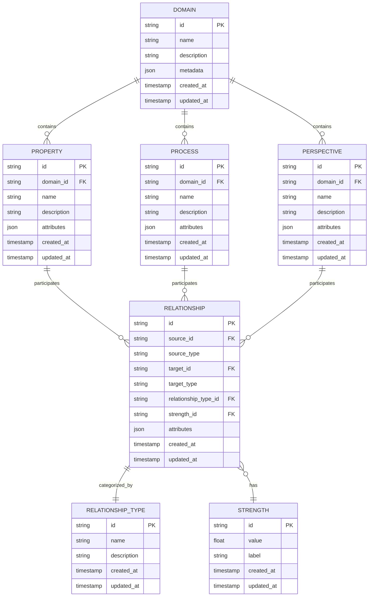
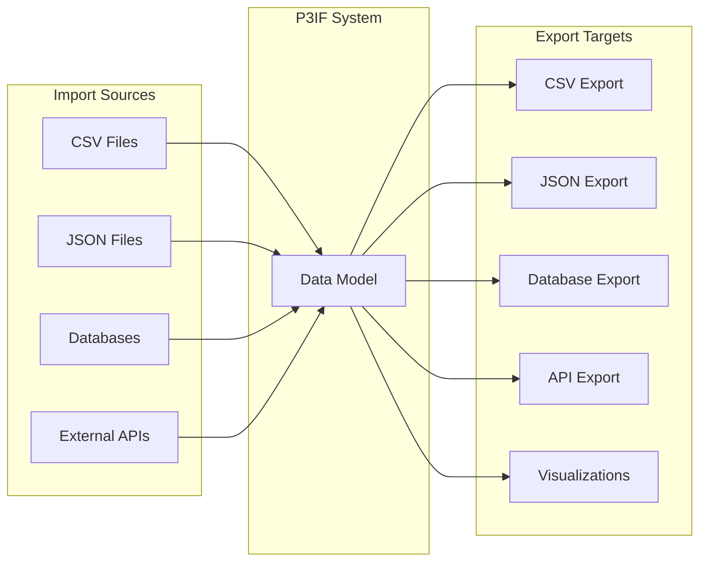

# P3IF Data Model

This document provides a detailed explanation of the P3IF data model, including entities, relationships, and schema definitions.

## Overview

The P3IF data model is designed to capture the relationships between Properties, Processes, and Perspectives across multiple domains. It provides a flexible structure that can accommodate various framework configurations and support the core P3IF operations.

## Entity-Relationship Diagram



## Entity Descriptions

### Domain

The Domain entity represents a specific area or field to which properties, processes, and perspectives belong. Examples include cybersecurity, healthcare, finance, etc.

| Field | Type | Description |
|-------|------|-------------|
| id | string | Unique identifier for the domain |
| name | string | Name of the domain |
| description | string | Detailed description of the domain |
| metadata | json | Additional domain-specific metadata |
| created_at | timestamp | When the domain was created |
| updated_at | timestamp | When the domain was last updated |

### Property

The Property entity represents qualities or characteristics that a system possesses or should possess. Examples include confidentiality, integrity, availability, etc.

| Field | Type | Description |
|-------|------|-------------|
| id | string | Unique identifier for the property |
| domain_id | string | Foreign key to the domain |
| name | string | Name of the property |
| description | string | Detailed description of the property |
| attributes | json | Additional property-specific attributes |
| created_at | timestamp | When the property was created |
| updated_at | timestamp | When the property was last updated |

### Process

The Process entity represents actions, steps, or functions that the system performs or should perform. Examples include data collection, analysis, dissemination, etc.

| Field | Type | Description |
|-------|------|-------------|
| id | string | Unique identifier for the process |
| domain_id | string | Foreign key to the domain |
| name | string | Name of the process |
| description | string | Detailed description of the process |
| attributes | json | Additional process-specific attributes |
| created_at | timestamp | When the process was created |
| updated_at | timestamp | When the process was last updated |

### Perspective

The Perspective entity represents viewpoints or contexts from which the system is evaluated or operated. Examples include business, legal, technical, etc.

| Field | Type | Description |
|-------|------|-------------|
| id | string | Unique identifier for the perspective |
| domain_id | string | Foreign key to the domain |
| name | string | Name of the perspective |
| description | string | Detailed description of the perspective |
| attributes | json | Additional perspective-specific attributes |
| created_at | timestamp | When the perspective was created |
| updated_at | timestamp | When the perspective was last updated |

### Relationship

The Relationship entity represents connections between properties, processes, and perspectives.

| Field | Type | Description |
|-------|------|-------------|
| id | string | Unique identifier for the relationship |
| source_id | string | Foreign key to the source entity |
| source_type | string | Type of the source entity (property, process, perspective) |
| target_id | string | Foreign key to the target entity |
| target_type | string | Type of the target entity (property, process, perspective) |
| relationship_type_id | string | Foreign key to the relationship type |
| strength_id | string | Foreign key to the strength |
| attributes | json | Additional relationship-specific attributes |
| created_at | timestamp | When the relationship was created |
| updated_at | timestamp | When the relationship was last updated |

### Relationship Type

The Relationship Type entity categorizes relationships between entities.

| Field | Type | Description |
|-------|------|-------------|
| id | string | Unique identifier for the relationship type |
| name | string | Name of the relationship type |
| description | string | Detailed description of the relationship type |
| created_at | timestamp | When the relationship type was created |
| updated_at | timestamp | When the relationship type was last updated |

### Strength

The Strength entity represents the intensity or importance of a relationship.

| Field | Type | Description |
|-------|------|-------------|
| id | string | Unique identifier for the strength |
| value | float | Numeric value of the strength |
| label | string | Textual label for the strength |
| created_at | timestamp | When the strength was created |
| updated_at | timestamp | When the strength was last updated |

## JSON Schema

The P3IF data model can be represented as a JSON schema for validation and documentation purposes:

```json
{
  "$schema": "http://json-schema.org/draft-07/schema#",
  "title": "P3IF Data Model",
  "type": "object",
  "properties": {
    "domains": {
      "type": "array",
      "items": {
        "type": "object",
        "properties": {
          "id": { "type": "string" },
          "name": { "type": "string" },
          "description": { "type": "string" },
          "metadata": { "type": "object" },
          "created_at": { "type": "string", "format": "date-time" },
          "updated_at": { "type": "string", "format": "date-time" }
        },
        "required": ["id", "name"]
      }
    },
    "properties": {
      "type": "array",
      "items": {
        "type": "object",
        "properties": {
          "id": { "type": "string" },
          "domain_id": { "type": "string" },
          "name": { "type": "string" },
          "description": { "type": "string" },
          "attributes": { "type": "object" },
          "created_at": { "type": "string", "format": "date-time" },
          "updated_at": { "type": "string", "format": "date-time" }
        },
        "required": ["id", "domain_id", "name"]
      }
    },
    "processes": {
      "type": "array",
      "items": {
        "type": "object",
        "properties": {
          "id": { "type": "string" },
          "domain_id": { "type": "string" },
          "name": { "type": "string" },
          "description": { "type": "string" },
          "attributes": { "type": "object" },
          "created_at": { "type": "string", "format": "date-time" },
          "updated_at": { "type": "string", "format": "date-time" }
        },
        "required": ["id", "domain_id", "name"]
      }
    },
    "perspectives": {
      "type": "array",
      "items": {
        "type": "object",
        "properties": {
          "id": { "type": "string" },
          "domain_id": { "type": "string" },
          "name": { "type": "string" },
          "description": { "type": "string" },
          "attributes": { "type": "object" },
          "created_at": { "type": "string", "format": "date-time" },
          "updated_at": { "type": "string", "format": "date-time" }
        },
        "required": ["id", "domain_id", "name"]
      }
    },
    "relationships": {
      "type": "array",
      "items": {
        "type": "object",
        "properties": {
          "id": { "type": "string" },
          "source_id": { "type": "string" },
          "source_type": { "type": "string", "enum": ["property", "process", "perspective"] },
          "target_id": { "type": "string" },
          "target_type": { "type": "string", "enum": ["property", "process", "perspective"] },
          "relationship_type_id": { "type": "string" },
          "strength_id": { "type": "string" },
          "attributes": { "type": "object" },
          "created_at": { "type": "string", "format": "date-time" },
          "updated_at": { "type": "string", "format": "date-time" }
        },
        "required": ["id", "source_id", "source_type", "target_id", "target_type"]
      }
    }
  }
}
```

## Data Serialization

P3IF data can be serialized in various formats, including:

1. **JSON**: For web APIs and data exchange
2. **SQLite/PostgreSQL**: For persistent storage
3. **CSV**: For data export and analysis

## Data Import/Export

The P3IF system provides utilities for importing and exporting data in various formats:



## Schema Evolution

The P3IF data model is designed to evolve over time. Schema migrations are handled through versioned schemas and migration scripts. The system maintains backward compatibility while allowing for new features and capabilities. 