# P3IF Data Model

This document provides a detailed description of the P3IF data model, including its core components, relationships, and implementation details.

## Core Data Model Overview

The P3IF data model is built around the three fundamental concepts: Properties, Processes, and Perspectives, which form the foundation of domain representation and cross-domain integration.

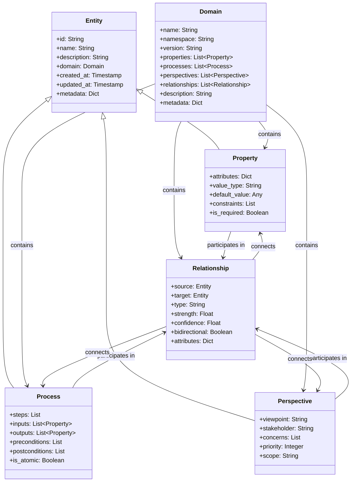

## Entity Relationships

The P3IF data model defines various relationship types between the core entities:

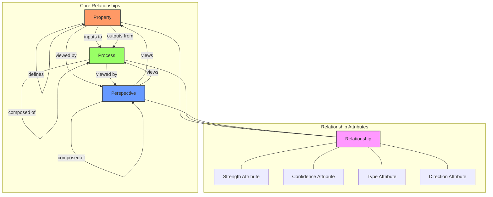

## Domain Data Structure

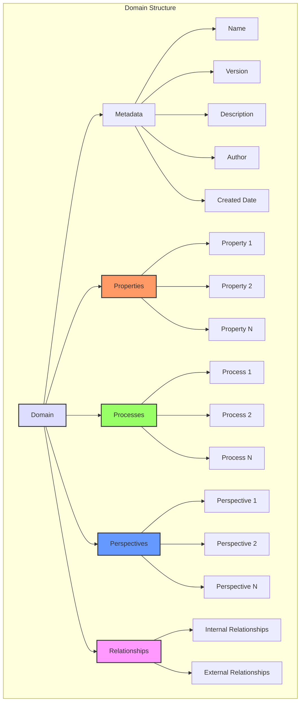

## Property Data Model

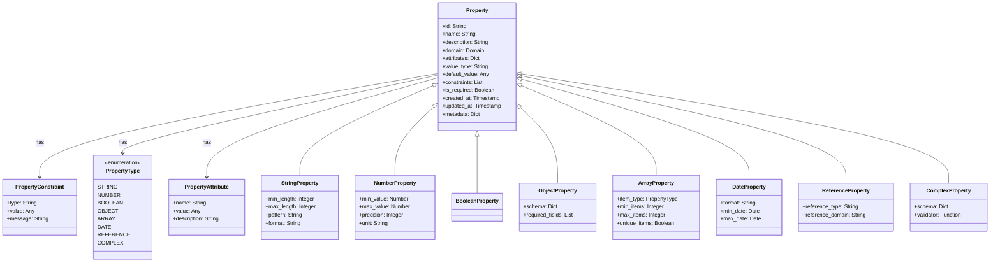

## Process Data Model

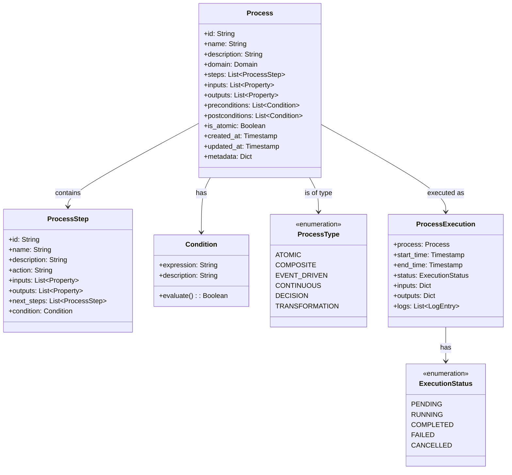

## Perspective Data Model

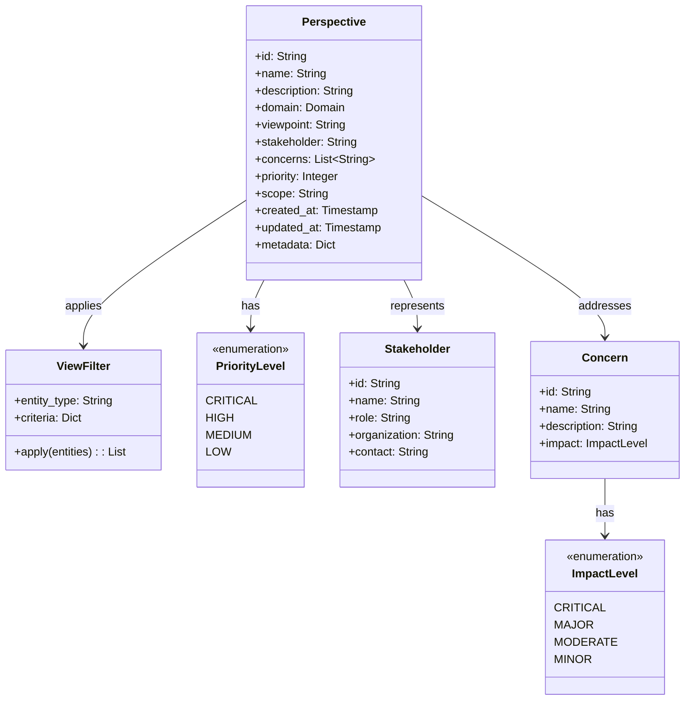

## Relationship Data Model

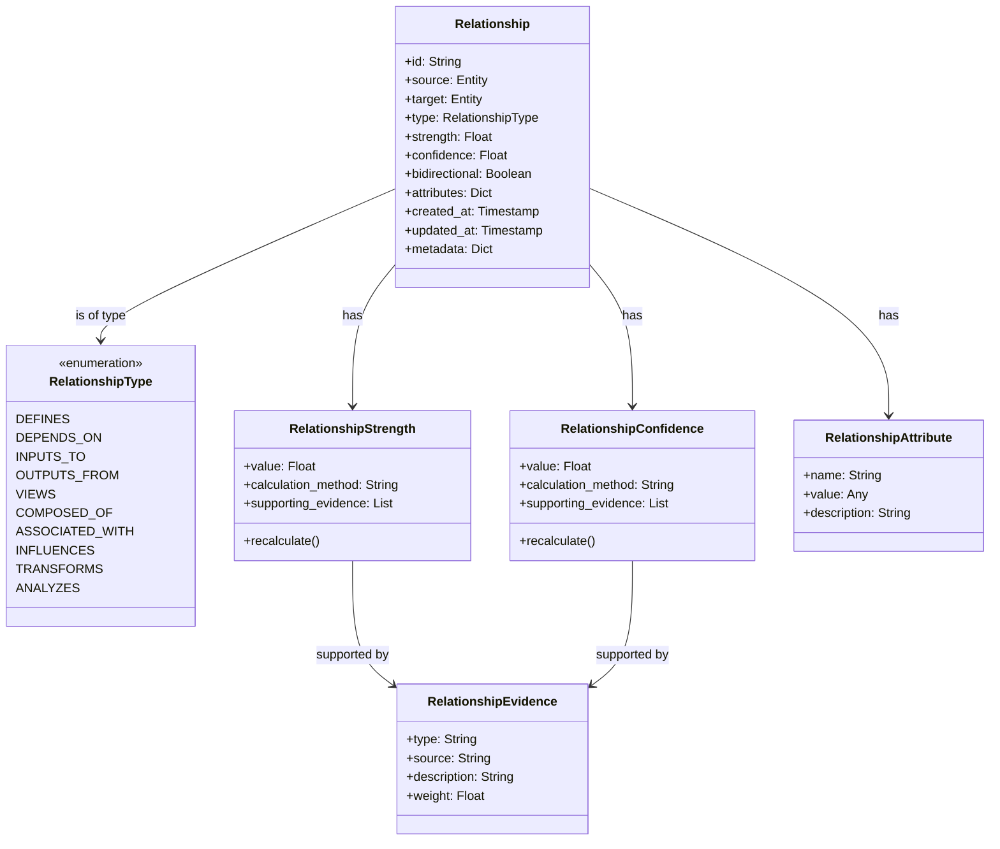

## Domain Data Model

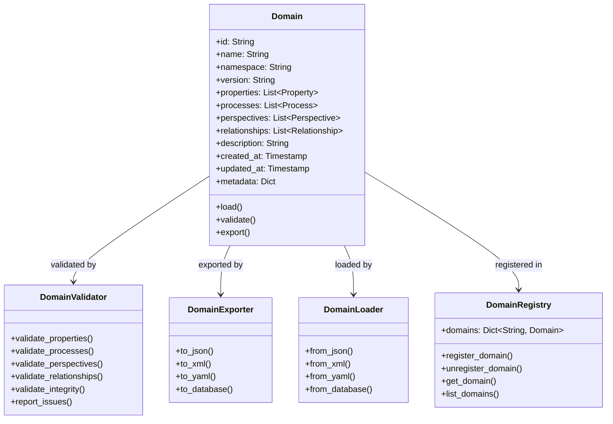

## Data Storage Schema

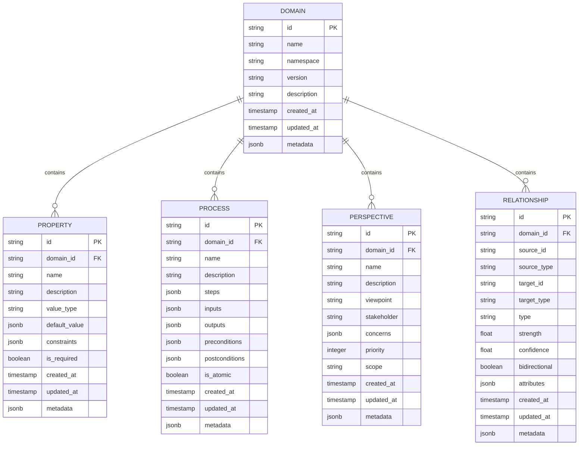

## Data Flow in P3IF

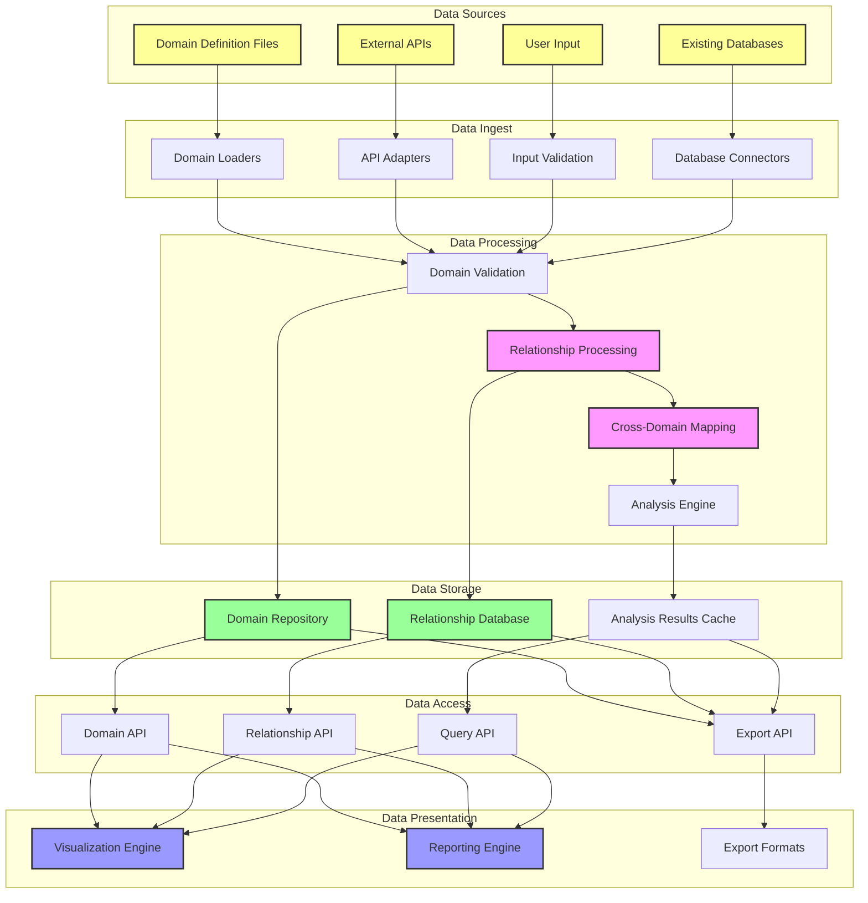

## Data Validation Rules

```mermaid
graph TD
    subgraph "Domain Validation"
        DV1[Structure Validation]
        DV2[Reference Validation]
        DV3[Integrity Validation]
        DV4[Format Validation]
    end
    
    subgraph "Entity Validation"
        EV1[Property Validation]
        EV2[Process Validation]
        EV3[Perspective Validation]
    end
    
    subgraph "Relationship Validation"
        RV1[Type Validation]
        RV2[Strength Validation]
        RV3[Confidence Validation]
        RV4[Circular Reference Check]
    end
    
    subgraph "Cross-Domain Validation"
        CV1[Reference Resolution]
        CV2[Consistency Check]
        CV3[Compatibility Validation]
    end
    
    DV1 --> EV1
    DV1 --> EV2
    DV1 --> EV3
    
    DV2 --> RV1
    DV2 --> RV4
    
    DV3 --> RV2
    DV3 --> RV3
    
    DV4 --> CV1
    DV4 --> CV2
    DV4 --> CV3
    
    EV1 --> ValidationOutcome
    EV2 --> ValidationOutcome
    EV3 --> ValidationOutcome
    RV1 --> ValidationOutcome
    RV2 --> ValidationOutcome
    RV3 --> ValidationOutcome
    RV4 --> ValidationOutcome
    CV1 --> ValidationOutcome
    CV2 --> ValidationOutcome
    CV3 --> ValidationOutcome
    
    style DV1 fill:#f99,stroke:#333,stroke-width:2px
    style DV2 fill:#ff9,stroke:#333,stroke-width:2px
    style DV3 fill:#9f9,stroke:#333,stroke-width:2px
    style DV4 fill:#99f,stroke:#333,stroke-width:2px
    
    style ValidationOutcome fill:#ddd,stroke:#333,stroke-width:2px
```

## Implementation Schema

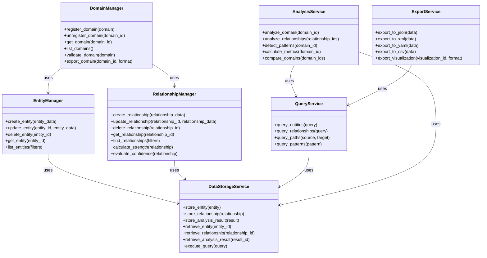

## Data Exchange Formats

P3IF supports several data exchange formats for domain models and relationships:

### JSON Schema Example

```json
{
  "domain": {
    "id": "cybersecurity",
    "name": "Cybersecurity Domain",
    "version": "1.0.0",
    "description": "Cybersecurity concepts and relationships",
    "properties": [
      {
        "id": "vulnerability",
        "name": "Vulnerability",
        "description": "A weakness in a system that can be exploited",
        "value_type": "OBJECT",
        "attributes": {
          "severity": "string",
          "cvss_score": "number"
        }
      }
    ],
    "processes": [
      {
        "id": "vulnerability_assessment",
        "name": "Vulnerability Assessment",
        "description": "Process of identifying and evaluating vulnerabilities",
        "inputs": ["asset"],
        "outputs": ["vulnerability_report"],
        "steps": [
          {
            "id": "scan",
            "name": "Scan Assets",
            "description": "Scan assets for vulnerabilities"
          }
        ]
      }
    ],
    "perspectives": [
      {
        "id": "security_analyst",
        "name": "Security Analyst",
        "description": "Perspective of a security analyst",
        "viewpoint": "Defensive",
        "concerns": ["Data Protection", "Compliance"]
      }
    ],
    "relationships": [
      {
        "source": "vulnerability",
        "source_type": "PROPERTY",
        "target": "vulnerability_assessment",
        "target_type": "PROCESS",
        "type": "OUTPUTS_FROM",
        "strength": 0.8,
        "confidence": 0.9,
        "bidirectional": false
      }
    ]
  }
}
```

## Schema Validation Rules

The P3IF data model enforces strict validation rules to ensure data integrity:

1. **Uniqueness Rules**:
   - Domain IDs must be unique across the system
   - Entity IDs must be unique within a domain
   - Relationship IDs must be unique within a domain

2. **Reference Integrity**:
   - All entity references must resolve to existing entities
   - Cross-domain references must specify the source domain

3. **Value Constraints**:
   - Strength and confidence values must be between 0.0 and 1.0
   - Required fields must be provided
   - Enum values must be from the defined set

4. **Relationship Constraints**:
   - No circular references in hierarchical relationships
   - Compatible entity types for relationship types
   - Valid relationship direction based on type

5. **Process Constraints**:
   - Process steps must form a valid directed graph
   - Inputs and outputs must reference valid properties
   - Preconditions and postconditions must be valid expressions 