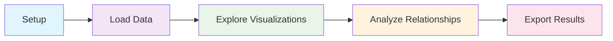
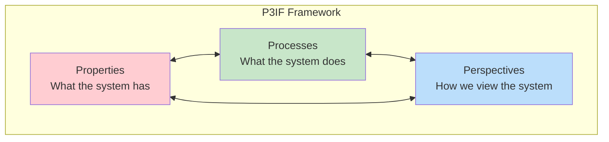
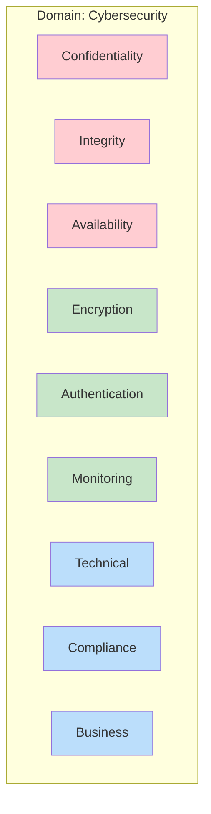
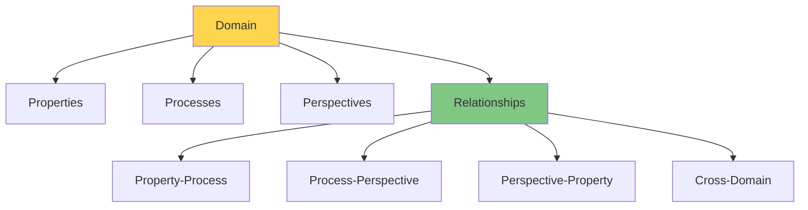
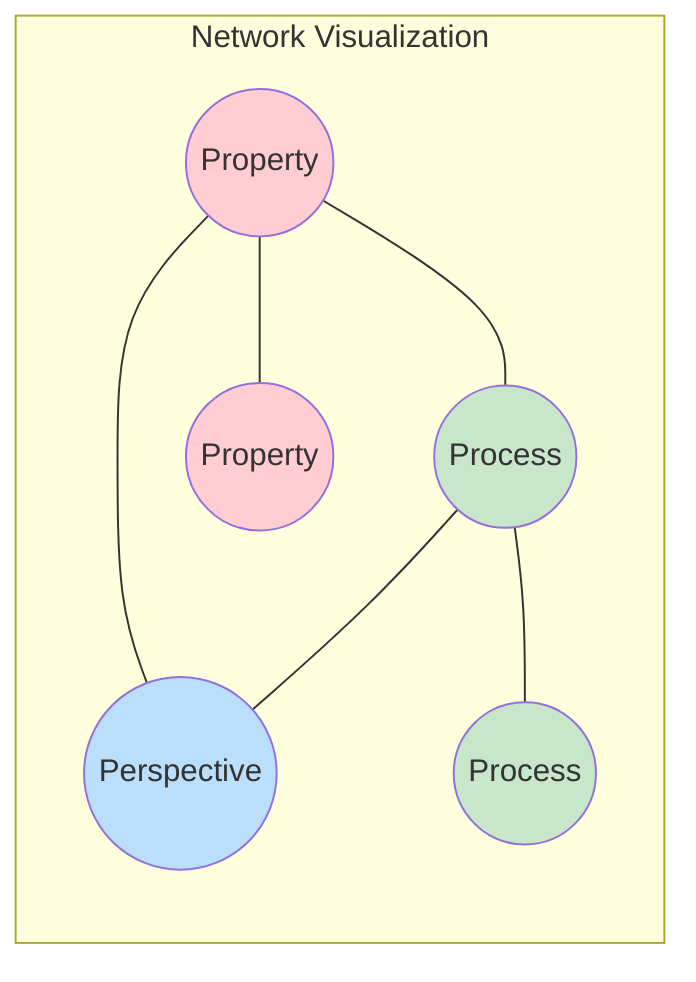
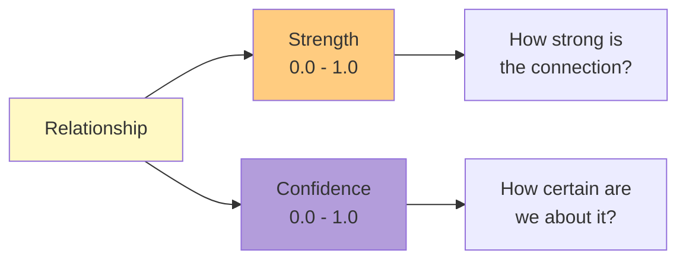

# P3IF Basic Usage Tutorial

This tutorial provides a step-by-step introduction to using P3IF for visualizing and analyzing relationships between Properties, Processes, and Perspectives across different domains.

## Prerequisites

Before starting this tutorial, ensure you have:

1. Completed the [Installation Guide](../guides/installation.md)
2. P3IF running locally on your system
3. Basic familiarity with command line interfaces

## Learning Objectives

By the end of this tutorial, you will:

- Understand the core P3IF concepts of Properties, Processes, and Perspectives
- Be able to generate and explore basic visualizations
- Know how to work with domains and relationships
- Understand how to export and share results

## Tutorial Overview



## Step 1: Understanding P3IF Concepts

### The P3IF Framework

P3IF organizes information systems around three dimensions:



- **Properties**: Qualities or characteristics (e.g., Confidentiality, Reliability, Performance)
- **Processes**: Actions or functions (e.g., Authentication, Data Processing, Monitoring)
- **Perspectives**: Viewpoints or contexts (e.g., Technical, Business, Legal, User)

### Domain Representation

Each domain represents a specific field or area of concern:



## Step 2: Setting Up Your First Analysis

### Start P3IF

```bash
# Navigate to your P3IF directory
cd /path/to/p3if

# Activate virtual environment (if using one)
source venv/bin/activate

# Start the application
python app.py
```

### Access the Web Interface

Open your browser and navigate to:
```
http://localhost:5000
```

You should see the P3IF welcome screen.

## Step 3: Working with Sample Data

### Generate Sample Data

Let's create some sample data to explore:

```bash
# Generate a cybersecurity domain with default settings
python scripts/generate_sample_data.py --domain cybersecurity --output data/domains/

# Generate a healthcare domain for comparison
python scripts/generate_sample_data.py --domain healthcare --output data/domains/
```

### Understanding the Data Structure

The generated data includes:



## Step 4: Exploring Basic Visualizations

### Generate Your First Visualization

```bash
# Create a multi-domain portal
python scripts/run_multidomain_portal.py --domains cybersecurity,healthcare --output output/
```

This creates an interactive portal at `output/index.html`.

### Understanding the Portal

The portal includes several visualization types:

#### 1. Network View



**Features:**
- Nodes represent Properties, Processes, and Perspectives
- Edges represent relationships
- Node size indicates importance/centrality
- Edge thickness shows relationship strength

#### 2. Matrix View

Shows relationships in a tabular format:
- Rows: One dimension (e.g., Properties)
- Columns: Another dimension (e.g., Processes)
- Cell values: Relationship strength or presence

#### 3. 3D Cube View

Interactive 3D representation of the P3IF space:
- X-axis: Properties
- Y-axis: Processes
- Z-axis: Perspectives
- Points in space: Specific relationships

### Navigation Tips

1. **Domain Selection**: Use the dropdown to switch between domains
2. **Zoom and Pan**: Mouse wheel to zoom, click and drag to pan
3. **Element Selection**: Click on elements to highlight connected components
4. **Filter Panel**: Use filters to focus on specific relationship types or strengths

## Step 5: Analyzing Relationships

### Understanding Relationship Metrics

Each relationship in P3IF has two key metrics:



### Identifying Key Patterns

Look for:

1. **High-Strength Relationships**: Strong connections between elements
2. **Central Elements**: Elements with many connections
3. **Clusters**: Groups of highly interconnected elements
4. **Gaps**: Missing relationships that might indicate opportunities

### Example Analysis

In the cybersecurity domain, you might notice:

- Strong relationship between "Confidentiality" (Property) and "Encryption" (Process)
- "Technical Perspective" connects to most security processes
- "Compliance Perspective" primarily connects to documentation processes

## Step 6: Customizing Visualizations

### Adjusting Filters

Use the filter panel to focus your analysis:

```bash
# In the web interface:
# 1. Set minimum relationship strength: 0.7
# 2. Select specific perspectives: Technical, Business
# 3. Choose element types: Properties, Processes
```

### Changing Visualization Parameters

```bash
# Generate visualization with custom parameters
python scripts/run_multidomain_portal.py \
  --domains cybersecurity \
  --min-strength 0.6 \
  --layout-algorithm spring \
  --color-scheme dark \
  --output output/custom/
```

### Color Schemes and Themes

Available options:
- `default`: Standard color scheme
- `dark`: Dark background with bright elements
- `high_contrast`: High contrast for accessibility
- `colorblind_friendly`: Optimized for color vision differences

## Step 7: Working with Real Data

### Importing Your Own Data

Create a domain file in JSON format:

```json
{
  "name": "My Custom Domain",
  "description": "Custom domain for my organization",
  "properties": [
    {
      "id": "security",
      "name": "Security",
      "description": "Information security requirements"
    },
    {
      "id": "usability",
      "name": "Usability",
      "description": "User experience requirements"
    }
  ],
  "processes": [
    {
      "id": "design",
      "name": "Design Process",
      "description": "User interface and experience design"
    },
    {
      "id": "testing",
      "name": "Testing Process",
      "description": "Security and usability testing"
    }
  ],
  "perspectives": [
    {
      "id": "developer",
      "name": "Developer Perspective",
      "description": "Development team viewpoint"
    },
    {
      "id": "user",
      "name": "End User Perspective",
      "description": "End user viewpoint"
    }
  ],
  "relationships": [
    {
      "property_id": "security",
      "process_id": "testing",
      "perspective_id": "developer",
      "strength": 0.9,
      "confidence": 0.8
    }
  ]
}
```

### Loading Custom Data

```bash
# Load your custom domain
python scripts/load_domain.py --file data/domains/my_custom_domain.json

# Generate visualization for your domain
python scripts/run_multidomain_portal.py --domains my_custom_domain --output output/
```

## Step 8: Exporting and Sharing Results

### Export Visualization

```bash
# Export as static image
python scripts/export_visualization.py \
  --domain cybersecurity \
  --format png \
  --output exports/cybersecurity_network.png

# Export as interactive HTML
python scripts/export_visualization.py \
  --domain cybersecurity \
  --format html \
  --output exports/cybersecurity_interactive.html
```

### Export Data

```bash
# Export domain data as JSON
python scripts/export_data.py \
  --domain cybersecurity \
  --format json \
  --output exports/cybersecurity_data.json

# Export relationship data as CSV
python scripts/export_data.py \
  --domain cybersecurity \
  --format csv \
  --output exports/cybersecurity_relationships.csv
```

### Generate Reports

```bash
# Generate analysis report
python scripts/generate_report.py \
  --domain cybersecurity \
  --include-statistics \
  --include-visualizations \
  --output reports/cybersecurity_analysis.pdf
```

## Step 9: API Usage

### Basic API Calls

If you prefer programmatic access:

```python
import requests

# Get all domains
response = requests.get('http://localhost:5000/api/v1/domains')
domains = response.json()

# Get specific domain details
response = requests.get('http://localhost:5000/api/v1/domains/cybersecurity')
domain_data = response.json()

# Get relationships with filtering
params = {
    'min_strength': 0.7,
    'perspective_id': 'technical'
}
response = requests.get(
    'http://localhost:5000/api/v1/domains/cybersecurity/relationships',
    params=params
)
relationships = response.json()
```

### Creating New Relationships

```python
# Add a new relationship
new_relationship = {
    'property_id': 'confidentiality',
    'process_id': 'encryption',
    'perspective_id': 'technical',
    'strength': 0.95,
    'confidence': 0.9
}

response = requests.post(
    'http://localhost:5000/api/v1/domains/cybersecurity/relationships',
    json=new_relationship
)
```

## Step 10: Troubleshooting Common Issues

### Visualization Not Loading

```bash
# Check if the server is running
curl http://localhost:5000/health

# Check for JavaScript errors in browser console
# Press F12 -> Console tab

# Verify data files exist
ls data/domains/
```

### Performance Issues

```bash
# For large datasets, enable caching
export P3IF_CACHE_ENABLED=true

# Reduce dataset size for testing
python scripts/generate_sample_data.py \
  --domain cybersecurity \
  --max-relationships 100 \
  --output data/domains/
```

### Data Import Errors

```bash
# Validate JSON format
python -m json.tool data/domains/my_domain.json

# Check domain schema
python scripts/validate_domain.py --file data/domains/my_domain.json
```

## Next Steps

Congratulations! You've completed the basic P3IF tutorial. You can now:

1. **Explore Advanced Features**: Check out the [Advanced Features Tutorial](advanced-features.md)
2. **Work with Multiple Domains**: See [Multi-Domain Analysis Tutorial](multi-domain-analysis.md)
3. **Customize the Framework**: Read the [Configuration Guide](../guides/configuration.md)
4. **Integrate with Your Systems**: Review the [API Documentation](../api/README.md)

## Summary

In this tutorial, you learned to:

- ✅ Understand P3IF's core concepts (Properties, Processes, Perspectives)
- ✅ Generate and explore basic visualizations
- ✅ Work with sample and custom data
- ✅ Analyze relationships and patterns
- ✅ Export results and generate reports
- ✅ Use the P3IF API programmatically

The P3IF framework provides a powerful way to analyze complex systems by organizing information around Properties, Processes, and Perspectives. As you become more familiar with the tool, you'll discover new ways to apply it to your specific domain and use cases.

## Additional Resources

- [P3IF Core Documentation](../concepts/P3IF.md)
- [Visualization Guide](../visualization/user_guide.md)
- [FAQ](../FAQ.md)
- [Community Examples](../examples/README.md) 