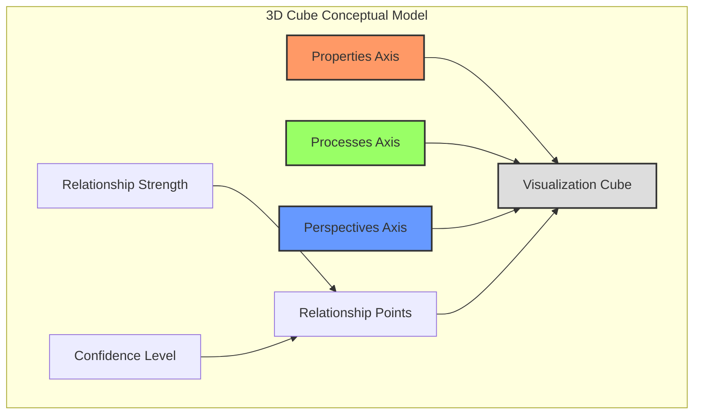
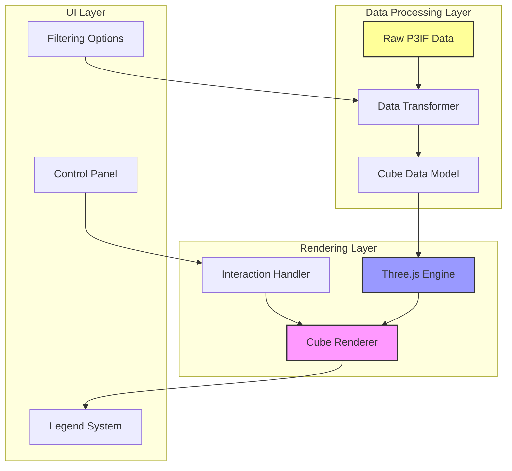
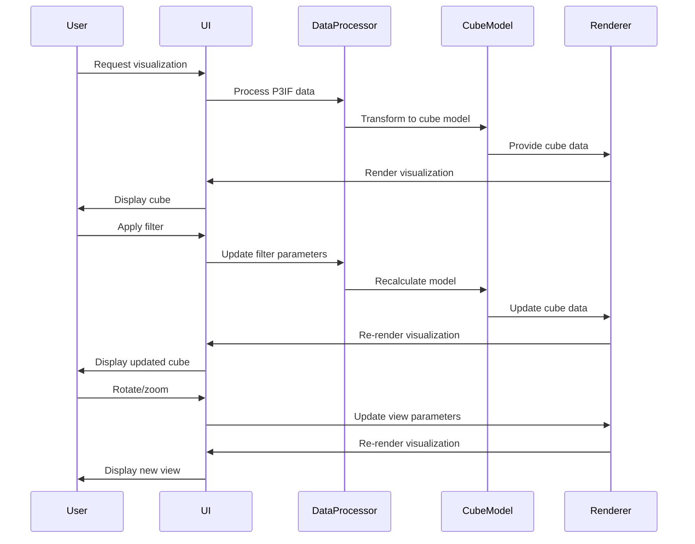
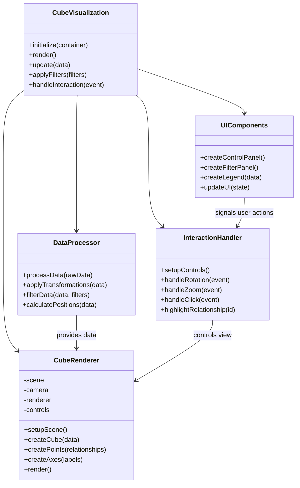
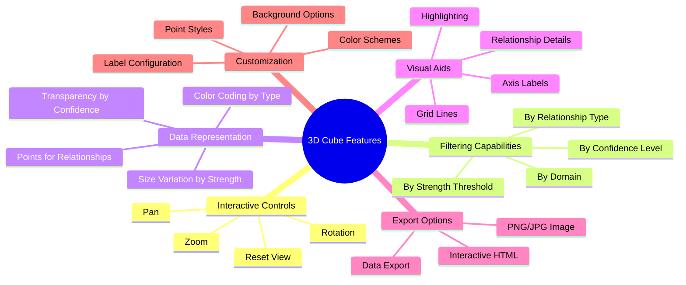
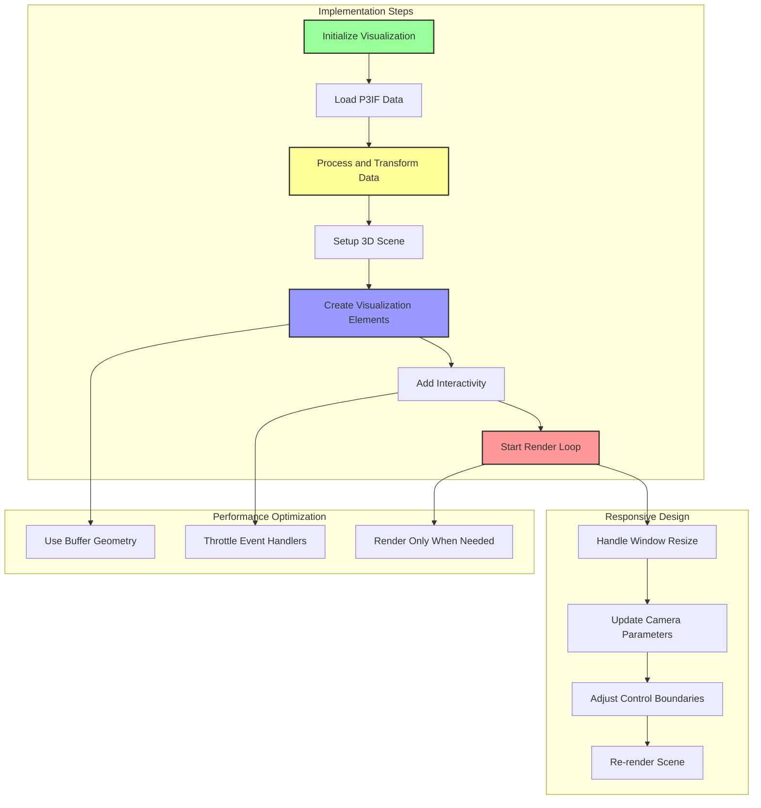
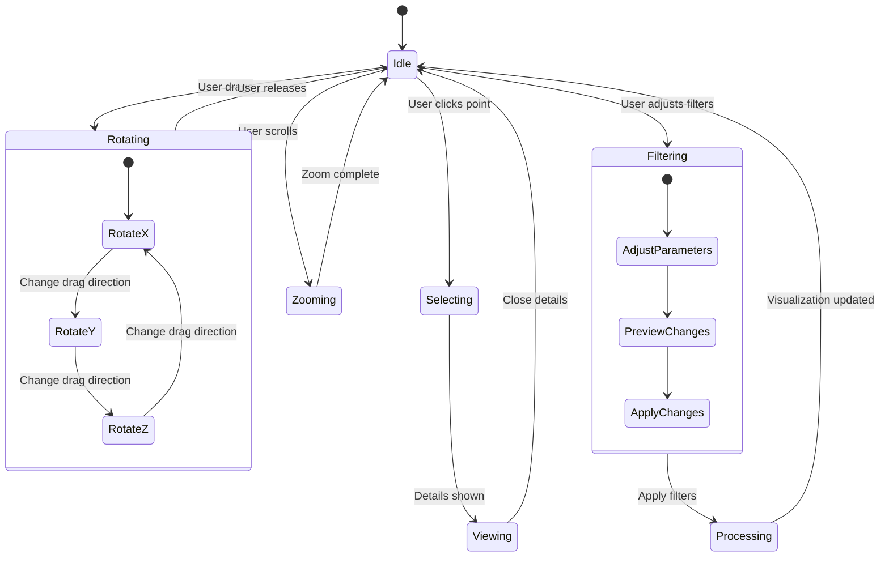
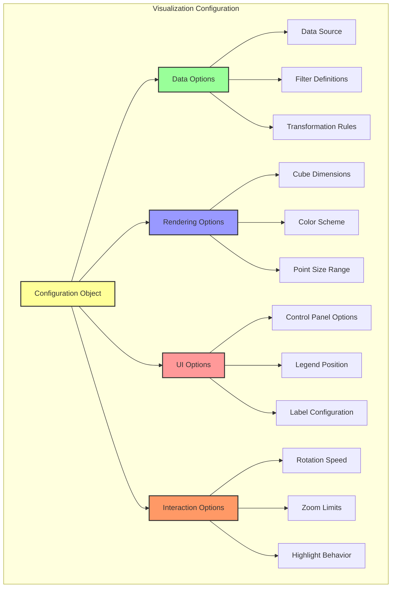

# P3IF 3D Cube Visualization

This document provides detailed information about the 3D Cube visualization component of the P3IF framework, including its conceptual model, implementation details, and usage guidelines.

## Conceptual Model

The 3D Cube visualization represents the three core dimensions of the P3IF framework: Properties, Processes, and Perspectives. Each dimension forms an axis in the 3D space, creating a cube where relationships between elements can be visualized.



## Architecture

The 3D Cube visualization is implemented using a layered architecture that separates data processing from rendering.



## Data Flow

The following sequence diagram illustrates the data flow through the visualization system:



## Component Structure

The internal structure of the visualization components:



## Visualization Features



## Implementation Flow



## User Interaction Model



## Integration with P3IF Framework

```mermaid
graph LR
    subgraph "P3IF Core"
        Core[Core Framework]
        DataModel[Domain Models]
        Relationships[Relationship Engine]
    end
    
    subgraph "Visualization Component"
        VizEngine[Visualization Engine]
        CubeViz[3D Cube Visualization]
        VizAPI[Visualization API]
    end
    
    Core --> VizAPI: Provides data
    DataModel --> VizAPI: Provides structure
    Relationships --> VizAPI: Provides relationships
    
    VizAPI --> VizEngine: Processes data
    VizEngine --> CubeViz: Renders visualization
    
    style Core fill:#f9f,stroke:#333,stroke-width:2px
    style VizEngine fill:#99f,stroke:#333,stroke-width:2px
    style CubeViz fill:#f96,stroke:#333,stroke-width:2px
```

## Configuration Options



## Usage Examples

### Basic Implementation

```javascript
// Example code for basic implementation
const cubeVisualization = new P3IFCubeVisualization({
    container: document.getElementById('visualization-container'),
    dataSource: '/api/p3if/visualization-data',
    dimensions: {width: 800, height: 600, depth: 800},
    colorScheme: 'spectrum'
});

cubeVisualization.initialize();
cubeVisualization.render();
```

### Advanced Configuration

```javascript
// Example code for advanced configuration
const advancedConfig = {
    container: document.getElementById('advanced-viz-container'),
    dataSource: '/api/p3if/domains/cybersecurity/relationships',
    dimensions: {width: 1000, height: 800, depth: 1000},
    colorScheme: 'custom',
    customColors: {
        properties: '#ff5733',
        processes: '#33ff57',
        perspectives: '#3357ff',
        relationships: {
            strong: '#ff0000',
            medium: '#ffaa00',
            weak: '#ffff00'
        }
    },
    interactionOptions: {
        rotationSpeed: 0.5,
        zoomRange: [0.1, 10],
        enablePan: true
    },
    filterOptions: {
        showFilters: true,
        defaultFilters: {
            minStrength: 0.3,
            minConfidence: 0.5,
            domains: ['all']
        }
    },
    renderOptions: {
        showGrid: true,
        showAxes: true,
        pointSizeRange: [2, 10],
        highlightSize: 3
    }
};

const vizInstance = new P3IFCubeVisualization(advancedConfig);
vizInstance.initialize();
vizInstance.render();

// Add event listeners
vizInstance.on('pointSelected', (point) => {
    displayDetailsPanel(point);
});
```

## Accessibility Considerations

The 3D Cube visualization implements several accessibility features to ensure it can be used by a wide range of users:

1. Keyboard navigation for rotation and zoom
2. High-contrast mode option
3. Screen reader compatibility with ARIA attributes
4. Alternative 2D visualization modes
5. Customizable text sizes and interface elements

## Performance Optimization

To ensure smooth performance even with large datasets, the visualization employs several optimization techniques:

1. Instanced rendering for relationship points
2. Level of detail adjustments based on zoom level
3. Frustum culling to only render visible points
4. Throttled event handlers for smooth interaction
5. Deferred rendering of non-essential visual elements
6. Web worker processing for data transformations 